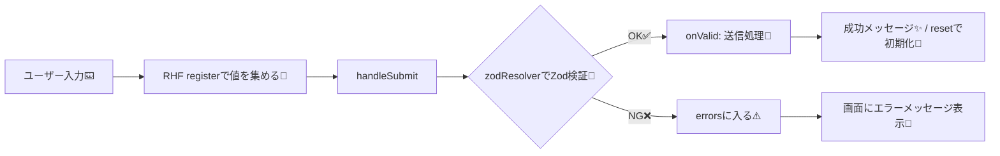

# 第190章：練習：Zod で厳密な型定義 + RHF でプロ級のお問い合わせフォーム

この章では「**入力 → バリデーション → エラー表示 → 送信 → 成功/失敗**」まで、ちゃんと揃ったお問い合わせフォームを作るよ〜！🧸💡
ポイントは **Zodで“型＋ルール”を1箇所に集約**して、**React Hook Form（RHF）で高速にフォーム管理**すること🙌

---

## この章のゴール🎯

* Zodスキーマを **唯一の正** にして、TypeScriptの型もそこから自動生成✨
* RHFに `zodResolver` をつないで、エラーをきれいに表示👀
* 問い合わせ種別によって必須項目が変わる「**条件付きバリデーション**」も実装🧠

---

## 全体の流れ（図解）🗺️



---

## 1) 依存パッケージを入れる📦

RHF本体・Zod・Resolver を入れるよ！
（RHFはnpm上で v7系が安定して配布されてるよ〜）([npmjs.com][1])
（Resolverは `@hookform/resolvers`。Zod v4 対応もこの系で進んでるよ）([npmjs.com][2])
（Zod v4 は `zod` からそのまま使える案内があるよ）([Zod][3])

```bash
npm i react-hook-form zod @hookform/resolvers
```

---

## 2) フォルダ構成（おすすめ）📁

```text
src/
  features/
    contact/
      contactSchema.ts
      ContactForm.module.css
      ContactForm.tsx
  App.tsx
```

---

## 3) Zodスキーマ（ここが本体👑）

### ✅ “問い合わせ種別”で必須項目が変わる例

* `type = business` のとき → `company` 必須🏢
* `type = bug` のとき → `url` 必須🔗

`src/features/contact/contactSchema.ts`

```ts
import { z } from "zod";

export const inquiryTypes = ["general", "business", "bug"] as const;

export const ContactSchema = z
  .object({
    name: z
      .string()
      .trim()
      .min(1, "お名前は必須です🙂")
      .max(50, "お名前は50文字までにしてね📝"),

    email: z
      .string()
      .trim()
      .email("メールアドレスの形がちょっと変かも！📧"),

    type: z.enum(inquiryTypes, { message: "問い合わせ種別を選んでね👇" }),

    subject: z
      .string()
      .trim()
      .min(1, "件名は必須です🧷")
      .max(80, "件名は80文字までだよ✂️"),

    message: z
      .string()
      .trim()
      .min(10, "本文は10文字以上でお願い🙏")
      .max(1000, "本文は1000文字までだよ🧼"),

    // 任意：電話（入れるなら形式チェック）
    phone: z
      .string()
      .trim()
      .optional()
      .refine(
        (v) => !v || /^[0-9\-()+\s]{8,20}$/.test(v),
        "電話番号っぽくないかも📞（数字と - ( ) スペースだけOK）"
      ),

    // 条件付き必須にする候補たち（基本はoptional）
    company: z.string().trim().optional(),
    url: z.string().trim().url("URLの形にしてね🔗").optional(),

    // チェック必須（true固定がラク！）
    agree: z.literal(true, {
      errorMap: () => ({ message: "同意にチェックしてね✅" }),
    }),
  })
  .strict() // “余計なキー”が来たら弾く（堅牢さUP🛡️）
  .superRefine((data, ctx) => {
    if (data.type === "business" && !data.company) {
      ctx.addIssue({
        code: z.ZodIssueCode.custom,
        path: ["company"],
        message: "法人・お仕事のときは会社名が必須だよ🏢",
      });
    }

    if (data.type === "bug" && !data.url) {
      ctx.addIssue({
        code: z.ZodIssueCode.custom,
        path: ["url"],
        message: "不具合のときは再現URLがあると助かる！🔗",
      });
    }
  });

export type ContactFormValues = z.infer<typeof ContactSchema>;
```

---

## 4) ContactForm 本体を作る🧩

`src/features/contact/ContactForm.tsx`

```tsx
import { useState } from "react";
import { useForm } from "react-hook-form";
import { zodResolver } from "@hookform/resolvers/zod";
import { ContactSchema, type ContactFormValues } from "./contactSchema";
import styles from "./ContactForm.module.css";

async function fakeSendContact(_data: ContactFormValues) {
  // 本当はここで fetch("/api/contact", { method: "POST", body: ... })
  await new Promise((r) => setTimeout(r, 900));
  // たまに失敗する演出（動作確認用）
  if (Math.random() < 0.2) throw new Error("network error");
}

function FieldError({ message }: { message?: string }) {
  if (!message) return null;
  return (
    <p role="alert" className={styles.error}>
      {message}
    </p>
  );
}

export function ContactForm() {
  const [success, setSuccess] = useState<string | null>(null);

  const {
    register,
    handleSubmit,
    watch,
    reset,
    setError,
    formState: { errors, isSubmitting },
  } = useForm<ContactFormValues>({
    resolver: zodResolver(ContactSchema),
    mode: "onBlur",
    reValidateMode: "onChange",
    shouldFocusError: true,
    defaultValues: {
      name: "",
      email: "",
      type: "general",
      subject: "",
      message: "",
      phone: "",
      company: "",
      url: "",
      agree: false,
    },
  });

  const type = watch("type");

  const onSubmit = async (data: ContactFormValues) => {
    setSuccess(null);

    try {
      await fakeSendContact(data);
      setSuccess("送信できたよ〜！ありがとう✨📨");
      reset(); // 入力を全部消す🧼
    } catch {
      // サーバー側エラーっぽいのをrootに入れると扱いやすいよ💥
      setError("root", { type: "server", message: "送信に失敗しちゃった…😭 もう一回ためしてね🙏" });
    }
  };

  return (
    <section className={styles.card}>
      <h2 className={styles.title}>お問い合わせフォーム📩</h2>

      <form onSubmit={handleSubmit(onSubmit)} className={styles.form}>
        {/* サーバーエラー（root） */}
        <FieldError message={errors.root?.message} />

        {success && <p className={styles.success}>{success}</p>}

        <div className={styles.field}>
          <label htmlFor="name">お名前</label>
          <input
            id="name"
            type="text"
            autoComplete="name"
            aria-invalid={!!errors.name}
            {...register("name")}
          />
          <FieldError message={errors.name?.message} />
        </div>

        <div className={styles.field}>
          <label htmlFor="email">メールアドレス</label>
          <input
            id="email"
            type="email"
            autoComplete="email"
            aria-invalid={!!errors.email}
            {...register("email")}
          />
          <FieldError message={errors.email?.message} />
        </div>

        <div className={styles.field}>
          <label htmlFor="type">問い合わせ種別</label>
          <select id="type" aria-invalid={!!errors.type} {...register("type")}>
            <option value="general">一般</option>
            <option value="business">お仕事</option>
            <option value="bug">不具合報告</option>
          </select>
          <FieldError message={errors.type?.message} />
        </div>

        {type === "business" && (
          <div className={styles.field}>
            <label htmlFor="company">会社名（お仕事のとき必須）</label>
            <input
              id="company"
              type="text"
              aria-invalid={!!errors.company}
              {...register("company")}
            />
            <FieldError message={errors.company?.message} />
          </div>
        )}

        {type === "bug" && (
          <div className={styles.field}>
            <label htmlFor="url">再現URL（不具合のとき必須）</label>
            <input id="url" type="url" aria-invalid={!!errors.url} {...register("url")} />
            <FieldError message={errors.url?.message} />
          </div>
        )}

        <div className={styles.field}>
          <label htmlFor="subject">件名</label>
          <input id="subject" type="text" aria-invalid={!!errors.subject} {...register("subject")} />
          <FieldError message={errors.subject?.message} />
        </div>

        <div className={styles.field}>
          <label htmlFor="phone">電話（任意）</label>
          <input id="phone" type="tel" autoComplete="tel" aria-invalid={!!errors.phone} {...register("phone")} />
          <FieldError message={errors.phone?.message} />
        </div>

        <div className={styles.field}>
          <label htmlFor="message">本文</label>
          <textarea
            id="message"
            rows={6}
            aria-invalid={!!errors.message}
            {...register("message")}
          />
          <FieldError message={errors.message?.message} />
        </div>

        <div className={styles.checkboxRow}>
          <input id="agree" type="checkbox" {...register("agree")} />
          <label htmlFor="agree">プライバシーポリシーに同意します✅</label>
        </div>
        <FieldError message={errors.agree?.message} />

        <button type="submit" className={styles.button} disabled={isSubmitting}>
          {isSubmitting ? "送信中…⏳" : "送信する📨"}
        </button>
      </form>
    </section>
  );
}
```

※ `useForm` の基本は公式ドキュメントにまとまってるよ（オプションもいっぱい）([React Hook Form][4])

---

## 5) CSS Modulesで“プロっぽく”整える🎨

`src/features/contact/ContactForm.module.css`

```css
.card {
  max-width: 720px;
  margin: 24px auto;
  padding: 20px;
  border: 1px solid #ddd;
  border-radius: 12px;
}

.title {
  margin: 0 0 12px;
  font-size: 20px;
}

.form {
  display: flex;
  flex-direction: column;
  gap: 12px;
}

.field {
  display: flex;
  flex-direction: column;
  gap: 6px;
}

.field input,
.field select,
.field textarea {
  padding: 10px;
  border: 1px solid #bbb;
  border-radius: 10px;
  font-size: 14px;
}

.checkboxRow {
  display: flex;
  align-items: center;
  gap: 8px;
}

.error {
  margin: 0;
  font-size: 13px;
  color: #c00;
}

.success {
  margin: 0;
  padding: 10px;
  border: 1px solid #7ccf9a;
  border-radius: 10px;
}

.button {
  padding: 12px 14px;
  border: none;
  border-radius: 12px;
  cursor: pointer;
}
```

---

## 6) Appに貼るだけで完成👏

`src/App.tsx`

```tsx
import { ContactForm } from "./features/contact/ContactForm";

export default function App() {
  return (
    <main style={{ padding: 16 }}>
      <ContactForm />
    </main>
  );
}
```

---

## 動作チェック✅（ここ大事！）

1. 種別を **お仕事** にして `会社名` 空 → エラー出る？🏢⚠️
2. 種別を **不具合報告** にして `URL` 空 → エラー出る？🔗⚠️
3. `agree` チェックしない → 怒られる？✅❌
4. 送信 → 成功メッセージ or 失敗メッセージが出る？📨😭✨

---

## よくあるミス集🧯

* **Zodの型と、フォームのdefaultValuesがズレる** → `defaultValues` をスキーマに合わせよ〜🧩
* **条件付き必須をUIだけでやって、スキーマ側が甘い** → `superRefine` で最終防衛線🛡️
* **送信失敗をどこに出すか迷う** → `setError("root", ...)` が便利💥

---

## 発展課題（できたら一気に“実務感”UP🔥）

* ✅ `message` にNGワード（例：URL禁止）を `refine` で入れる🧪
* ✅ 送信前に「確認画面」を挟む（Zodで整形したデータだけ表示）👀
* ✅ `fakeSendContact` を `fetch` に置き換えて、**同じZodスキーマでサーバー側も再検証**（本物の堅牢さ💪）

---

必要なら、このフォームを「実在API（例：Cloudflare Workers / Firebase Functions / Supabase Edge Functions）」に送る版に進化させた第190章“続き”も、そのままのノリで作れるよ〜！🚀✨

[1]: https://www.npmjs.com/package/react-hook-form?utm_source=chatgpt.com "react-hook-form"
[2]: https://www.npmjs.com/package/%40hookform/resolvers?utm_source=chatgpt.com "hookform/resolvers"
[3]: https://zod.dev/v4/versioning?utm_source=chatgpt.com "Versioning"
[4]: https://react-hook-form.com/docs/useform?utm_source=chatgpt.com "useForm"
