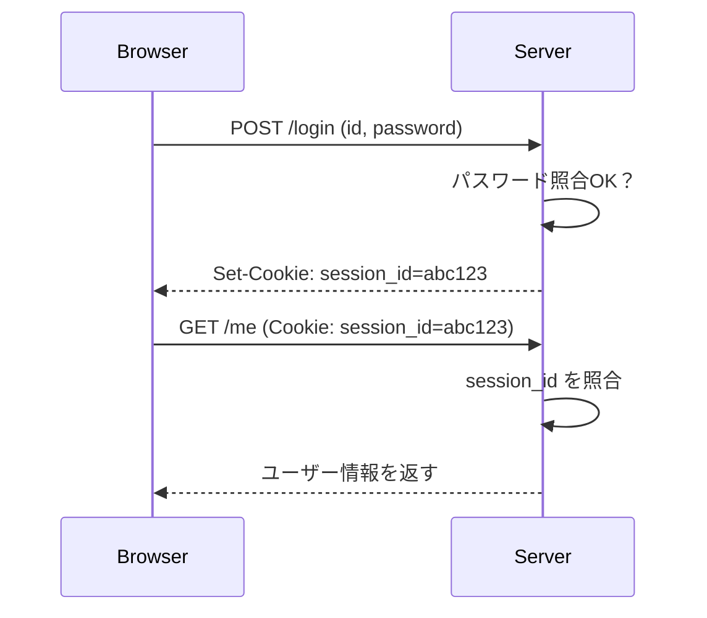
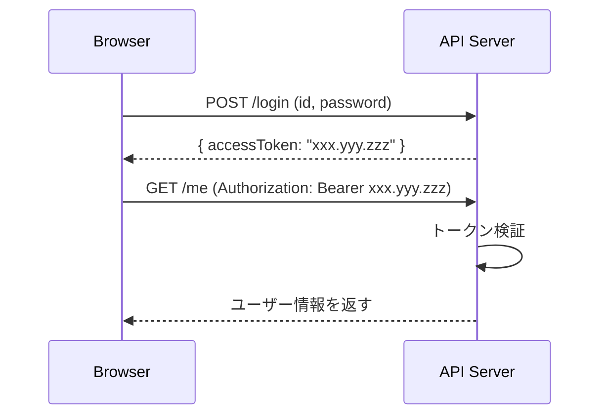
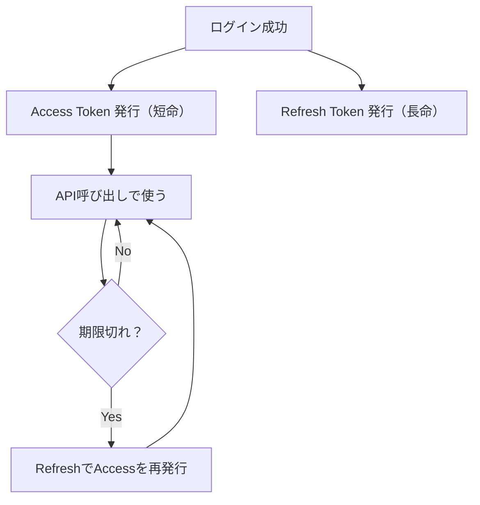

# 第191章：そもそも「ログイン」って裏で何してるの？

こんにちは〜！今日は「ログインの正体」を、ふわっと理解できるように分解していくよ😊✨
この章を読めば、Supabase/Firebaseみたいな認証サービスを使うときも「今なにが起きてる？」が見えるようになるよ〜！👀💡

---

## 1) まず結論：ログインは「合言葉チェック」＋「合格証を渡す」🎫✅

ログインって、実はこの2段階！

1. **本人確認（Authentication）**：ID/パスワードが合ってる？🔍
2. **合格証（ログイン済みの証拠）を渡す**：次から「この人ログイン済みだよ」って分かるようにする🎫

この「合格証」が、だいたい **クッキー🍪** か **トークン🔑** だよ！

---

## 2) 用語をサクッと整理🧠✨

* **Cookie（クッキー）🍪**：ブラウザが持てる小さなメモ。リクエストのたびに自動で送れる（設定次第）。
* **Session（セッション）🪪**：サーバー側で「ログイン中リスト」を持つ方式。
* **Token（トークン）🔑**：ログイン済みの証拠の文字列。サーバーに送って「私はログイン済み！」って示す。
* **JWT（ジョット）🧾**：よくあるトークン形式のひとつ。中に情報が入ってることが多い（署名付き）。

※ ざっくりでOK！この章は「仕組みの全体像」がゴールだよ😊

---

## 3) パターンA：セッションCookie方式（王道）🍪👑

### 何が起きてるの？

* パスワードが合ったら、サーバーが **セッションID** を発行
* ブラウザはそれを **Cookie** として保存
* 次からアクセスするたびに、ブラウザが **自動でCookieを送る**
* サーバーはセッションIDを見て「あ、ログイン中だね！」って判定



### いいところ🌸

* Cookieが自動送信でラク🍪✨
* **HttpOnly Cookie** にすると、JSから読めない（ちょっと安全）🛡️

### 注意ポイント⚠️

* **CSRF**（別サイトから勝手にリクエストされる）対策が必要になりがち
  → SameSite設定やCSRFトークンなど（ここは後の章で深掘りでOK！）

---

## 4) パターンB：トークン方式（APIっぽい）🔑📡

### 何が起きてるの？

* ログイン成功したら、サーバーが **アクセストークン** を渡す
* 以後はリクエストに **Authorization: Bearer ...** を付けて送る
* サーバーがトークンを検証して「ログイン済み！」と判断



### いいところ🌟

* API設計と相性よし📦
* サーバーを分ける構成でも扱いやすい（フロントとAPIが別とか）🧩

### 注意ポイント⚠️

* トークンを **どこに保存する？** 問題がある

  * `localStorage`：ラクだけど **XSS** に弱くなりがち😢
  * **HttpOnly Cookie**：JSから触れないので安全寄り🛡️（でもCSRFの話が戻ってくる）
  * メモリ（状態管理）：安全寄りだけど、リロードで消える🔄

---

## 5) 「アクセストークン」と「リフレッシュトークン」ってなに？🔁🔐

よくある設計はこれ！

* **アクセストークン**：短命（例：15分）⌛
* **リフレッシュトークン**：長命（例：数日〜数週間）🗓️

  * アクセストークンが切れたら、リフレッシュトークンで再発行してもらう



※ Supabase/FirebaseみたいなBaaSは、このへんを“いい感じに”やってくれることが多いよ😊✨

---

## 6) 体感しよう：ブラウザで「証拠」を見てみる👀🍪🔑（Windows）

Chrome想定でいくね！（Edgeでもほぼ同じだよ）

### Cookieを見る🍪

1. 対象サイトを開く
2. **F12**（開発者ツール）
3. **Application** タブ
4. 左の **Cookies** を開く
   → `session` とか `token` っぽいのがあったら、それが「合格証」かも！🎫✨

### localStorageを見る🧺

同じく **Application** → **Local Storage**
→ `accessToken` とかが入ってたら、トークン方式の可能性があるよ🔑

---

## 7) React的には「ログイン状態」ってどこに置くの？🧩✨

超ざっくり、よくある置き場👇

* **メモリ（React state / Zustand）**：安全寄り＆扱いやすい😊

  * 欠点：リロードで消える🔄
* **localStorage**：永続で便利✨

  * 欠点：XSSに弱くなりがち⚠️
* **Cookie（HttpOnly推奨）**：JSから読めないので安全寄り🛡️

  * 欠点：CSRF対策がテーマになることがある⚠️

この教材の後半（特に認証サービス利用）では、**「自分で全部抱えない」設計**も紹介するよ〜😌🌸

---

## 8) ミニ練習：ログインの“雰囲気”だけ作ってみる😊🎮

※これは仕組み理解用の「おもちゃ」だよ！本番はBaaSやAPIとつなぐよ〜🔌✨

### やること

* 「ログイン」ボタンを押したら、擬似トークンを受け取ったことにして保存
* ログイン中だけ「ようこそ！」を表示

```tsx
// src/App.tsx
import { useState } from "react";

type User = {
  name: string;
};

type AuthState =
  | { status: "loggedOut" }
  | { status: "loggedIn"; user: User; accessToken: string };

async function fakeLogin(): Promise<{ user: User; accessToken: string }> {
  // 本当はここでAPIにPOST /login するイメージだよ🔌
  await new Promise((r) => setTimeout(r, 600));
  return {
    user: { name: "Akari" },
    accessToken: "FAKE_ACCESS_TOKEN_123",
  };
}

export default function App() {
  const [auth, setAuth] = useState<AuthState>({ status: "loggedOut" });

  const handleLogin = async () => {
    const result = await fakeLogin();
    setAuth({ status: "loggedIn", ...result });
  };

  const handleLogout = () => {
    setAuth({ status: "loggedOut" });
  };

  return (
    <div style={{ padding: 24, fontFamily: "sans-serif" }}>
      <h1>ログインのしくみ体験✨</h1>

      {auth.status === "loggedOut" ? (
        <>
          <p>いまはログアウト中だよ〜🥺</p>
          <button onClick={handleLogin}>ログインする🔑</button>
        </>
      ) : (
        <>
          <p>ようこそ、{auth.user.name} さん🎉</p>
          <p style={{ fontSize: 12 }}>
            （合格証の例）accessToken: {auth.accessToken}
          </p>
          <button onClick={handleLogout}>ログアウトする👋</button>
        </>
      )}
    </div>
  );
}
```

この例だと「合格証（トークン）」は **Reactの状態（メモリ）** にあるよ🧠✨
だからリロードすると消えるのも体験できるはず！🔄

---

## 9) まとめ✨（この章で覚えれば勝ち！🏆）

* ログインは **本人確認**＋**合格証を渡す** 🎫
* 合格証の代表が **Cookie🍪** と **Token🔑**
* セッションCookie方式：サーバーがログイン状態を持つ（CookieでIDだけ持つ）
* トークン方式：クライアントがトークンを持って提示する
* 「保存場所」と「安全（XSS/CSRF）」がセットで考えるポイント🛡️

---

## ちょいクイズ🎓✨（答えはすぐ下！）

1. ログインの「合格証」って何のため？
2. Cookie方式とトークン方式、いちばん違うのどこ？
3. `localStorage` 保存が便利な理由と注意点は？

**答え📝**

1. 次のリクエストでも「ログイン済み」を証明するため🎫
2. ログイン状態を主に **サーバーが持つ（セッション）** のか、**クライアントが持つ（トークン）** のか🔁
3. リロードしても残るのが便利✨ でもXSSが起きると盗まれるリスクが上がりがち⚠️

---

次の章（第192章）では、Supabase/FirebaseみたいなBaaSで「認証をサクッと実装」する方向に進むよ〜！🚀💖
