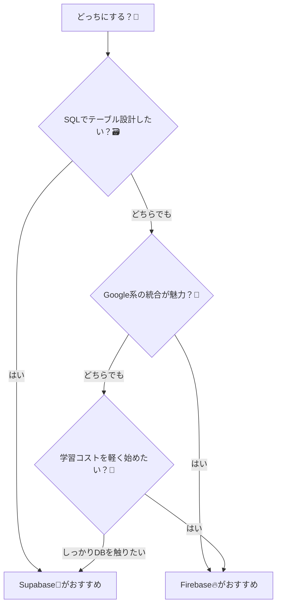
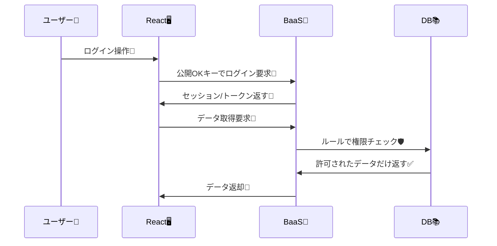

# 第192章：BaaS (Supabase/Firebase) という選択肢

この章では「ログイン付きアプリ」を作るときに、**自分でサーバーを書かずに**進められる選択肢＝**BaaS**を紹介するよ〜！😊💡
（次の章から、いよいよ実装に入っていく準備章だよ🧰✨）

---

## 1) BaaSってなに？🤔📦

**BaaS = Backend as a Service**
ざっくり言うと…

> 「ログイン」「データベース」「ファイル置き場」「権限管理」みたいな
> **裏側の面倒な部分を、まるっと用意してくれるサービス** 🎁✨

Reactは画面づくりが得意だけど、**ログイン**や**ユーザー情報の保存**って「裏側（バックエンド）」が必要になるのね🧠🔧
そこで BaaS を使うと、**バックエンドを自作しなくても**かなりのところまで作れちゃうよ！

---

## 2) 「普通に作る」と、こうなる😇➡️😵

「ログイン機能」って、表に見えてない作業が多い…！

* ユーザー登録・ログイン処理
* パスワードの安全な保存（ハッシュ化）
* セッション管理（ログイン状態の維持）
* DB設計（usersテーブルとか）
* 権限（他人のデータ見えないように）
* メール確認、パスワードリセット…

これを全部自作すると、最初はかなり大変🥹💦

---

## 3) BaaSを使うと、こうなる😍⚡

BaaSが「裏側の定番セット」を持ってるから、React側は **UIに集中**できるよ🎨✨

```mermaid
flowchart LR
  A[Reactアプリ🖥️] -->|ログイン/データ取得| B[BaaS🧩]
  B --> C[認証(Auth)🔐]
  B --> D[DB📚]
  B --> E[Storage🗂️]
  B --> F[権限ルール🛡️]
```

---

## 4) Supabase と Firebase で、何が違うの？🆚✨

どっちも「ログイン付きアプリ」を作れる超有力候補だよ🙌
違いは“データの考え方”が大きい！

| 項目    | Supabase 🐘              | Firebase 🔥               |
| ----- | ------------------------ | ------------------------- |
| データ   | **SQL（PostgreSQL）**が中心📚 | **NoSQL（Firestore）**が中心📦 |
| 好み    | テーブル設計・SQLが好きなら相性◎       | ドキュメント型が好きなら相性◎           |
| 認証    | Authあり🔐                 | Authあり🔐（超定番）             |
| 権限    | **DB側で細かく制御**しやすい🛡️     | **Security Rules**で制御🛡️  |
| 使いどころ | “ちゃんとDB”を感じたい時           | “サクッと爆速”で作りたい時            |

どっちが正解、じゃなくて「向いてる方向」が違うって感じだよ😊✨

---

## 5) 3分で決める！どっちを選ぶ？🧭💖



迷ったら…

* **SQLが好き**→ Supabase 🐘
* **スピード感で作りたい**→ Firebase 🔥
  こんな決め方でもOKだよ〜😊🌸

---

## 6) 超大事：BaaSは「鍵の扱い」で事故る🔑⚠️

BaaSはブラウザ（React）から直接使うことも多いんだけど、そこで大事なのがこれ👇

* ✅ **公開してよいキー**（ブラウザに置いてOK）
* ❌ **公開しちゃダメなキー**（サーバー専用）

この区別を間違えると、最悪 **誰でもDBを操作できちゃう**みたいな事故が起きる😭💥

なので原則はこう👇

* ブラウザには「公開OKキー」だけ置く
* データを守るのは **ルール（権限設定）**でやる🛡️✨



---

## 7) ミニ実習：とりあえず「接続」だけしてみよ！🔌✨

ここでは「ログイン実装」は次章以降に回して、まず **SDK導入→接続準備**だけやるよ😊
（どっちか片方だけでOK！✨）

---

### A) Supabase を選ぶ場合 🐘💙

#### ① SDKを入れる📦

```bash
npm i @supabase/supabase-js
```

#### ② 環境変数を用意（Vite）🔐

プロジェクト直下に `.env.local` を作って👇

```env
VITE_SUPABASE_URL="あなたのSupabase URL"
VITE_SUPABASE_ANON_KEY="あなたのanon key"
```

#### ③ クライアントを作る（おすすめ配置：`src/lib/`）🧰

`src/lib/supabaseClient.ts`

```ts
import { createClient } from "@supabase/supabase-js";

const supabaseUrl = import.meta.env.VITE_SUPABASE_URL as string;
const supabaseAnonKey = import.meta.env.VITE_SUPABASE_ANON_KEY as string;

export const supabase = createClient(supabaseUrl, supabaseAnonKey);
```

#### ④ 接続チェック（ログイン状態だけ見る）👀

`src/App.tsx` に、表示だけ入れてみるよ✨（まだログインUIは作らない）

```tsx
import { useEffect, useState } from "react";
import { supabase } from "./lib/supabaseClient";

export default function App() {
  const [status, setStatus] = useState("確認中…🌀");

  useEffect(() => {
    const run = async () => {
      const { data } = await supabase.auth.getSession();
      setStatus(data.session ? "ログイン中✅" : "未ログイン🙂");
    };
    run();
  }, []);

  return (
    <div style={{ padding: 24 }}>
      <h1>第192章：BaaS 接続チェック🐘</h1>
      <p>状態：{status}</p>
    </div>
  );
}
```

これで画面に「未ログイン🙂」って出たら、接続準備はOK🎉✨
（ログインできるようにするのは次章でやるよ！）

---

### B) Firebase を選ぶ場合 🔥🧡

#### ① SDKを入れる📦

```bash
npm i firebase
```

#### ② 環境変数を用意（Vite）🔐

`.env.local` にこういうのを置くよ（値はFirebaseコンソールから）👇

```env
VITE_FIREBASE_API_KEY="..."
VITE_FIREBASE_AUTH_DOMAIN="..."
VITE_FIREBASE_PROJECT_ID="..."
VITE_FIREBASE_APP_ID="..."
```

#### ③ 初期化ファイルを作る🧰

`src/lib/firebase.ts`

```ts
import { initializeApp } from "firebase/app";
import { getAuth } from "firebase/auth";

const firebaseConfig = {
  apiKey: import.meta.env.VITE_FIREBASE_API_KEY as string,
  authDomain: import.meta.env.VITE_FIREBASE_AUTH_DOMAIN as string,
  projectId: import.meta.env.VITE_FIREBASE_PROJECT_ID as string,
  appId: import.meta.env.VITE_FIREBASE_APP_ID as string,
};

const app = initializeApp(firebaseConfig);
export const auth = getAuth(app);
```

#### ④ 接続チェック（ログイン状態だけ見る）👀

`src/App.tsx`

```tsx
import { useEffect, useState } from "react";
import { onAuthStateChanged } from "firebase/auth";
import { auth } from "./lib/firebase";

export default function App() {
  const [status, setStatus] = useState("確認中…🌀");

  useEffect(() => {
    const unsub = onAuthStateChanged(auth, (user) => {
      setStatus(user ? "ログイン中✅" : "未ログイン🙂");
    });
    return () => unsub();
  }, []);

  return (
    <div style={{ padding: 24 }}>
      <h1>第192章：BaaS 接続チェック🔥</h1>
      <p>状態：{status}</p>
    </div>
  );
}
```

これで「未ログイン🙂」が出れば、準備OK🎉✨

---

## 8) よくあるミス集（ここで詰まりがち😵‍💫）🧷

* `.env.local` を作ったのに反映されない
  → ✅ **Viteは再起動が必要**なこと多いよ！`npm run dev` し直してね🔁

* 環境変数の名前が `VITE_` で始まってない
  → ✅ Viteは `VITE_` がついてないと読めないよ〜😭

* キーを置いたのに動かない
  → ✅ まず「文字列が空じゃないか」をチェックしよ（コピペ事故あるある）📋💦

---

## 9) まとめ🎀✨

* BaaSは「ログイン付きアプリ」の裏側を一気にラクにしてくれる🧩✨
* Supabase🐘 は SQL・ちゃんとDB派に相性よし
* Firebase🔥 は スピード感・統合の強さが魅力
* ブラウザに置くキーは **公開OKのものだけ**、守るのは **権限ルール**🛡️

次の章（第193章）からは「ログインしてない人を追い返す」＝**保護されたルート**に入るよ！🚪🔐✨
