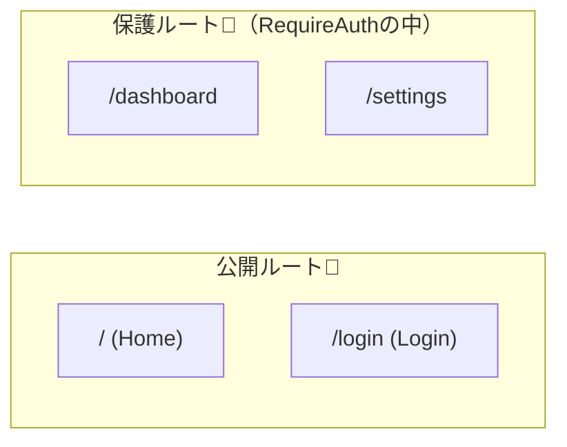

# 第193章：保護されたルート (Private Route)

ログインしてない人が「マイページ」みたいな場所に入ろうとしたら…
**「ごめんね！まずログインしてね🙂」ってログイン画面に送り返す**仕組みを作るよ〜✨

> これ、**UX（使いやすさ）**のためのガードだよ💡
> 本当の安全は **API側でも必ず認可チェック**（トークン検証など）しようね🔒

---

## 今日つくるもの🎁✨

* `/dashboard` と `/settings` を **ログイン済みの人だけ**見られるようにする👀
* 未ログインでアクセスしたら `/login` へ **リダイレクト**🚀
* ログイン成功したら **元々行こうとしてたページに戻す**↩️✨（ここ大事！）

---

## ざっくり流れ（図解）🗺️✨

```mermaid
flowchart TD
  A[ユーザーが /dashboard にアクセス] --> B{ログインしてる？}
  B -- はい😊 --> C[/dashboard を表示✨/]
  B -- いいえ🙅‍♀️ --> D[/login にリダイレクト🚪/]
  D --> E[ログイン成功🔑]
  E --> F[元のページへ戻す (state.from)↩️]
  F --> C
```

---

## 使うルータの前提🧭

* `react-router-dom` は **v7系が最新**（v6→v7は「非破壊アップグレード」で基本は同じ考え方のまま使えるよ） ([reactrouter.com][1])

---

## 手順0：もし未導入ならインストール（すでにあるならスキップOK）💨

```bash
npm i react-router-dom
```

---

## 手順1：AuthProvider（ログイン状態の置き場）を作る🧺✨

📁 `src/auth/AuthProvider.tsx`

```tsx
import React, { createContext, useContext, useMemo, useState } from "react";

export type User = { id: string; name: string };

type AuthContextValue = {
  user: User | null;
  login: (name: string) => Promise<void>;
  logout: () => void;
};

const AuthContext = createContext<AuthContextValue | null>(null);

export function AuthProvider({ children }: { children: React.ReactNode }) {
  const [user, setUser] = useState<User | null>(null);

  // 本物の認証(Firebase/Supabase)ならここが「ログイン処理」に置き換わるよ🙂
  const login = async (name: string) => {
    await new Promise((r) => setTimeout(r, 400)); // ちょい待ち演出✨
    setUser({ id: crypto.randomUUID(), name });
  };

  const logout = () => setUser(null);

  const value = useMemo(() => ({ user, login, logout }), [user]);

  return <AuthContext.Provider value={value}>{children}</AuthContext.Provider>;
}

export function useAuth() {
  const ctx = useContext(AuthContext);
  if (!ctx) throw new Error("useAuth must be used inside <AuthProvider>");
  return ctx;
}
```

---

## 手順2：Private Route（門番）を作る🚪👮‍♀️

ここが本題！✨
ログイン済みなら中へ通して、未ログインなら `/login` に送るよ〜🚀

📁 `src/routes/RequireAuth.tsx`

```tsx
import { Navigate, Outlet, useLocation } from "react-router-dom";
import { useAuth } from "../auth/AuthProvider";

export function RequireAuth() {
  const { user } = useAuth();
  const location = useLocation();

  if (!user) {
    // state.from に「元いた場所」を入れておくのがコツ✨
    return <Navigate to="/login" replace state={{ from: location }} />;
  }

  // OKなら子ルートを表示（これがOutletの役目）✨
  return <Outlet />;
}
```

---

## 手順3：Loginページで「元のページへ戻る」を実装↩️🔑

📁 `src/pages/LoginPage.tsx`

```tsx
import { FormEvent, useState } from "react";
import { Location, useLocation, useNavigate } from "react-router-dom";
import { useAuth } from "../auth/AuthProvider";

type LocationState = { from?: Location };

export function LoginPage() {
  const [name, setName] = useState("");
  const { login } = useAuth();

  const navigate = useNavigate();
  const location = useLocation();
  const state = location.state as LocationState | null;

  // 行き先が分かればそこへ、なければダッシュボードへ✨
  const fromPath = state?.from?.pathname ?? "/dashboard";

  const onSubmit = async (e: FormEvent) => {
    e.preventDefault();
    await login(name.trim() || "ゲスト");
    navigate(fromPath, { replace: true });
  };

  return (
    <div style={{ padding: 24 }}>
      <h1>ログイン🔑</h1>

      <form onSubmit={onSubmit} style={{ display: "grid", gap: 12, maxWidth: 320 }}>
        <label style={{ display: "grid", gap: 6 }}>
          <span>おなまえ🙂</span>
          <input
            value={name}
            onChange={(e) => setName(e.target.value)}
            placeholder="例：あやか"
          />
        </label>

        <button type="submit">ログインする✨</button>
      </form>

      <p style={{ marginTop: 16 }}>
        ログインしたら、もともと行こうとしたページに戻るよ〜↩️💖
      </p>
    </div>
  );
}
```

---

## 手順4：保護したいRouteを `<RequireAuth>` の中に入れる🧩✨

こんなイメージ👇



📁 `src/App.tsx`

```tsx
import { Link, Route, Routes } from "react-router-dom";
import { RequireAuth } from "./routes/RequireAuth";
import { LoginPage } from "./pages/LoginPage";

function HomePage() {
  return (
    <div style={{ padding: 24 }}>
      <h1>Home🏠</h1>
      <p>上のリンクから遊んでみてね✨</p>
    </div>
  );
}

function DashboardPage() {
  return (
    <div style={{ padding: 24 }}>
      <h1>Dashboard📊（保護）</h1>
      <p>ログインできてる人だけ見えるよ〜✨</p>
    </div>
  );
}

function SettingsPage() {
  return (
    <div style={{ padding: 24 }}>
      <h1>Settings⚙️（保護）</h1>
      <p>ここもログイン必須🙂</p>
    </div>
  );
}

export default function App() {
  return (
    <>
      <nav style={{ display: "flex", gap: 12, padding: 12 }}>
        <Link to="/">Home🏠</Link>
        <Link to="/dashboard">Dashboard🔐</Link>
        <Link to="/settings">Settings🔐</Link>
        <Link to="/login">Login🔑</Link>
      </nav>

      <Routes>
        {/* 公開ルート */}
        <Route path="/" element={<HomePage />} />
        <Route path="/login" element={<LoginPage />} />

        {/* 保護ルート（ここがポイント✨） */}
        <Route element={<RequireAuth />}>
          <Route path="/dashboard" element={<DashboardPage />} />
          <Route path="/settings" element={<SettingsPage />} />
        </Route>

        <Route path="*" element={<div style={{ padding: 24 }}>Not Found🥲</div>} />
      </Routes>
    </>
  );
}
```

---

## 手順5：`main.tsx` で Provider を上に置く👑✨

📁 `src/main.tsx`

```tsx
import React from "react";
import ReactDOM from "react-dom/client";
import { BrowserRouter } from "react-router-dom";
import App from "./App";
import { AuthProvider } from "./auth/AuthProvider";
import "./index.css";

ReactDOM.createRoot(document.getElementById("root")!).render(
  <React.StrictMode>
    <BrowserRouter>
      <AuthProvider>
        <App />
      </AuthProvider>
    </BrowserRouter>
  </React.StrictMode>
);
```

---

## 動作チェック✅🎉

1. `npm run dev` で起動▶️
2. 未ログインで `/dashboard` を開く
   → `/login` に飛ばされる🚀
3. ログインする
   → 元々行こうとしてた `/dashboard` に戻る↩️✨

---

## よくある落とし穴💥（回避しよ〜🙂）

### 1) 無限リダイレクト♾️

* `/login` 自体を保護しない（保護の中に入れない）
* 未ログイン時は `Navigate`、ログイン時は `Outlet` で分岐する

### 2) ちらつき（ログイン確認が非同期のとき）✨

Firebase みたいに「最初にログイン済みか確認する」タイプだと、確認中は一旦ローディング表示にするのが定番だよ〜⏳
（この章では次の第194章で“ログイン状態の維持”をやるから、そこで本格対応すると最高！）

---

## ミニ課題📝💖

* `/profile` ページを追加して、同じように保護してみよう🔐
* `Home` に「ログアウト」ボタンを付けてみよう🚪✨（AuthProviderの `logout()` を呼ぶだけ！）

---

## まとめ🎀✨

* Private Route は **「門番コンポーネント」**を作るだけでOK🚪
* `Outlet` で「通す」、`Navigate` で「追い返す」👮‍♀️
* `state.from` を使うと「ログイン後に元のページへ戻す」ができて気持ちいい↩️💕

次の第194章で、**リロードしてもログインが残る**ようにして完成度を上げよ〜🔥✨

[1]: https://reactrouter.com/?utm_source=chatgpt.com "React Router Official Documentation"
