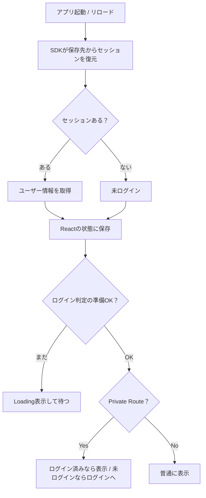

# 第194章：ログイン状態の維持

この章は「**ログイン済みなのに、ページ更新（F5）したらログアウト扱いになる問題**」をキレイに直す回だよ〜！🙌💕

---

## 1) なんでリロードするとログアウトしたように見えるの？🤔💭

結論：**「ログイン情報の読み込みが“非同期”で一瞬遅れる」**のが原因になりがち！⚡

* アプリ起動直後は、まだ「ログイン中か？」が確定してない
* でも Private Route が先に動いて「未ログインだ！」って判断しちゃう
* 結果：ログインページへ飛ばされる（チラつき／誤判定）😵‍💫

なので必要なのはこれ👇
✅ **“ログイン状態を読み込み中”の間は、判定を保留する（Loading を出す）**

---

## 2) 仕組みを図でつかむよ〜📌（Mermaid）

（※SupabaseでもFirebaseでも考え方は同じ！）



ポイントは「**準備OK？**」のところ！ここを作るのが第194章のゴールだよ🥳✨

---

## 3) 実装（Supabase 例）🧩💙

Supabase は「セッションを保存（localStorage/cookiesなど）→ 起動時に復元」してくれて、getSession で今のセッションを取り出せるよ、って公式に書いてあるよ📌 ([Supabase][1])
さらに onAuthStateChange でログイン/ログアウトなどのイベントも拾えるよ📣 ([Supabase][2])

### 3-0) 環境変数を用意（Vite）🧪

Vite は **VITE_ で始まる環境変数だけ**をフロントに公開するルールだよ！ ([vitejs][3])

プロジェクト直下に「.env.local」を作って👇

```text
VITE_SUPABASE_URL=あなたのSupabaseURL
VITE_SUPABASE_ANON_KEY=あなたのanonキー
```

※書いたら dev サーバーは再起動してね😉🔁（環境変数が読み直される）

---

### 3-1) Supabaseクライアントを作る（src/lib/supabase.ts）🧠

```ts
// src/lib/supabase.ts
import { createClient } from "@supabase/supabase-js";

const supabaseUrl = import.meta.env.VITE_SUPABASE_URL as string;
const supabaseAnonKey = import.meta.env.VITE_SUPABASE_ANON_KEY as string;

export const supabase = createClient(supabaseUrl, supabaseAnonKey);
```

---

### 3-2) AuthProvider を作る（最重要）🛡️✨

「起動時にセッションを読み込む」＋「ログイン状態の変化を購読する」＋「準備完了フラグを持つ」！

```tsx
// src/auth/AuthProvider.tsx
import React, { createContext, useContext, useEffect, useMemo, useState } from "react";
import type { Session, User } from "@supabase/supabase-js";
import { supabase } from "../lib/supabase";

type AuthContextValue = {
  ready: boolean;       // ← ここが第194章の主役！
  session: Session | null;
  user: User | null;
};

const AuthContext = createContext<AuthContextValue | undefined>(undefined);

export function AuthProvider({ children }: { children: React.ReactNode }) {
  const [ready, setReady] = useState(false);
  const [session, setSession] = useState<Session | null>(null);
  const [user, setUser] = useState<User | null>(null);

  useEffect(() => {
    let mounted = true;

    // ① 起動時：保存先からセッションを復元して取り出す
    (async () => {
      const { data, error } = await supabase.auth.getSession();
      if (!mounted) return;

      if (error) {
        console.error("getSession error:", error);
      }

      const s = data.session ?? null;
      setSession(s);
      setUser(s?.user ?? null);
      setReady(true); // ← 取り出し終わったら「準備OK」
    })();

    // ② ログイン/ログアウトなどの変化を購読
    const { data: sub } = supabase.auth.onAuthStateChange((_event, newSession) => {
      setSession(newSession);
      setUser(newSession?.user ?? null);
      setReady(true); // 念のため、ここでもOKにしておく
    });

    // ③ お片付け
    return () => {
      mounted = false;
      sub.subscription.unsubscribe();
    };
  }, []);

  const value = useMemo<AuthContextValue>(
    () => ({ ready, session, user }),
    [ready, session, user]
  );

  return <AuthContext.Provider value={value}>{children}</AuthContext.Provider>;
}

export function useAuth() {
  const ctx = useContext(AuthContext);
  if (!ctx) throw new Error("useAuth must be used within AuthProvider");
  return ctx;
}
```

※外部の仕組み（SDKの状態）と同期するのに useEffect を使うのはまさに王道の使い方だよ〜📌 ([react.dev][4])

---

### 3-3) Private Route を「ready対応」にする（チラつき対策）🚧✨

「ready が false の間は判定しない」を徹底するよ！

```tsx
// src/routes/PrivateRoute.tsx
import React from "react";
import { Navigate } from "react-router-dom";
import { useAuth } from "../auth/AuthProvider";

export function PrivateRoute({ children }: { children: React.ReactNode }) {
  const { ready, user } = useAuth();

  if (!ready) {
    return <div style={{ padding: 24 }}>読み込み中…⏳</div>;
  }

  if (!user) {
    return <Navigate to="/login" replace />;
  }

  return <>{children}</>;
}
```

---

### 3-4) ルートに組み込む（src/main.tsx と App など）🧷

```tsx
// src/main.tsx
import React from "react";
import ReactDOM from "react-dom/client";
import { BrowserRouter } from "react-router-dom";
import { AuthProvider } from "./auth/AuthProvider";
import App from "./App";

ReactDOM.createRoot(document.getElementById("root")!).render(
  <React.StrictMode>
    <BrowserRouter>
      <AuthProvider>
        <App />
      </AuthProvider>
    </BrowserRouter>
  </React.StrictMode>
);
```

そして保護したいページをこう👇

```tsx
// 例：App.tsx のルート定義イメージ
import { Routes, Route } from "react-router-dom";
import { PrivateRoute } from "./routes/PrivateRoute";

import LoginPage from "./pages/LoginPage";
import HomePage from "./pages/HomePage";
import SecretPage from "./pages/SecretPage";

export default function App() {
  return (
    <Routes>
      <Route path="/login" element={<LoginPage />} />
      <Route path="/" element={<HomePage />} />
      <Route
        path="/secret"
        element={
          <PrivateRoute>
            <SecretPage />
          </PrivateRoute>
        }
      />
    </Routes>
  );
}
```

---

## 4) 動作チェック ✅🎉

1. ログインする🔑
2. /secret に入れる（OK）😎
3. **F5で更新**する🌀
4. ちゃんと /secret のまま（Loading が一瞬出てもOK）✨
5. ログアウトしたら /login に飛ぶ（OK）🚪

これで「リロードでログアウト扱い」問題はほぼ解決〜！やったー！🥳💕

---

## 5) Firebase の場合は？🔥（超ざっくり要点）

Firebase は「ログイン状態を保存する種類（local / session / none）」があって、local を選べばブラウザを閉じても保持されるよ📌 ([Firebase][5])
実装の形は同じで👇

* 起動時：onAuthStateChanged で「今のユーザー」を受け取る
* その結果が来るまで ready=false（Loading）
* 来たら ready=true にする

やることは**Supabase版とほぼ一緒**だよ〜😊🌸

---

## 6) つまずきポイント集（あるある）😵‍💫🧯

* **F5直後にログインページへ飛ぶ**
  → ready を作ってない or ready を待たずに Private Route が判定してる可能性大⚠️

* **環境変数が undefined**
  → .env.local のキー名が VITE_ で始まってない、またはサーバー再起動忘れが多いよ📌 ([vitejs][3])

* **「保存されてない気がする」**
  → ブラウザのプライベートモード／拡張機能／設定でストレージ制限があることも🫣

---

## 7) ミニ課題（かわいく強くなる💪💕）

### 課題A 🌷

Loading 表示を「ふわふわ」した見た目にしてみよう（文字＋絵文字＋余白だけでOK）✨

### 課題B 🍀

「ログイン中のユーザー名（メール）」をヘッダーに出してみよう
（useAuth() で user を読むだけ！）

---

必要なら、次の第195章（プロフィール取得）へつながる形で「ユーザー情報をDBから読む設計」もキレイに組んでいけるよ〜📚✨

[1]: https://supabase.com/docs/reference/javascript/auth-getsession?utm_source=chatgpt.com "JavaScript: Retrieve a session"
[2]: https://supabase.com/docs/reference/javascript/auth-onauthstatechange?utm_source=chatgpt.com "JavaScript: Listen to auth events | Supabase Docs"
[3]: https://vite.dev/guide/env-and-mode?utm_source=chatgpt.com "Env Variables and Modes - Vite"
[4]: https://react.dev/reference/react/useEffect?utm_source=chatgpt.com "useEffect"
[5]: https://firebase.google.com/docs/auth/web/auth-state-persistence?utm_source=chatgpt.com "Authentication State Persistence | Firebase - Google"
