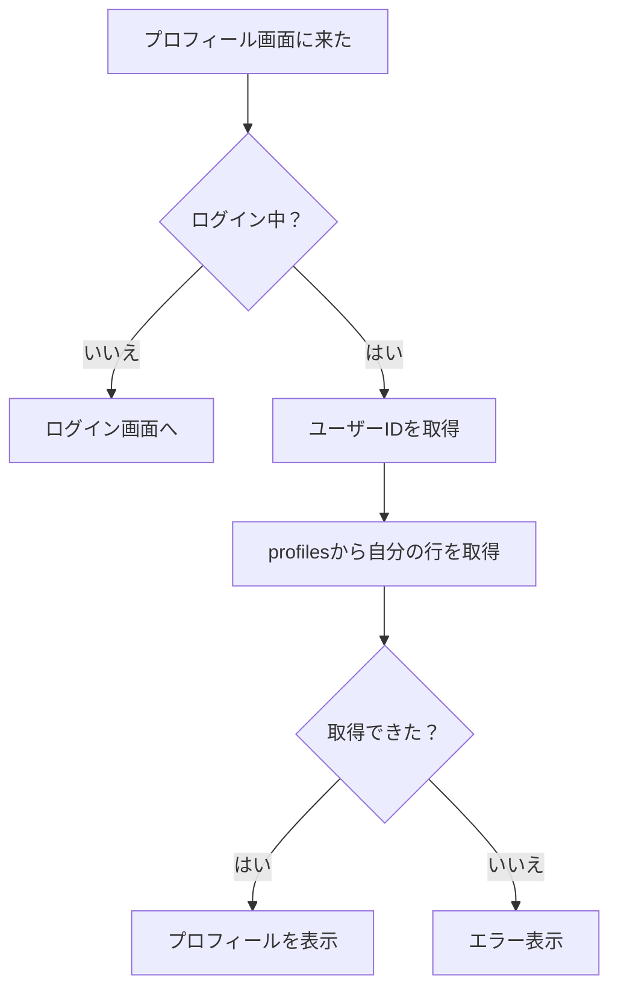
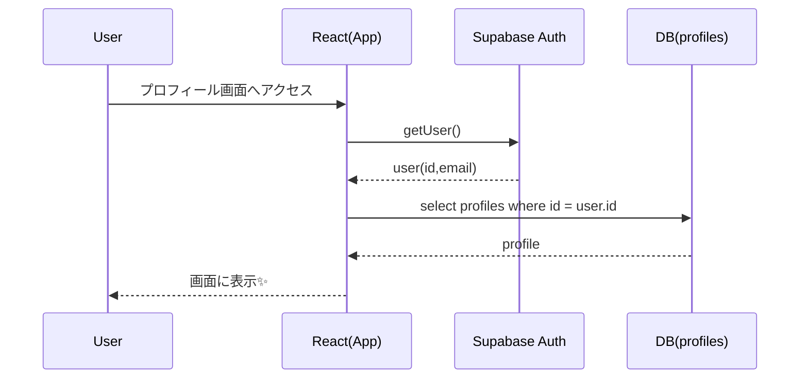

# 第195章：ユーザープロフィールの取得と表示

今日は「ログイン中のユーザーのプロフィール」をDBから取ってきて、画面に表示します😊
（例：表示名・自己紹介・アバターなど）🪄

ここでは **Supabase** を例にします（Firebaseでも考え方はほぼ同じだよ！）🔥

---

## この章のゴール 🎯

* ✅ ログイン中ユーザーの `id` を取れる
* ✅ `profiles` テーブルから自分のプロフィールを取得できる
* ✅ ローディング中/エラー時も“それっぽく”表示できる

---

## 全体の流れ（図解）🗺️



---

## 1) Supabase側：profilesテーブルを用意する 🐘🛠️

Supabaseでは、`auth.users` は直接APIで触れないので、**publicスキーマに profiles を作る**のが定番です。([Supabase][1])
さらに **RLS（行レベルセキュリティ）** をONにして「本人だけ見れる」ようにします🔐([Supabase][2])

SupabaseのSQL Editorで、まずこれ👇（コピペOK）

```sql
create table if not exists public.profiles (
  id uuid primary key references auth.users(id) on delete cascade,
  username text,
  bio text,
  avatar_url text,
  updated_at timestamptz default now()
);

alter table public.profiles enable row level security;

-- 読み取り：自分のプロフィールだけOK
create policy "Profiles are readable by owner"
on public.profiles
for select
using (auth.uid() = id);

-- 更新：自分のプロフィールだけOK
create policy "Profiles are updatable by owner"
on public.profiles
for update
using (auth.uid() = id);
```

> 🔥ポイント：`id` を auth.users の `id` と一致させるのがラク！

---

## 2) フロント：Supabaseクライアントを作る 🔑

### インストール（Windows / PowerShellでもOK）💻

```powershell
npm i @supabase/supabase-js
```

### `.env.local` を作る（Vite）🧪

Viteは **`VITE_` で始まる環境変数だけ** フロントで読めます。([vitejs][3])

```env
VITE_SUPABASE_URL=https://xxxxxxxx.supabase.co
VITE_SUPABASE_ANON_KEY=xxxxxxxxxxxxxxxxxxxxxxxx
```

### `src/lib/supabase.ts`

```ts
import { createClient } from "@supabase/supabase-js";

const url = import.meta.env.VITE_SUPABASE_URL as string | undefined;
const anonKey = import.meta.env.VITE_SUPABASE_ANON_KEY as string | undefined;

if (!url || !anonKey) {
  throw new Error("Supabaseの環境変数が見つからないよ🥺 .env.local を確認してね！");
}

export const supabase = createClient(url, anonKey);
```

---

## 3) ログイン中ユーザーを取る 👤

Supabaseで「今のユーザー」を安全に取るなら `getUser()` が基本です。([Supabase][4])
（※フロントでもOK！）

### `src/features/auth/useCurrentUser.ts`

```ts
import { supabase } from "../../lib/supabase";

export async function getCurrentUser() {
  const { data, error } = await supabase.auth.getUser();
  if (error) throw error;
  return data.user; // ログインしてないなら null
}
```

---

## 4) プロフィールをDBから取る 📄✨

### 型を作る（TypeScript）🧩

`src/types/profile.ts`

```ts
export type Profile = {
  id: string;
  username: string | null;
  bio: string | null;
  avatar_url: string | null;
  updated_at: string | null;
};
```

### 取得関数を作る 🧲

`src/features/profile/getProfile.ts`

```ts
import { supabase } from "../../lib/supabase";
import type { Profile } from "../../types/profile";

export async function getProfile(userId: string): Promise<Profile> {
  const { data, error } = await supabase
    .from("profiles")
    .select("id, username, bio, avatar_url, updated_at")
    .eq("id", userId)
    .single();

  if (error) throw error;
  return data as Profile;
}
```

---

## 5) React v19らしく：`use` + `Suspense` で表示する 🌈😺

Reactの `use(Promise)` は、Promiseの結果を **レンダー中に読めて**、`Suspense` の `fallback` が効きます。([React][5])

ただし、毎回new Promiseだとつらいので、**Promiseをキャッシュ**します（ここ大事！）💡

### Promiseキャッシュ（超シンプル版）🧊

`src/features/profile/profileResource.ts`

```ts
import type { Profile } from "../../types/profile";
import { getProfile } from "./getProfile";

const cache = new Map<string, Promise<Profile>>();

export function getProfilePromise(userId: string) {
  const hit = cache.get(userId);
  if (hit) return hit;

  const p = getProfile(userId);
  cache.set(userId, p);
  return p;
}

// ログアウト時などに呼ぶ用（任意）
export function clearProfileCache() {
  cache.clear();
}
```

### エラーバウンダリ（最小）🧯

`src/components/ErrorBoundary.tsx`

```tsx
import React from "react";

type Props = {
  fallback?: React.ReactNode;
  children: React.ReactNode;
};

type State = {
  hasError: boolean;
};

export class ErrorBoundary extends React.Component<Props, State> {
  state: State = { hasError: false };

  static getDerivedStateFromError() {
    return { hasError: true };
  }

  render() {
    if (this.state.hasError) {
      return this.props.fallback ?? <p>エラーだよ〜🥺</p>;
    }
    return this.props.children;
  }
}
```

### プロフィール画面 💖

`src/pages/ProfilePage.tsx`

```tsx
import { Suspense, use } from "react";
import { getCurrentUser } from "../features/auth/useCurrentUser";
import { getProfilePromise } from "../features/profile/profileResource";
import { ErrorBoundary } from "../components/ErrorBoundary";

function ProfileContent() {
  const user = use(getCurrentUser()); // user or null
  if (!user) return <p>ログインしてないみたい…😢（ログイン画面へ）</p>;

  const profile = use(getProfilePromise(user.id));

  return (
    <div style={{ maxWidth: 520, margin: "24px auto", padding: 16 }}>
      <h1>プロフィール 👤✨</h1>

      <div style={{ display: "flex", gap: 12, alignItems: "center", marginTop: 12 }}>
        
        <div>
          <div style={{ fontSize: 18, fontWeight: "bold" }}>
            {profile.username ?? "（名前未設定）"}
          </div>
          <div style={{ opacity: 0.8 }}>{user.email}</div>
        </div>
      </div>

      <div style={{ marginTop: 16 }}>
        <h2>ひとこと 📝</h2>
        <p style={{ whiteSpace: "pre-wrap" }}>
          {profile.bio ?? "（自己紹介がまだないよ〜🙂）"}
        </p>
      </div>
    </div>
  );
}

export default function ProfilePage() {
  return (
    <ErrorBoundary fallback={<p>プロフィールの読み込みで失敗したよ🥺（RLSとかSQL見てみて！）</p>}>
      <Suspense fallback={<p>プロフィール読み込み中…⏳✨</p>}>
        <ProfileContent />
      </Suspense>
    </ErrorBoundary>
  );
}
```

---

## 取得のタイミング（シーケンス図）⏱️



---

## 動作チェック ✅🎉

1. `npm run dev` で起動
2. ログインした状態でプロフィール画面へ
3. `profiles` に自分の行が無い場合は、まだ表示できないので

   * Supabase側で `profiles` に行を作る
   * または「サインアップ時に自動作成」(次の章以降でやると気持ちいい😙)

---

## よくあるつまづき 🥺🧷

* **`profiles` が取れない（403/401）**
  → RLSポリシーが無い/間違いのことが多いよ🔐([Supabase][2])
* **`import.meta.env...` が `undefined`**
  → `.env.local` のキーが `VITE_` で始まってるか確認！([vitejs][3])
* **`use(Promise)` で無限に読み込み**
  → Promiseを毎回作ってるかも！今回みたいにキャッシュしよ🧊([React][6])

---

## ミニ練習（やってみよ〜🧠💪）

* ✅ `profiles` に `favorite_color`（好きな色）カラムを追加して表示 🎨
* ✅ `updated_at` を「最終更新：YYYY/MM/DD」みたいに整形して表示 📅
* ✅ 「プロフィール未作成なら作成画面へ」って分岐を入れてみる 🚪✨

---

次の章（第196章）で「ログイン/新規登録フォーム」を作るなら、**サインアップ直後にprofilesを自動作成**する流れにするとめっちゃ気持ちいいよ😆💖

[1]: https://supabase.com/docs/guides/auth/managing-user-data?utm_source=chatgpt.com "User Management | Supabase Docs"
[2]: https://supabase.com/docs/guides/database/postgres/row-level-security?utm_source=chatgpt.com "Row Level Security | Supabase Docs"
[3]: https://vite.dev/guide/env-and-mode?utm_source=chatgpt.com "Env Variables and Modes"
[4]: https://supabase.com/docs/reference/javascript/auth-getuser?utm_source=chatgpt.com "JavaScript: Retrieve a user"
[5]: https://react.dev/reference/react/use?utm_source=chatgpt.com "use"
[6]: https://react.dev/reference/react/Suspense?utm_source=chatgpt.com "<Suspense> – React"
