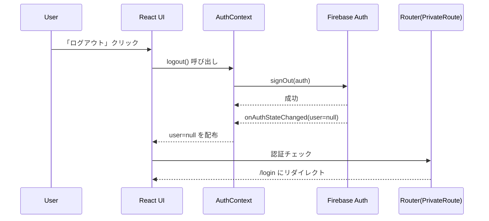

# 第197章：ログアウト機能

ログインできるようになったら、最後に必要なのが **ログアウト**だよね😊
この章では「ログアウトボタンを押したら、ちゃんとログアウトしてログイン画面に戻る」までを作るよ〜！🎀

---

## 今日のゴール 🎯

* ✅ ログアウトボタンを作る
* ✅ ログアウト時に認証状態（user）を `null` にする
* ✅ ログインが必要なページから自動で追い出す（/loginへ）
* ✅ 失敗したときにエラー表示できる

---

## ログアウトの流れ（図解）🗺️



---

## 1) `logout()` を用意する 🔧✨

すでにログイン状態を管理している `AuthContext` がある前提で、そこに `logout` を追加するのが一番キレイだよ〜🙂

### `src/contexts/AuthContext.tsx`（例）

```tsx
import React, { createContext, useContext, useEffect, useMemo, useState } from "react";
import { onAuthStateChanged, signOut, User } from "firebase/auth";
import { auth } from "../lib/firebase";

type AuthContextValue = {
  user: User | null;
  loading: boolean;
  logout: () => Promise<void>;
};

const AuthContext = createContext<AuthContextValue | null>(null);

export function AuthProvider({ children }: { children: React.ReactNode }) {
  const [user, setUser] = useState<User | null>(null);
  const [loading, setLoading] = useState(true);

  useEffect(() => {
    const unsub = onAuthStateChanged(auth, (u) => {
      setUser(u);
      setLoading(false);
    });
    return () => unsub();
  }, []);

  const logout = async () => {
    await signOut(auth);
  };

  const value = useMemo<AuthContextValue>(() => ({ user, loading, logout }), [user, loading]);

  return <AuthContext.Provider value={value}>{children}</AuthContext.Provider>;
}

export function useAuth() {
  const ctx = useContext(AuthContext);
  if (!ctx) throw new Error("useAuth must be used within AuthProvider");
  return ctx;
}
```

ポイントはこれ👇😊

* `logout()` は `signOut(auth)` を呼ぶだけでOK
* 成功すると `onAuthStateChanged` が走って `user=null` になる（だから画面側も自然に切り替わる）✨

---

## 2) ログアウトボタンを置く 🧸🖱️

よくあるのはヘッダー右上だね💡
ログアウト中はボタンを無効にして「送信中…」っぽくすると親切だよ〜☺️

### `src/components/Header.tsx`（例）

```tsx
import { useState } from "react";
import { useNavigate, Link } from "react-router-dom";
import { useAuth } from "../contexts/AuthContext";

export function Header() {
  const { user, logout } = useAuth();
  const navigate = useNavigate();
  const [pending, setPending] = useState(false);
  const [error, setError] = useState<string | null>(null);

  const onClickLogout = async () => {
    setError(null);
    setPending(true);
    try {
      await logout();
      navigate("/login", { replace: true });
    } catch (e) {
      setError("ログアウトに失敗したかも…😢 もう一回やってみてね");
    } finally {
      setPending(false);
    }
  };

  return (
    <header style={{ display: "flex", gap: 12, alignItems: "center", padding: 12 }}>
      <Link to="/">🏠 Home</Link>

      <div style={{ marginLeft: "auto", display: "flex", gap: 12, alignItems: "center" }}>
        {user ? (
          <>
            <span>こんにちは、{user.displayName ?? "ユーザー"}さん😊</span>
            <button type="button" onClick={onClickLogout} disabled={pending}>
              {pending ? "ログアウト中…⏳" : "ログアウト🚪"}
            </button>
          </>
        ) : (
          <Link to="/login">ログイン🔐</Link>
        )}
      </div>

      {error && <p style={{ color: "crimson" }}>{error}</p>}
    </header>
  );
}
```

---

## 3) 「ログイン必須ページ」は自動で追い出す 🛡️✨

ログアウト後に「戻るボタン」で戻っても、ログインしてないなら入れないようにするのが大事！💡
`PrivateRoute`（またはそれ相当）がある前提で、こんな感じならOKだよ😊

### `src/routes/PrivateRoute.tsx`（例）

```tsx
import { Navigate, Outlet } from "react-router-dom";
import { useAuth } from "../contexts/AuthContext";

export function PrivateRoute() {
  const { user, loading } = useAuth();

  if (loading) return <div>読み込み中…⏳</div>;
  return user ? <Outlet /> : <Navigate to="/login" replace />;
}
```

---

## 動作チェック ✅🎉

* ログインした状態で「ログアウト🚪」を押す
* `/login` に移動する
* ログイン必須ページに行こうとしても `/login` に戻される
* リロードしてもログアウト状態のまま（=ログイン維持の逆が成立）✨

---

## よくあるつまずき 💥（ここだけ見れば復旧できる）

* **ログアウト押しても表示が変わらない**
  → `onAuthStateChanged` で `user` を更新してるかチェック👀
* **ログアウト後に保護ページが見えちゃう**
  → `PrivateRoute` の判定が `user ?` になってるか確認✅
* **エラーが出る**
  → `AuthProvider` が `App` 全体を囲んでるか確認（Providerの外で `useAuth()` 呼んでない？）🧩

---

## ミニ練習（やると一気に“それっぽいアプリ”になる）🌸

1. ログアウト前に `confirm("ログアウトする？")` を入れてみよう🙂
2. ログアウト成功したら「ログアウトしました✨」って表示してみよう（1秒後に消えるとなお良い🎀）
3. `pending` 中はボタンだけじゃなく、画面のどこかに `⏳` を出してみよう

---

次の章（第198章）は「認証エラーのハンドリング」だね😈💥
ここまでできたら、認証まわりがかなり“実戦レベル”になってきたよ〜！✨
