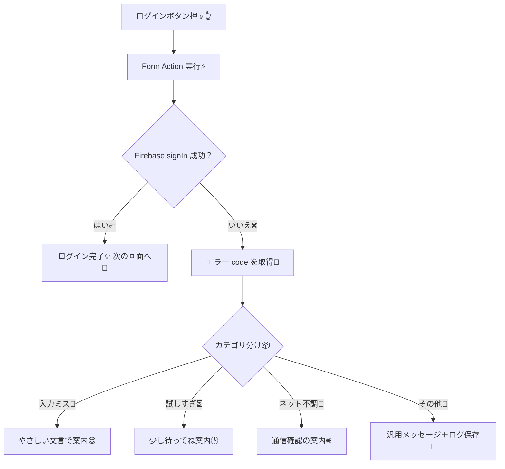
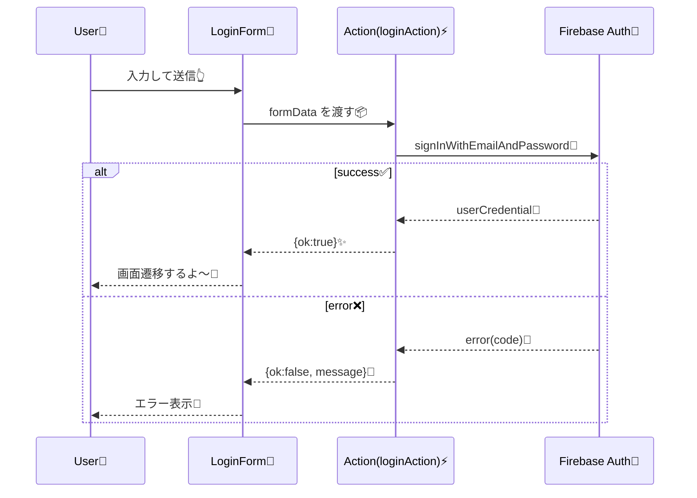

# 第198章：認証エラーのハンドリング

ログイン機能って、**成功より失敗のほうが体験の差が出やすい**んだよね…！😵‍💫
この章では「ログイン失敗した時に、ユーザーにやさしく＆安全に伝える」仕組みを作るよ〜🫶✨

---

## 今日のゴール🎯✨

* エラーを **「種類ごと」** に分ける（入力ミス / ネット不調 / 試しすぎ / その他）📦
* 表示するメッセージを **日本語でわかりやすく** する☺️💬
* セキュリティ的にNGな「ユーザーが存在する/しない」バレを避ける🕵️‍♀️🚫
* React 19 の **Form Actions + useActionState** で「送信中」「失敗」をスッキリ管理する🧼✨ ([React][1])

---

## まず全体像（図解）🗺️✨



---

## 大事ポイント（ここだけは覚えて🧠🔑）

### ① “存在するメールです/存在しません” を言わない🙅‍♀️

「ユーザーがいない」「パスワードが違う」を別々に出すと、悪い人がメールアドレスの存在チェックに使えちゃう…😇
なので **ログイン失敗は基本まとめて** 👇みたいにするのが安全🛡️

* ✅「メールアドレスかパスワードが違います」

Firebase JS SDK では、複数の失敗理由が `auth/invalid-credential` に寄ることもあるよ（仕様変更の経緯もリリースノートに記載あり）([Firebase][2])

### ② “同じ操作をすぐリトライしても成功しない” ことが多い🔁💥

ネットワーク系や “試しすぎ” 以外は、同じ入力のまま連打しても改善しないことが多いよ〜😵‍💫
（Firebase でも「ネットワーク/TooManyRequests 以外はリトライしても成功しない」系の注意がある）([Firebase][3])

---

## 実装①：エラーを「UI用」に変換する関数を作ろう🧑‍🍳✨

📁 `src/features/auth/authError.ts` を作るイメージ！

```tsx
// src/features/auth/authError.ts

export type AuthUiError =
  | { kind: "invalid_email"; message: string; field: "email" }
  | { kind: "invalid_credentials"; message: string }
  | { kind: "too_many_requests"; message: string }
  | { kind: "network"; message: string }
  | { kind: "unknown"; message: string; debug?: string };

// FirebaseError に限らず「code を持つエラー」を安全に判定するタイプガード
function hasStringCode(err: unknown): err is { code: string; message?: string } {
  return (
    typeof err === "object" &&
    err !== null &&
    "code" in err &&
    typeof (err as { code: unknown }).code === "string"
  );
}

export function toAuthUiError(err: unknown): AuthUiError {
  if (!hasStringCode(err)) {
    return { kind: "unknown", message: "ログインに失敗しました…もう一度試してね🙏" };
  }

  const code = err.code;

  switch (code) {
    case "auth/invalid-email":
      return {
        kind: "invalid_email",
        field: "email",
        message: "メールアドレスの形がちょっと変かも…💦 もう一度チェックしてね🙂",
      };

    // ✅ セキュリティのため、存在チェックにつながる系は “まとめて” 同じ表示に寄せる
    case "auth/invalid-credential":
    case "auth/wrong-password":
    case "auth/user-not-found":
      return {
        kind: "invalid_credentials",
        message: "メールアドレスかパスワードが違います…🥺",
      };

    case "auth/too-many-requests":
      return {
        kind: "too_many_requests",
        message: "試しすぎちゃったかも…⏳ 少し待ってからもう一度やってみてね！",
      };

    case "auth/network-request-failed":
      return {
        kind: "network",
        message: "ネットワークが不安定みたい…📶 Wi-Fi/回線を確認してね！",
      };

    default:
      return {
        kind: "unknown",
        message: "ログインに失敗しました…🙏 時間をおいて再度試してみてね。",
        debug: `${code}${err.message ? `: ${err.message}` : ""}`,
      };
  }
}
```

補足：`auth/invalid-credential` が出るのは近年よくある挙動（複数の失敗理由がここに集約されるケース）([Firebase][2])

---

## 実装②：React 19 の Form Actions + useActionState で「送信中・失敗」を管理する🧡⚡

### 1) 送信ボタン（送信中は無効化）🔘⏳

```tsx
// src/features/auth/SubmitButton.tsx
import { useFormStatus } from "react-dom";

type Props = { label: string };

export function SubmitButton({ label }: Props) {
  const { pending } = useFormStatus();

  return (
    <button type="submit" disabled={pending}>
      {pending ? "送信中…⏳" : label}
    </button>
  );
}
```

`useFormStatus` は React 19 の Actions と一緒に使う想定の仕組みだよ〜🧩 ([React][4])

---

### 2) ログインフォーム本体（失敗メッセージを表示）🧾✨

```tsx
// src/features/auth/LoginForm.tsx
import { useActionState, useEffect, useState } from "react";
import { useNavigate } from "react-router-dom";
import { signInWithEmailAndPassword } from "firebase/auth";

import { auth } from "@/lib/firebase"; // 既に作ってある前提でOK
import { toAuthUiError } from "./authError";
import { SubmitButton } from "./SubmitButton";

type FormState =
  | { ok: true }
  | { ok: false; message: string; field?: "email" | "password" };

const initialState: FormState = { ok: false, message: "" };

async function loginAction(_prev: FormState, formData: FormData): Promise<FormState> {
  const email = String(formData.get("email") ?? "");
  const password = String(formData.get("password") ?? "");

  try {
    await signInWithEmailAndPassword(auth, email, password);
    return { ok: true };
  } catch (err: unknown) {
    const ui = toAuthUiError(err);

    // 開発中だけ「原因」を見たいとき用（本番でそのまま表示はしない！🚫）
    if (ui.kind === "unknown" && ui.debug) {
      console.error("Auth error(debug):", ui.debug);
    }

    // email の形が変な時は field を email に寄せてあげると親切🙂
    if (ui.kind === "invalid_email") {
      return { ok: false, message: ui.message, field: "email" };
    }

    return { ok: false, message: ui.message, field: "password" };
  }
}

export function LoginForm() {
  const navigate = useNavigate();
  const [state, formAction, isPending] = useActionState(loginAction, initialState);
  const [touched, setTouched] = useState(false);

  useEffect(() => {
    if (state.ok) navigate("/"); // ログイン後の遷移
  }, [state.ok, navigate]);

  const showError = touched && !state.ok && state.message;

  return (
    <div style={{ maxWidth: 420 }}>
      <h1>ログイン🔐✨</h1>

      <form
        action={async (fd) => {
          setTouched(true);
          await formAction(fd);
        }}
        aria-busy={isPending}
      >
        <label>
          メールアドレス📧
          <input
            name="email"
            type="email"
            autoComplete="email"
            aria-invalid={showError && state.field === "email" ? true : undefined}
          />
        </label>

        <label>
          パスワード🔑
          <input
            name="password"
            type="password"
            autoComplete="current-password"
            aria-invalid={showError && state.field === "password" ? true : undefined}
          />
        </label>

        {showError ? (
          <p role="alert" aria-live="polite">
            {state.message}
          </p>
        ) : null}

        <SubmitButton label="ログインする🚀" />
      </form>
    </div>
  );
}
```

`useActionState` は「フォームアクションに紐づく状態（成功/失敗/送信中）」をまとめて扱える仕組みだよ〜✨ ([React][1])

---

## 図解：フォーム送信のやりとり（シーケンス）📨✨



---

## ちょい足しTips（プロっぽくなる✨）🌟

* ✅ **「送信中…」の間はボタン無効化**（二重送信防止）🔒
* ✅ エラー文は **生の英語メッセージを出さない**（怖い＆わかりにくい）😵‍💫
* ✅ `auth/too-many-requests` は「待ってね」＋「パスワード再設定導線」も相性◎🕒✨
* ✅ `unknown` はユーザーには短く、開発者には `console.error` や監視ツールへ🧯📈

---

## （おまけ）Supabase の場合は？🐳💡

Supabase Auth はエラーコード一覧が公式にまとまってるよ（まずここを見るのが最短）([Supabase][5])
やり方は同じで、**「error を UI 用に変換する関数」**を1個作ればOK🙆‍♀️✨

---

## ミニ課題（5〜10分）🧪✨

1. `auth/too-many-requests` のときだけ、メッセージの下に
   「パスワードを忘れた？」リンクを出してみよう🔗🙂
2. `state.field` に合わせて、`aria-invalid` だけじゃなく **見た目も赤枠**にしてみよう❤️‍🔥

---

必要なら、この章の続きとして「トースト通知（Shadcn UI / Sonner）でエラーを出す版」も同じ設計でサクッと作れるよ〜🍞✨

[1]: https://react.dev/reference/react/useActionState?utm_source=chatgpt.com "useActionState"
[2]: https://firebase.google.com/support/release-notes/js?utm_source=chatgpt.com "Firebase JavaScript SDK Release Notes - Google"
[3]: https://firebase.google.com/docs/auth/ios/errors?utm_source=chatgpt.com "Handle Firebase Apple Platforms Auth Errors"
[4]: https://react.dev/blog/2024/12/05/react-19?utm_source=chatgpt.com "React v19"
[5]: https://supabase.com/docs/guides/auth/debugging/error-codes?utm_source=chatgpt.com "Error Codes | Supabase Docs"
