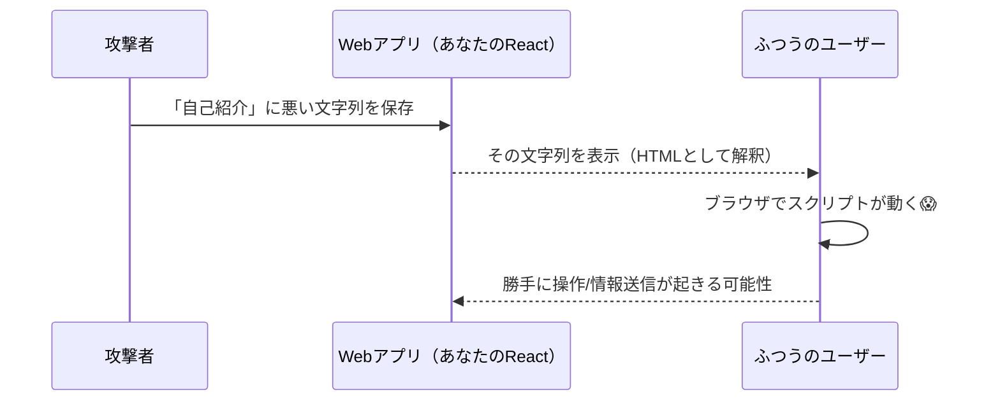
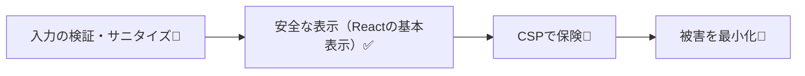

# 第199章：セキュリティの基本

ここまで作ってきたアプリ、**「動く」だけじゃなくて「守れる」**ようにしよ〜！😊
今日はとくに大事な **XSS（クロスサイトスクリプティング）** を中心に、フロントでできる基本対策をギュッとやるよ💪🍀

---

## この章でできるようになること🎯

* XSSって何がヤバいのか、イメージできる👀💥
* Reactで「安全になりやすい所」と「事故る所」が分かる⚠️
* うっかりXSSを呼び込まない書き方ができる✅
* **どうしてもHTMLを表示したい時**の安全なやり方が分かる🧼✨
* ついでに最低限のセキュリティ習慣が身につく🧠🔒

---

## まず結論：**入力は信じない**（これ最強）🧠🔒

ユーザー入力、URLのパラメータ、APIから返ってきた文字列…
**「外から来た文字」は全部あやしい**と思ってOK😇

---

## XSSってなに？😱

ざっくり言うと、**悪意あるスクリプト（JavaScript）を、あなたのサイト上で動かされちゃう**攻撃のこと💣

たとえば、もしXSSが成立すると…👇

* ログイン中のユーザーになりすまして操作される😵‍💫
* 画面に偽フォームを出してパスワードを入力させられる🎭
* トークン等が盗まれる可能性が上がる（特に localStorage 置きは危険度UP）🧨

---

## XSSの流れ（図でイメージ）🖼️

（“ユーザーが入れた文章”を、うっかりHTMLとして表示しちゃうと…の図）



---

## ReactはXSSに強い？✅ でも「例外」で死ぬ⚠️

Reactは基本的にえらくて、JSXに文字列を入れると **自動でエスケープ**してくれるよ😊
だから、普通にこう表示する限りはかなり安全👇

```tsx
export function Profile({ bio }: { bio: string }) {
  return <p>{bio}</p>; // ✅ Reactが基本エスケープしてくれる
}
```

でも！**事故ポイント**があるよ⚠️
とくにこの3つは超要注意😵‍💫

1. `dangerouslySetInnerHTML`（危険って名前に書いてあるやつ）💀
2. URL系（`href`, `src` など）に「怪しい文字列」を入れる🔗
3. 外部ライブラリ/Markdown/HTMLレンダリング系を雑に使う📦

---

## 事故ポイント1：`dangerouslySetInnerHTML` 💀

**これを使うと、Reactの自動エスケープを自分で無効化**する感じになるよ⚠️
「HTML文字列をそのまま表示したい」って時に使えるけど、丸腰だと危険！

### ❌ ダメ例（そのまま突っ込む）

```tsx
export function UnsafeHtml({ html }: { html: string }) {
  return <div dangerouslySetInnerHTML={{ __html: html }} />; // ❌ 危険
}
```

---

## ✅ 安全にやる：サニタイズ（無害化）してから入れる🧼✨

「どうしてもHTML表示したい！」って時は、**サニタイズ**しよう😊
定番は DOMPurify だよ（フロント側の“掃除機”みたいなやつ🧹）

### 1) インストール（Windowsでも同じ）

```bash
npm i dompurify
```

（もし型で困ったら）

```bash
npm i -D @types/dompurify
```

### 2) サニタイズしてから表示 ✅

```tsx
import DOMPurify from "dompurify";

type Props = { html: string };

export function SafeHtml({ html }: Props) {
  const clean = DOMPurify.sanitize(html, {
    USE_PROFILES: { html: true }, // まずは無難に
  });

  return <div dangerouslySetInnerHTML={{ __html: clean }} />;
}
```

💡ポイント

* **「表示したいHTML」＝「安全」じゃない**から、必ずサニタイズ🧼
* できれば「許可するタグを絞る（allowlist）」のがさらに強い🛡️

---

## 事故ポイント2：リンク（href）に要注意🔗⚠️

ユーザー入力をリンクにするとき、**`javascript:` みたいなスキーム**が混ざると危ないことがあるよ😱
（ブラウザや状況によって挙動は違うけど、基本は弾くのが正解✅）

### ✅ 安全寄り：URLをチェックしてから使う

```tsx
function safeHttpUrl(input: string): string | null {
  try {
    const url = new URL(input, window.location.origin);
    if (url.protocol === "http:" || url.protocol === "https:") return url.toString();
    return null;
  } catch {
    return null;
  }
}

export function SafeLink({ urlText }: { urlText: string }) {
  const safe = safeHttpUrl(urlText);

  if (!safe) return <span>リンクが無効だよ🥺</span>;

  return (
    <a href={safe} target="_blank" rel="noopener noreferrer">
      開くよ🔗✨
    </a>
  );
}
```

💡`target="_blank"` を使うときは `rel="noopener noreferrer"` をセットが基本だよ（別タブ悪用の対策）🧷

---

## 事故ポイント3：MarkdownやHTMLを“そのまま表示”系📦⚠️

「ユーザーの文章をMarkdownで表示したい！」って、よくあるよね😊
でも、Markdownレンダラーの設定次第で **HTMLが通っちゃう**ことがある…😇
✅ 対策はこれ👇

* 「ユーザー入力→HTML化」するなら、**必ずサニタイズ**🧼
* レンダラー側でも **HTMLを無効**にできるなら無効にする🚫

---

## さらに一段強くする：CSP（コンテンツセキュリティポリシー）🧱✨

フロントだけで100%は無理でも、**CSPを入れると“爆発を小さく”できる**よ💥➡️🧯
ざっくり言うと「このサイトでは、ここ以外のスクリプト動かないでね！」ってブラウザに命令するやつ🧠



※CSPはホスティング（Vercel/Cloudflare等）側の設定が絡むので、ここでは「そういう盾がある」って覚えておけばOKだよ😊🛡️

---

## ありがちな勘違い3つ（ここ落とし穴）🕳️😵‍💫

* **「TypeScriptだから安全でしょ？」** → 型とXSSは別問題🥺
* **「Reactだから絶対安全でしょ？」** → `dangerouslySetInnerHTML` など例外で死ぬ😇
* **「サニタイズしたから完全勝利！」** → できればサーバー側でも対策＆CSPも合わせ技が強い💪

---

## 実戦ミニチェックリスト✅✨（この章のゴール）

* [ ] ユーザー入力は **基本そのままJSX表示**にする（HTMLとして解釈させない）
* [ ] `dangerouslySetInnerHTML` は **原則禁止**、使うなら **サニタイズ必須**
* [ ] `href/src` などURLは **http/https だけ許可**（最低限）
* [ ] `target="_blank"` には `rel="noopener noreferrer"` を付ける
* [ ] “HTML化するライブラリ”は設定をちゃんと確認する

---

## 練習問題（5〜15分）✍️💡

### 練習1：自己紹介の「安全表示」✅

* 入力欄（自己紹介）を `useState` で持つ
* そのまま `<p>{bio}</p>` で表示する（まずはこれが安全ルート😊）

### 練習2：自己紹介の「HTML表示（上級）」🧼

* どうしても `<b>` とか使いたい想定で、DOMPurify を入れて
* `SafeHtml` コンポーネントで表示してみる
* 「サニタイズなし」と「あり」の違いを体感してみよ👀✨
  （※危ない文字列はテスト用でも貼りすぎ注意ね🙏）

---

## まとめ🎀

Reactは基本エスケープしてくれるから頼もしい😊✨
でも **`dangerouslySetInnerHTML` と URL と “HTML化系”** は、こちらがちゃんと守らないと危ない⚠️
この章の合言葉はこれ👇

**「外から来た文字は信じない」🧠🔒**

次（第200章）は、認証つきのメモアプリを完成させるよ〜！📓✨
