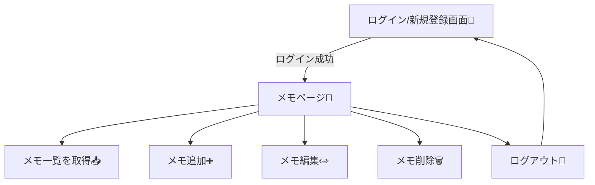

# 第200章：練習：認証付きのメモアプリを完成させる

ここまでで「ログインできる」「ログアウトできる」あたりはできてる前提で、**最後に “メモ機能” をガッツリ完成**させるよ〜！✨
完成したら、**「自分だけのアプリ」感**が一気に出るやつ😆💕

---

## この章のゴール🏁✨

✅ ログインしてる人だけが入れる「メモページ」を作る
✅ **自分のメモだけ**を表示する（他人のメモは見えない🙅‍♀️）
✅ メモの **追加 ➕ / 編集 ✏️ / 削除 🗑️** ができる
✅ リロードしてもログイン状態が維持される🔁

---

## 全体の流れ（完成イメージ）🧠✨



---

## 1) Supabase側の準備（メモ用テーブル＆安全設定）🛡️🐘

Supabaseを使う例でいくね！（Firebase派でも考え方は同じだよ👍）

### ✅ テーブルを作る（SQLエディタで実行）🧩

```sql
create table if not exists memos (
  id uuid primary key default gen_random_uuid(),
  user_id uuid not null references auth.users(id) on delete cascade,
  content text not null,
  created_at timestamptz not null default now(),
  updated_at timestamptz not null default now()
);

create index if not exists memos_user_id_idx on memos(user_id);
```

### ✅ RLS（行レベルセキュリティ）をONにする🔒

```sql
alter table memos enable row level security;
```

### ✅ 「自分のメモだけ」見れる＆いじれるポリシーを作る🧷

```sql
create policy "select own memos"
on memos for select
using (auth.uid() = user_id);

create policy "insert own memos"
on memos for insert
with check (auth.uid() = user_id);

create policy "update own memos"
on memos for update
using (auth.uid() = user_id);

create policy "delete own memos"
on memos for delete
using (auth.uid() = user_id);
```

これで **他人のメモは絶対に見えない**（超大事🥹✨）

---

## 2) React側：Supabaseクライアント準備🌟

### パッケージ入れる（PowerShell）💻

```bash
npm i @supabase/supabase-js
```

### `.env.local` を作る（Vite用）🔑

プロジェクト直下に作ってね！

```env
VITE_SUPABASE_URL=あなたのSupabaseURL
VITE_SUPABASE_ANON_KEY=あなたのanonキー
```

※ `anon key` はフロントに置いてOKな公開キーだよ（でも `service_role` は絶対ダメ🙅‍♀️）

### `src/lib/supabase.ts` を作る📦

```ts
import { createClient } from "@supabase/supabase-js";

const supabaseUrl = import.meta.env.VITE_SUPABASE_URL as string;
const supabaseAnonKey = import.meta.env.VITE_SUPABASE_ANON_KEY as string;

export const supabase = createClient(supabaseUrl, supabaseAnonKey);
```

---

## 3) 認証状態をアプリ全体で持つ（AuthProvider）🧠🔁

`src/contexts/AuthContext.tsx` を作るよ！

```tsx
import { createContext, useContext, useEffect, useMemo, useState } from "react";
import type { Session, User } from "@supabase/supabase-js";
import { supabase } from "../lib/supabase";

type AuthContextValue = {
  session: Session | null;
  user: User | null;
  loading: boolean;
  signOut: () => Promise<void>;
};

const AuthContext = createContext<AuthContextValue | null>(null);

export function AuthProvider({ children }: { children: React.ReactNode }) {
  const [session, setSession] = useState<Session | null>(null);
  const [user, setUser] = useState<User | null>(null);
  const [loading, setLoading] = useState(true);

  useEffect(() => {
    let mounted = true;

    // 起動時にセッション復元🔁
    supabase.auth.getSession().then(({ data }) => {
      if (!mounted) return;
      setSession(data.session ?? null);
      setUser(data.session?.user ?? null);
      setLoading(false);
    });

    // 変化監視👀（ログイン/ログアウト）
    const { data: sub } = supabase.auth.onAuthStateChange((_event, newSession) => {
      setSession(newSession);
      setUser(newSession?.user ?? null);
    });

    return () => {
      mounted = false;
      sub.subscription.unsubscribe();
    };
  }, []);

  const value = useMemo<AuthContextValue>(() => {
    return {
      session,
      user,
      loading,
      signOut: async () => {
        await supabase.auth.signOut();
      },
    };
  }, [session, user, loading]);

  return <AuthContext.Provider value={value}>{children}</AuthContext.Provider>;
}

export function useAuth() {
  const ctx = useContext(AuthContext);
  if (!ctx) throw new Error("useAuth must be used within AuthProvider");
  return ctx;
}
```

---

## 4) 保護されたルート（ログインしてない人を追い返す）🚧🔐

`src/components/RequireAuth.tsx` を作る！

```tsx
import { Navigate, useLocation } from "react-router-dom";
import { useAuth } from "../contexts/AuthContext";

export function RequireAuth({ children }: { children: React.ReactNode }) {
  const { user, loading } = useAuth();
  const location = useLocation();

  if (loading) return <p>読み込み中...⏳</p>;
  if (!user) return <Navigate to="/login" replace state={{ from: location }} />;

  return <>{children}</>;
}
```

ルーティングの守り方はこんな感じ👇

```mermaid
flowchart LR
  A[アクセス] --> B{ログイン中？}
  B -->|YES| C[ページ表示📝]
  B -->|NO| D[/loginへ強制移動🔐]
```

---

## 5) メモページ（CRUD）を作る📝✨

`src/pages/MemosPage.tsx` を作るよ！

```tsx
import { useEffect, useState } from "react";
import { supabase } from "../lib/supabase";
import { useAuth } from "../contexts/AuthContext";

type Memo = {
  id: string;
  user_id: string;
  content: string;
  created_at: string;
  updated_at: string;
};

export function MemosPage() {
  const { user, signOut } = useAuth();
  const [memos, setMemos] = useState<Memo[]>([]);
  const [newText, setNewText] = useState("");
  const [editingId, setEditingId] = useState<string | null>(null);
  const [editingText, setEditingText] = useState("");
  const [error, setError] = useState<string | null>(null);
  const [loading, setLoading] = useState(true);

  async function loadMemos() {
    setError(null);
    setLoading(true);

    const { data, error } = await supabase
      .from("memos")
      .select("*")
      .order("created_at", { ascending: false });

    if (error) {
      setError(error.message);
      setLoading(false);
      return;
    }

    setMemos((data ?? []) as Memo[]);
    setLoading(false);
  }

  useEffect(() => {
    void loadMemos();
  }, []);

  async function addMemo() {
    if (!user) return;
    const text = newText.trim();
    if (!text) return;

    setError(null);

    const { error } = await supabase.from("memos").insert({
      user_id: user.id,
      content: text,
    });

    if (error) {
      setError(error.message);
      return;
    }

    setNewText("");
    await loadMemos();
  }

  async function startEdit(m: Memo) {
    setEditingId(m.id);
    setEditingText(m.content);
  }

  async function saveEdit() {
    if (!editingId) return;
    const text = editingText.trim();
    if (!text) return;

    setError(null);

    const { error } = await supabase
      .from("memos")
      .update({ content: text, updated_at: new Date().toISOString() })
      .eq("id", editingId);

    if (error) {
      setError(error.message);
      return;
    }

    setEditingId(null);
    setEditingText("");
    await loadMemos();
  }

  async function deleteMemo(id: string) {
    setError(null);

    const { error } = await supabase.from("memos").delete().eq("id", id);

    if (error) {
      setError(error.message);
      return;
    }

    setMemos((prev) => prev.filter((m) => m.id !== id));
  }

  return (
    <div style={{ maxWidth: 720, margin: "24px auto", padding: 16 }}>
      <header style={{ display: "flex", justifyContent: "space-between", alignItems: "center" }}>
        <h1>メモ📝</h1>
        <button onClick={() => void signOut()}>ログアウト🚪</button>
      </header>

      <p style={{ opacity: 0.7 }}>ようこそ！🎀 {user?.email}</p>

      {error && (
        <div style={{ background: "#ffecec", padding: 12, borderRadius: 8, marginTop: 12 }}>
          エラーだよ🥲：{error}
        </div>
      )}

      <section style={{ marginTop: 16 }}>
        <h2>新しいメモ➕</h2>
        <textarea
          value={newText}
          onChange={(e) => setNewText(e.target.value)}
          rows={3}
          style={{ width: "100%", padding: 8 }}
          placeholder="今日のメモを書く…✍️"
        />
        <button onClick={() => void addMemo()} style={{ marginTop: 8 }}>
          追加する✨
        </button>
      </section>

      <section style={{ marginTop: 24 }}>
        <h2>メモ一覧📚</h2>

        {loading ? (
          <p>読み込み中…⏳</p>
        ) : memos.length === 0 ? (
          <p>まだメモがないよ〜！最初の1個を書いてみよっ🫶</p>
        ) : (
          <ul style={{ listStyle: "none", padding: 0, display: "grid", gap: 12 }}>
            {memos.map((m) => (
              <li key={m.id} style={{ border: "1px solid #ddd", borderRadius: 12, padding: 12 }}>
                {editingId === m.id ? (
                  <>
                    <textarea
                      value={editingText}
                      onChange={(e) => setEditingText(e.target.value)}
                      rows={3}
                      style={{ width: "100%", padding: 8 }}
                    />
                    <div style={{ display: "flex", gap: 8, marginTop: 8 }}>
                      <button onClick={() => void saveEdit()}>保存💾</button>
                      <button
                        onClick={() => {
                          setEditingId(null);
                          setEditingText("");
                        }}
                      >
                        キャンセル🙅‍♀️
                      </button>
                    </div>
                  </>
                ) : (
                  <>
                    <p style={{ whiteSpace: "pre-wrap" }}>{m.content}</p>
                    <div style={{ display: "flex", gap: 8 }}>
                      <button onClick={() => void startEdit(m)}>編集✏️</button>
                      <button onClick={() => void deleteMemo(m.id)}>削除🗑️</button>
                    </div>
                    <small style={{ opacity: 0.6 }}>
                      作成：{new Date(m.created_at).toLocaleString()}
                    </small>
                  </>
                )}
              </li>
            ))}
          </ul>
        )}
      </section>
    </div>
  );
}
```

---

## 6) ルーティングに組み込む（App.tsx例）🧭✨

例：`src/App.tsx`

```tsx
import { Routes, Route, Navigate } from "react-router-dom";
import { RequireAuth } from "./components/RequireAuth";
import { MemosPage } from "./pages/MemosPage";

// ここは既に作ってある想定でOK（あなたの実装に合わせてね🫶）
import { LoginPage } from "./pages/LoginPage";
import { SignupPage } from "./pages/SignupPage";

export default function App() {
  return (
    <Routes>
      <Route path="/" element={<Navigate to="/memos" replace />} />

      <Route path="/login" element={<LoginPage />} />
      <Route path="/signup" element={<SignupPage />} />

      <Route
        path="/memos"
        element={
          <RequireAuth>
            <MemosPage />
          </RequireAuth>
        }
      />
    </Routes>
  );
}
```

そして `main.tsx` で Provider を巻く（例）🎁

```tsx
import React from "react";
import ReactDOM from "react-dom/client";
import { BrowserRouter } from "react-router-dom";
import App from "./App";
import { AuthProvider } from "./contexts/AuthContext";

ReactDOM.createRoot(document.getElementById("root")!).render(
  <React.StrictMode>
    <BrowserRouter>
      <AuthProvider>
        <App />
      </AuthProvider>
    </BrowserRouter>
  </React.StrictMode>
);
```

---

## 動作チェック✅🎀

1. 起動する🚀

```bash
npm run dev
```

2. `/signup` で新規登録✨
3. `/memos` に入れたらOK📝
4. メモ追加➕ → 反映された？
5. リロード🔁 → ログイン状態保たれてる？
6. 他のアカウントでログイン → メモが混ざってない？（混ざってたらRLS見直し🥹）

---

## 仕上げミッション（できたら超えらい💯）🌈

* ⭐ メモに「タイトル」欄を追加してみる
* ⭐ 並び替え（新しい順/古い順）ボタンを付ける
* ⭐ 検索（キーワードで絞り込み🔎）を付ける
* ⭐ “保存しました✅” みたいなトースト通知を出す（次のUI章にもつながるよ😆）

---

ここまでできたら、もう立派に「ログイン必須のWebアプリ」完成だよ〜！🎉🎉🎉
次はアニメーションやUIライブラリで、見た目を一気に“プロっぽく”していこ💃✨
