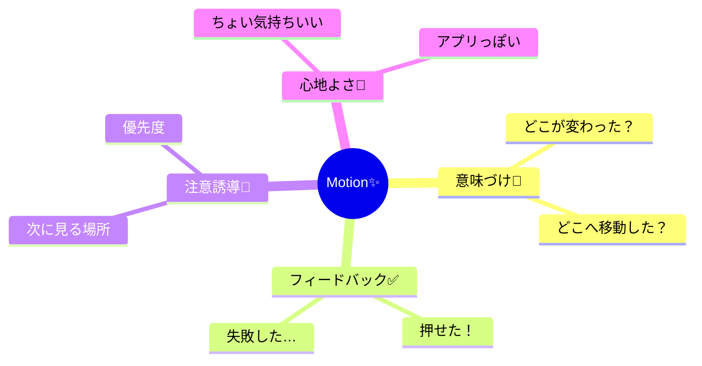

# 第201章：動き (Motion) はUXの一部

アニメーションって「飾り」っぽく見えるけど、実は **“ユーザーに状況を伝えるUI”** なんだよね😊
この章は「なぜ動きを入れるのか？」を、ちゃんと腹落ちさせる回だよ〜🧠✨

---

## 今日のゴール 🎯🌸

* 「動き＝UXの説明」って感覚がわかる😊
* どんな動きが“良い動き”で、どんな動きが“うざい動き”か判断できる🙆‍♀️
* 次章の Framer Motion に入る準備ができる🚀

---

## まず結論：動きは「説明」📝✨

画面って、いきなり変わると人は不安になるの😵
そこで、**“変化の理由”** をちょい動きで見せると、めっちゃ安心するよ〜☺️

```mermaid
flowchart TD
A[ユーザーが操作👆] --> B[状態が変わる🔁]
B --> C{変化が伝わる？}
C -- 伝わる😊 --> D[「押せた/反映された」安心感✨]
C -- 伝わらない😵 --> E[「今なにが起きた？」不安💦]
B --> F[ちょい動き(モーション)✨]
F --> C
```

---

## Motionがやってくれること（4つ）🧩✨

「動き」には、主にこの4つの役割があるよ〜🌷



たとえば👇

* ボタンを押した瞬間に **ちょい縮む** →「押せた！」が一瞬で伝わる👍✨
* 画面遷移で **ふわっと入る** →「別のページに来た」がわかる🚪🌿
* エラーで **プルプル** →「ここ直して！」が一発で伝わる⚠️😵

---

## ダメな動き（逆にUXが落ちるやつ）🚫🌀

動きは強すぎると **“説明” じゃなくて “邪魔”** になるよ💦

* ずっと動き続ける（常時ぴょこぴょこ）🐸💥
* 何の意味もない回転・バウンドが多い🎡😵
* 遅すぎて待たされる（もっさり）🐢
* 画面が揺れる・ズームが激しい（酔う人がいる）🤢

👉 ポイント：**動きは主役じゃなくて、案内役** だよ🧭✨

---

## “良い動き”の3ルール 🧁✨

### ルール1：意味があること 🧠

「何を伝える動き？」って言葉にできるのが正解🙆‍♀️
（例：成功/失敗、移動、追加、注目、など）

### ルール2：速いこと（目安でOK）⚡

* ボタンの反応：だいたい **100〜200ms** くらいが気持ちいいこと多め😊
* 画面の切り替え：だいたい **200〜300ms** くらいが多め✨
  （※プロも“体感”で調整すること多いよ〜🎧）

### ルール3：一貫してること 🎨

同じ種類の動きは、同じテンポ・同じ雰囲気にすると
「このアプリ安心〜☺️」ってなる✨

---

## ちょい実験：CSSだけで「押せた感」出してみる 👍💖

Framer Motionは次章でやるから、ここでは **“動きの価値”** を軽く体験しよ〜😊

### `App.tsx`

```tsx
import { useState } from "react";
import "./App.css";

export default function App() {
  const [liked, setLiked] = useState(false);

  return (
    <div className="page">
      <button
        className={`likeButton ${liked ? "isLiked" : ""}`}
        onClick={() => setLiked((v) => !v)}
        aria-pressed={liked}
      >
        {liked ? "いいね済み 💖" : "いいね 👍"}
      </button>

      <p className="hint">動きは「押せたよ」を伝えるサインだよ✨</p>
    </div>
  );
}
```

### `App.css`

```css
.page {
  padding: 24px;
}

.likeButton {
  font-size: 18px;
  padding: 12px 16px;
  border-radius: 12px;
  border: 1px solid #ccc;
  background: white;
  cursor: pointer;

  transition: transform 120ms ease, box-shadow 120ms ease;
}

.likeButton:active {
  transform: scale(0.96);
}

.likeButton.isLiked {
  box-shadow: 0 6px 20px rgba(0, 0, 0, 0.12);
  transform: translateY(-1px);
}

.hint {
  margin-top: 12px;
  opacity: 0.8;
}
```

✅ これだけで「押せた感」「反映された感」が出るよ〜！🥹✨
装飾じゃなくて **“安心のサイン”** になってるのがポイント🫶

---

## めちゃ大事：動きを減らしたい人への配慮 🧑‍🦽🌿

人によっては動きがしんどいことがあるよ（酔う・疲れる等）🤢💦
だから **“動きを減らす設定”** を尊重できると最高✨

`prefers-reduced-motion` を使うと、OS設定に合わせてアニメを弱められるよ✅

```css
@media (prefers-reduced-motion: reduce) {
  .likeButton {
    transition: none;
  }
  .likeButton:active {
    transform: none;
  }
}
```

これ入れておくだけで、やさしさ爆上がり🌸😊

---

## この章のまとめ 🍰✨

* Motionは「飾り」じゃなくて **UXの説明** 📝
* 良い動きは **意味がある / 速い / 一貫してる** ✅
* 強すぎる動きは逆効果🚫
* `prefers-reduced-motion` でやさしさ対応🌿

---

## 次章予告 🎬💫（第202章）

次はついに **Framer Motion** に入るよ〜！🚀
CSSよりずっとラクに、気持ちいい動きが作れるようになる😊✨

「押したらふわっ」「出てくる」「消える」みたいな基本を、最短で掴もうね🫶💖
