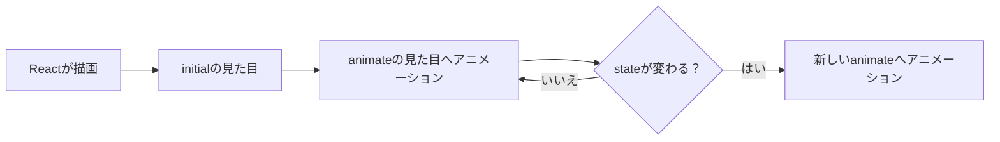

# 第202章：Framer Motion の基本

この章では「とりあえず1個、気持ちよく動くUI」を作ります🎀
**ポイントはたった1つ：** 普通の要素を **`motion` 要素に置き換える**だけ！🪄

---

### まず全体像（どう動くの？）🧠✨



---

## 1) インストール（Windows / PowerShell）💻✨

プロジェクトのルートで👇

```bash
npm install motion
```

そして、使うときはこう import します👇（公式のやり方） ([Motion][1])

```ts
import { motion } from "motion/react";
```

※昔の情報だと `framer-motion` を入れる記事もありますが、今の公式ドキュメントは **`motion`** が案内されています ([Motion][1])
（React 19 でも動作確認OKという案内も出ています） ([Motion][2])

---

## 2) まずは「登場するときにフワッと出る」💖✨

`src/App.tsx` をこれにしてみてね👇

```tsx
import { useState } from "react";
import { motion } from "motion/react";

export default function App() {
  const [open, setOpen] = useState(true);

  return (
    <div style={{ padding: 24, fontFamily: "system-ui" }}>
      <h1 style={{ marginBottom: 12 }}>Motion 入門 💃✨</h1>

      <button
        onClick={() => setOpen((v) => !v)}
        style={{
          padding: "10px 14px",
          borderRadius: 10,
          border: "1px solid #ddd",
          background: "white",
          cursor: "pointer",
        }}
      >
        {open ? "カードを隠す 🙈" : "カードを出す 👀"}
      </button>

      <div style={{ height: 16 }} />

      {open && (
        <motion.div
          initial={{ opacity: 0, y: 12, scale: 0.98 }}
          animate={{ opacity: 1, y: 0, scale: 1 }}
          transition={{ duration: 0.35 }}
          style={{
            width: 320,
            padding: 16,
            borderRadius: 16,
            border: "1px solid #eee",
            boxShadow: "0 8px 30px rgba(0,0,0,0.08)",
            background: "white",
          }}
        >
          <h2 style={{ margin: 0 }}>フワッと登場 🎉</h2>
          <p style={{ margin: "8px 0 0" }}>
            initial → animate に向かってアニメーションするよ✨
          </p>
        </motion.div>
      )}
    </div>
  );
}
```

### ここが超大事🥺👉

* `initial`: 最初の見た目（登場前）
* `animate`: 最終的にこうなってね（登場後）
* `transition`: どれくらいの速さで動く？

「**状態（state）で表示/非表示**」みたいな切り替えと相性最高です🎀

---

## 3) “押したら気持ちいい” を足す（Hover / Tap）🫶✨

ボタンを Motion にして、触った感をつけよう😆
（`whileHover` / `whileTap` は公式でも定番！） ([Motion][1])

```tsx
<motion.button
  whileHover={{ scale: 1.05 }}
  whileTap={{ scale: 0.96 }}
  style={{
    padding: "10px 14px",
    borderRadius: 10,
    border: "1px solid #ddd",
    background: "white",
    cursor: "pointer",
  }}
>
  触ると気持ちいいボタン 🥰
</motion.button>
```

---

## 4) よく使う「動かせるもの」メモ📌✨

* `opacity`（透明）👻
* `x`, `y`（スライド）➡️⬇️
* `scale`（拡大縮小）🔎
* `rotate`（回転）🌀

「値が変わったら、いい感じに間を埋めて動かしてくれる」のが Motion の強みだよ🪄 ([Motion][1])

---

## ミニ課題（5分）⏱️🌸

上のカードに、次のどれかを追加してみてね👇（1つでOK！）

1. `rotate: -1` → `rotate: 0` を足して、ちょいオシャレに🌀
2. `transition` を `duration: 0.6` にして、ゆっくり上品に🍷
3. `whileHover` をカードにもつけて、ふわっと浮かせる🎈

---

## よくあるミス集（詰まりポイントだけ）🧯😵‍💫

* **`motion` の import が違う**
  ✅ `import { motion } from "motion/react";` ([Motion][1])
* **`initial` と `animate` が同じ値で、動いてない**
  ✅ 例えば `opacity: 0` → `1` みたいに差を作る
* **「消えるアニメ」が欲しいのに消え方ができない**
  👉 それは次の **`AnimatePresence`**（第204章）でバッチリやるやつ😉✨

---

## まとめ 🎀✨

* **`<div />` を `<motion.div />` にするだけ**でアニメが始められる💃
* 基本セットは **`initial` / `animate` / `transition`** 🧠✨
* 触った感は **`whileHover` / `whileTap`** が最強🫶 ([Motion][1])

次の章（第203章）は「マウント（出現）のアニメ」をもっと気持ちよくしていこうね〜🌸😊

[1]: https://motion.dev/docs/react "Motion for React — Install & first React animation | Motion"
[2]: https://examples.motion.dev/react/infinite-loading "Infinite loading — Motion for React Example"
