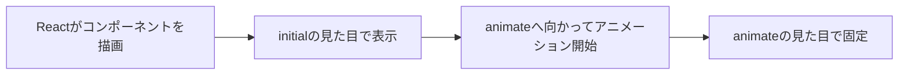

# 第203章：マウントアニメーション（フワッと表示）✨🪽

この章では「コンポーネントが**画面に現れた瞬間（=マウント）**に、フワッと気持ちよく登場させる」方法をやるよ〜！😊💕

---

## 1) 今日のゴール🎯✨

* `motion.div` を使って、**登場アニメーション**を付けられるようになる🙌
* `initial` / `animate` / `transition` の意味がわかる🧠💡
* `variants` で、アニメ設定をスッキリまとめられる📦✨

---

## 2) 準備：Framer Motion（Motion）を入れる🧰✨

ViteのReactプロジェクトで、ターミナルを開いて👇

```bash
npm i framer-motion
```

※ npm上の `framer-motion` は今も更新が続いていて、最新は 12.x 系だよ（2025年12月時点）🆕✨ ([npmjs.com][1])

---

## 3) まずは最小：カードが「フワッ」と出る🪄✨

`src/App.tsx` をこうしてみてね👇（まずはコピペでOK！）

```tsx
import { motion } from "framer-motion";

export default function App() {
  return (
    <div style={{ padding: 24 }}>
      <motion.div
        initial={{ opacity: 0, y: 12 }}
        animate={{ opacity: 1, y: 0 }}
        transition={{ duration: 0.35, ease: "easeOut" }}
        style={{
          padding: 16,
          borderRadius: 12,
          background: "white",
          boxShadow: "0 8px 24px rgba(0,0,0,0.12)",
          maxWidth: 420,
        }}
      >
        <h1 style={{ margin: 0, fontSize: 20 }}>ようこそ〜！🎉</h1>
        <p style={{ marginTop: 8, marginBottom: 0 }}>
          画面に出てきた瞬間にフワッと表示されるよ 😊✨
        </p>
      </motion.div>
    </div>
  );
}
```

### ここが超大事ポイント💡👀

* `initial`: **最初の見た目**（透明＋少し下）
* `animate`: **最終の見た目**（不透明＋定位置）
* `transition`: **動き方**（何秒で、どんな加速で）

---

## 4) マウントアニメーションの流れ（図解）🗺️✨



「描画された直後に `initial` が適用されて、そこから `animate` に移動する」って感じだよ〜！🥰

---

## 5) ちょい応用：variantsで“読みやすく”する📦✨

同じアニメを他の場所でも使いたい時、`variants` が便利〜！🎀

```tsx
import { motion, type Variants } from "framer-motion";

const cardVariants: Variants = {
  hidden: { opacity: 0, y: 12, scale: 0.98 },
  show: { opacity: 1, y: 0, scale: 1 },
};

export default function App() {
  return (
    <div style={{ padding: 24 }}>
      <motion.div
        variants={cardVariants}
        initial="hidden"
        animate="show"
        transition={{ duration: 0.35, ease: "easeOut" }}
        style={{
          padding: 16,
          borderRadius: 12,
          background: "white",
          boxShadow: "0 8px 24px rgba(0,0,0,0.12)",
          maxWidth: 420,
        }}
      >
        <h1 style={{ margin: 0, fontSize: 20 }}>variants版だよ〜✨</h1>
        <p style={{ marginTop: 8, marginBottom: 0 }}>
          アニメの設定がスッキリして気持ちいい😊🫶
        </p>
      </motion.div>
    </div>
  );
}
```

---

## 6) “追加した瞬間”にフワッ（リストで体験）🧁✨

「ボタンで項目を追加」→「追加された項目がマウント」→「フワッ！」ってなるやつ！😆🎉

```tsx
import { useState } from "react";
import { motion } from "framer-motion";

type Item = { id: string; text: string };

export default function App() {
  const [items, setItems] = useState<Item[]>([
    { id: crypto.randomUUID(), text: "最初のカードだよ🍓" },
  ]);

  const addItem = () => {
    const next: Item = { id: crypto.randomUUID(), text: "追加されたよ〜🎈" };
    setItems((prev) => [next, ...prev]);
  };

  return (
    <div style={{ padding: 24, maxWidth: 520 }}>
      <button
        onClick={addItem}
        style={{
          padding: "10px 14px",
          borderRadius: 10,
          border: "1px solid #ddd",
          background: "white",
          cursor: "pointer",
        }}
      >
        ＋ 追加する✨
      </button>

      <div style={{ marginTop: 16, display: "grid", gap: 12 }}>
        {items.map((item) => (
          <motion.div
            key={item.id}
            initial={{ opacity: 0, y: 10 }}
            animate={{ opacity: 1, y: 0 }}
            transition={{ duration: 0.28, ease: "easeOut" }}
            style={{
              padding: 14,
              borderRadius: 12,
              background: "white",
              boxShadow: "0 8px 24px rgba(0,0,0,0.10)",
            }}
          >
            {item.text}
          </motion.div>
        ))}
      </div>
    </div>
  );
}
```

> ここでは「登場（マウント）」だけをやってるよ💡
> 「消えるとき（アンマウント）」にもアニメしたい場合は、次の **第204章：AnimatePresence** の出番！👻✨

---

## 7) よくあるハマりどころ😵‍💫💦

* **`key` が同じだと、追加しても同じ要素扱い**になって、期待どおり動かないことがあるよ🗝️
  → リストの各要素は **ユニークな `key`** にしよう✨

* **“最初から表示されてるもの”に毎回アニメが走ってほしくない**こともある
  → `initial={false}` みたいな制御もできるよ（SSR等の話も絡む）📌 ([motion.dev][2])

---

## 8) 練習ミッション💪🎀

### ミッションA：上から“ふわっ”と通知を出す📣✨

* `initial={{ opacity: 0, y: -12 }}`
* `animate={{ opacity: 1, y: 0 }}`
* `transition={{ duration: 0.25, ease: "easeOut" }}`

### ミッションB：気持ちいいバネにする🪀✨

* `transition={{ type: "spring", stiffness: 420, damping: 28 }}`
  （バネは数字で感覚を掴むのがコツだよ〜！🥰）

---

次は **第204章：AnimatePresence（消える時もアニメ）** に行くと、UIが一気に“プロっぽく”なるよ〜！🎓✨

[1]: https://www.npmjs.com/package/framer-motion?utm_source=chatgpt.com "framer-motion"
[2]: https://motion.dev/docs/react-motion-component?utm_source=chatgpt.com "Motion component - React"
