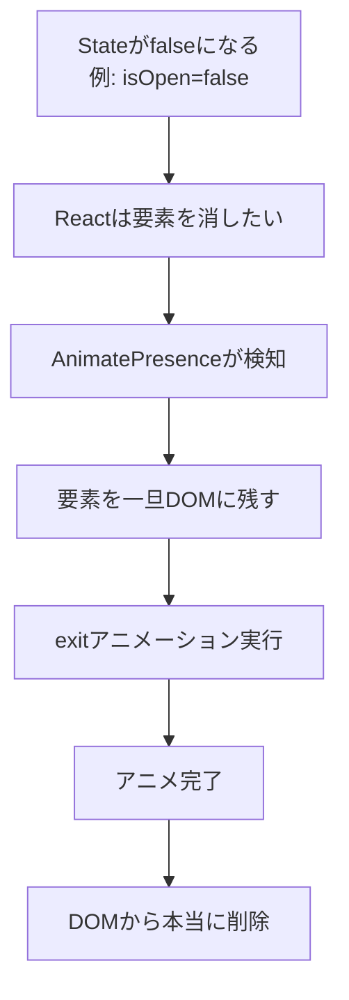
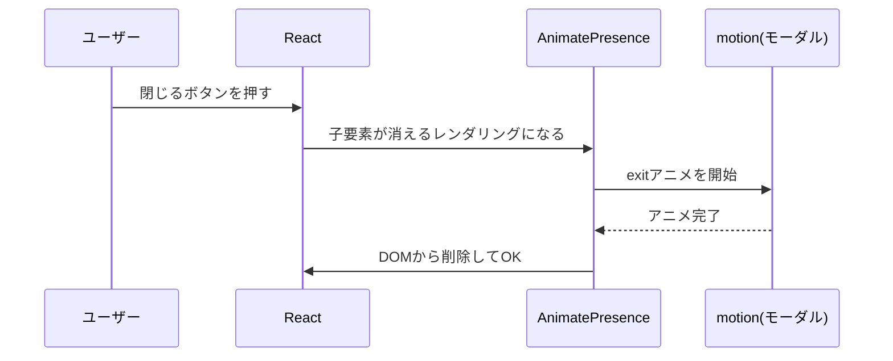

# 第204章：AnimatePresence

第203章で「出てくる時（マウント時）」はフワッとできたよね？😊
でも！UIって「消える時」もめっちゃ大事✨
**AnimatePresence** を使うと、要素が消える瞬間に **exit（退場）アニメ** を入れられるよ〜！🎬💨

---

## 1) AnimatePresenceってなに？🤔💡

Reactで `isOpen` を `false` にすると、普通は **即消える** よね。

でも AnimatePresence があると…

* React的には「消す」指示が来る
* AnimatePresence が「ちょっと待って！exitアニメやってから消す！」って止める
* exitが終わったら、本当にDOMから消える 👻✨

つまり **“消える瞬間” を演出できる** ってこと！最高〜！🥹💕

---

## 2) まずは図でイメージ🌈（Mermaid）



---

## 3) 最重要ポイント3つだけ覚えよう🧠✨

### ✅ ポイント1：`AnimatePresence`で「消える可能性がある要素」を囲む

`{isOpen && <motion.div ... />}` みたいな **条件付き表示** のところが対象だよ！

### ✅ ポイント2：消える側に `exit={{ ... }}` を書く

`initial` / `animate` / `exit` の3点セットが基本🎁

### ✅ ポイント3：リストの時は `key` が超重要🔑

`map()` で出す要素は **一意なkey** がないと、退出アニメがうまく動かないことがあるよ⚠️

---

## 4) 実践：トースト通知が「消える時もフワッ」🍞✨

### 4-1) インストール（まだなら）

PowerShellでプロジェクト直下で👇

```bash
npm i framer-motion
```

---

### 4-2) `App.tsx`（完成形）🧁

```tsx
import { useState } from "react";
import { AnimatePresence, motion } from "framer-motion";

export default function App() {
  const [open, setOpen] = useState(false);

  return (
    <div style={{ padding: 24 }}>
      <h1>AnimatePresence 練習 🎬✨</h1>

      <button
        onClick={() => setOpen(true)}
        style={{
          padding: "10px 14px",
          borderRadius: 10,
          border: "1px solid #ccc",
          cursor: "pointer",
        }}
      >
        トースト出す 🍞
      </button>

      <div style={{ position: "fixed", right: 16, bottom: 16 }}>
        <AnimatePresence>
          {open && (
            <motion.div
              key="toast"
              initial={{ opacity: 0, y: 16, scale: 0.98 }}
              animate={{ opacity: 1, y: 0, scale: 1 }}
              exit={{ opacity: 0, y: 16, scale: 0.98 }}
              transition={{ duration: 0.2 }}
              style={{
                width: 280,
                padding: 14,
                borderRadius: 14,
                border: "1px solid #ddd",
                background: "white",
                boxShadow: "0 8px 24px rgba(0,0,0,0.12)",
              }}
            >
              <div style={{ display: "flex", alignItems: "center", gap: 10 }}>
                <div style={{ fontSize: 18 }}>✅</div>
                <div style={{ flex: 1 }}>
                  <div style={{ fontWeight: 700 }}>保存しました！</div>
                  <div style={{ fontSize: 12, opacity: 0.7 }}>
                    消える時もアニメするよ〜👻✨
                  </div>
                </div>

                <button
                  onClick={() => setOpen(false)}
                  style={{
                    padding: "6px 10px",
                    borderRadius: 10,
                    border: "1px solid #ccc",
                    cursor: "pointer",
                    background: "white",
                  }}
                >
                  閉じる ✖️
                </button>
              </div>
            </motion.div>
          )}
        </AnimatePresence>
      </div>

      <div style={{ marginTop: 16, fontSize: 14, opacity: 0.8 }}>
        ※「閉じる」を押すと、即消えずに exit アニメしてから消えるよ〜🎬💨
      </div>
    </div>
  );
}
```

### ✅ 見どころ👀✨

* `open=false` にしても **すぐ消えない**
* `exit` が終わったら **自然に消える**
  これが AnimatePresence の力だよ〜！🪄

---

## 5) 実践：モーダルを「閉じる時も気持ちよく」🪟✨

トーストできたら、次は **モーダル** が鉄板！😆



### ミニTips🍬

* 背景（オーバーレイ）とモーダル本体を **別々にアニメ** するとプロっぽい🎩✨
* `role="dialog"` と `aria-modal="true"` を付けるとやさしいUIになるよ😊

---

## 6) よくあるハマりポイント集🕳️😵‍💫➡️😆

* **AnimatePresenceで囲んでない** → exitが発動しない💥
* **exitを書いてない** → 当然、何も起きない🙃
* **リストでkeyがユニークじゃない** → 退場する子が迷子になる👶💦
* **同時に入れ替えるUIでゴチャつく** → `mode="wait"` が助けになること多いよ✨

例：

```tsx
<AnimatePresence mode="wait">
  {open && <motion.div exit={{ opacity: 0 }} />}
</AnimatePresence>
```

---

## 7) 練習問題（ミニ課題）🎓💖

### ✅ 課題A：自動で消えるトースト⌛🍞

* 「トースト出す」を押したら表示
* **2秒後に自動で消える**
* 消える時はちゃんと `exit` でフワッ👻✨

（ヒント：`setTimeout` を使う。タイマーIDは `useRef` でもOK👌）

### ✅ 課題B：モーダルに「背景も消える」演出🌙

* オーバーレイ（背景）も `motion.div` にする
* 背景は `opacity` だけ変える
* モーダル本体は `y` と `scale` も使う

---

## 今日のまとめ🧡🎬

* AnimatePresence は **「消える瞬間」に命を吹き込む** やつ👻✨
* **囲む（AnimatePresence）＋ exitを書く（motion）** が基本セット🎁
* リストは **keyが命** 🔑💥

次の章（第205章）の「並び替えアニメ（layout）」と組み合わせると、さらに気持ちよさ爆上がりだよ〜！🕺✨
