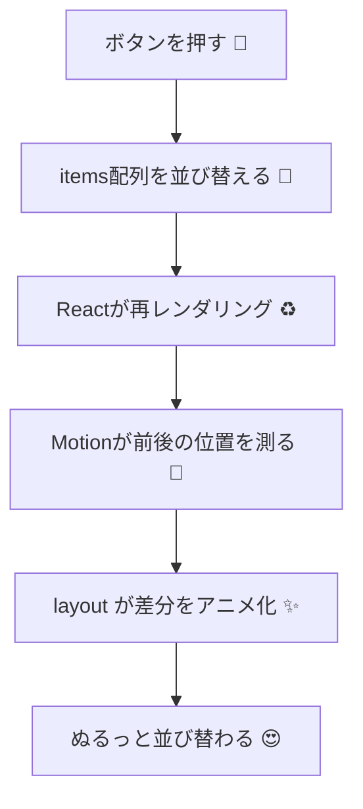

# 第205章：リストの並び替えアニメーション

この章は「並び替えでリストの順番が変わったとき、スルッ✨っと気持ちよく動く」を作ります😊
Motion（旧 Framer Motion）の **`layout`** を使うと、**Reactの再レンダリングで起きたレイアウト変化（位置・サイズ・並び順）**を自動でアニメーションしてくれます。([Motion][1])

---

## 1) 今日つくるもの 🎯📋

* 「シャッフル」「A→Z」「Z→A」「上へ」「下へ」「削除」ボタンで順番が変わる
* そのたびに **リストがぬるっと並び替わる**✨
* 削除は **ふわっと消えて**、残りが **スッ…と詰まる**（`AnimatePresence`）🫧

---

## 2) まず準備（Windows / Vite）🪟⚡

Motion は npm で入れられて、React では `"motion/react"` から import します。([Motion][2])

```powershell
npm create vite@latest motion-list -- --template react-ts
cd motion-list
npm install
npm install motion
npm run dev
```

---

## 3) コードを書こう ✍️💖

### `src/App.tsx`

```tsx
import { useMemo, useState } from "react"
import { AnimatePresence, motion } from "motion/react"
import styles from "./App.module.css"

type Item = {
  id: string
  title: string
  score: number
}

const initialItems: Item[] = [
  { id: "a", title: "カフェで課題", score: 3 },
  { id: "b", title: "友だちとごはん", score: 1 },
  { id: "c", title: "推し動画見る", score: 2 },
  { id: "d", title: "ジム行く", score: 4 },
  { id: "e", title: "お部屋そうじ", score: 5 },
]

function shuffle<T>(arr: T[]) {
  const a = [...arr]
  for (let i = a.length - 1; i > 0; i--) {
    const j = Math.floor(Math.random() * (i + 1))
    const tmp = a[i]
    a[i] = a[j]
    a[j] = tmp
  }
  return a
}

function swap<T>(arr: T[], i: number, j: number) {
  const a = [...arr]
  const tmp = a[i]
  a[i] = a[j]
  a[j] = tmp
  return a
}

export default function App() {
  const [items, setItems] = useState<Item[]>(initialItems)

  const sortedAz = useMemo(() => {
    return [...items].sort((a, b) => a.title.localeCompare(b.title, "ja"))
  }, [items])

  const sortedZa = useMemo(() => {
    return [...items].sort((a, b) => b.title.localeCompare(a.title, "ja"))
  }, [items])

  const onShuffle = () => setItems((prev) => shuffle(prev))
  const onSortAz = () => setItems(sortedAz)
  const onSortZa = () => setItems(sortedZa)

  const moveUp = (id: string) => {
    setItems((prev) => {
      const i = prev.findIndex((x) => x.id === id)
      if (i <= 0) return prev
      return swap(prev, i, i - 1)
    })
  }

  const moveDown = (id: string) => {
    setItems((prev) => {
      const i = prev.findIndex((x) => x.id === id)
      if (i < 0 || i >= prev.length - 1) return prev
      return swap(prev, i, i + 1)
    })
  }

  const remove = (id: string) => setItems((prev) => prev.filter((x) => x.id !== id))

  return (
    <div className={styles.page}>
      <header className={styles.header}>
        <h1>並び替えリスト ✨</h1>
        <p>ボタンで順番を変えると、ぬるっと動くよ〜🧸</p>
      </header>

      <div className={styles.toolbar}>
        <button onClick={onShuffle}>シャッフル 🔀</button>
        <button onClick={onSortAz}>A→Z 🔤</button>
        <button onClick={onSortZa}>Z→A 🔡</button>
      </div>

      {/* ✅ ここが主役！親にも子にも layout を付ける */}
      <motion.ul layout className={styles.list}>
        {/* 削除(退出)も絡むので AnimatePresence を使う */}
        <AnimatePresence mode="popLayout">
          {items.map((item) => (
            // ✅ key は index じゃなくて「固定ID」！（並び替えで壊れるから）
            <motion.li
              key={item.id}
              layout
              className={styles.card}
              initial={{ opacity: 0, y: 10 }}
              animate={{ opacity: 1, y: 0 }}
              exit={{ opacity: 0, scale: 0.98 }}
              transition={{ type: "spring", stiffness: 500, damping: 35 }}
            >
              <div className={styles.cardMain}>
                <div className={styles.titleRow}>
                  <span className={styles.title}>{item.title}</span>
                  <span className={styles.badge}>優先度 {item.score} ⭐</span>
                </div>

                <div className={styles.actions}>
                  <button onClick={() => moveUp(item.id)}>上へ ⬆️</button>
                  <button onClick={() => moveDown(item.id)}>下へ ⬇️</button>
                  <button onClick={() => remove(item.id)}>削除 🗑️</button>
                </div>
              </div>
            </motion.li>
          ))}
        </AnimatePresence>
      </motion.ul>

      <footer className={styles.footer}>
        <p>
          ポイント：<code>layout</code> は「Reactの再描画で起きたレイアウト変化」を自動でアニメ化するよ
          🪄
        </p>
      </footer>
    </div>
  )
}
```

### `src/App.module.css`

```css
.page {
  max-width: 720px;
  margin: 0 auto;
  padding: 24px;
  font-family: system-ui, -apple-system, "Segoe UI", sans-serif;
}

.header h1 {
  margin: 0 0 6px;
  font-size: 28px;
}

.header p {
  margin: 0 0 18px;
  opacity: 0.8;
}

.toolbar {
  display: flex;
  gap: 10px;
  flex-wrap: wrap;
  margin-bottom: 14px;
}

button {
  padding: 10px 12px;
  border-radius: 12px;
  border: 1px solid #ddd;
  background: #fff;
  cursor: pointer;
}

button:hover {
  background: #f7f7f7;
}

.list {
  list-style: none;
  padding: 0;
  margin: 0;
  display: grid;
  gap: 12px;
}

.card {
  border: 1px solid #e5e5e5;
  border-radius: 16px;
  background: #fff;
  padding: 14px;
}

.cardMain {
  display: grid;
  gap: 10px;
}

.titleRow {
  display: flex;
  align-items: center;
  justify-content: space-between;
  gap: 10px;
}

.title {
  font-size: 18px;
  font-weight: 700;
}

.badge {
  font-size: 12px;
  padding: 6px 10px;
  border-radius: 999px;
  border: 1px solid #eee;
  background: #fafafa;
  white-space: nowrap;
}

.actions {
  display: flex;
  gap: 8px;
  flex-wrap: wrap;
}

.footer {
  margin-top: 18px;
  opacity: 0.8;
}
```

---

## 4) 何が「魔法」なの？🪄🧠（超やさしく）

`layout` を付けると、**再レンダリング前の位置**と**後の位置**を Motion が測って、差分をいい感じに埋めるアニメにしてくれます✨
「幅/高さ」「グリッド列数」「リスト並び替え」「追加/削除」みたいなレイアウト変化が対象だよ。([Motion][1])
しかも内部的には `transform` を使うのでパフォーマンス面でも有利、という説明になってます。([Motion][1])

> ちなみに、`layout` で動かす“レイアウトの変化”は `style` や `className` で作るのが基本だよ（`layout` が面倒見てくれるから）🧼([Motion][1])

---

## 5) 図でイメージする（流れ）🧩➡️✨



---

## 6) つまずきポイント集 🧯😵‍💫

### ✅ `key` に `index` を使わない！

並び替えが起きると「同じ要素」の判定が崩れて、アニメもUIも変になります🥲
Motion側も **index key はダメ**、**IDなど固定のユニーク値が推奨**と説明しています。([Motion][3])

### ✅ 削除も気持ちよくやりたいなら `AnimatePresence`

削除（DOMから消える）瞬間をアニメしたいなら `AnimatePresence` を使うよ〜🫧
`mode="popLayout"` を使う例も docs に載っています。([Motion][3])

### ✅ スクロールする箱の中なら `layoutScroll`

スクロールコンテナ内のレイアウトアニメがズレるときは、スクロールする要素に `layoutScroll` を付ける方法が案内されています。([Motion][4])

---

## 7) ミニ練習（5分）⏱️🎀

1. 「優先度が高い順（数字が大きい順）」ボタンを追加してみよ〜⭐
2. 「追加」ボタンで新しいカードを1枚増やしてみよ〜➕（`crypto.randomUUID()` でID作ると楽！）
3. 追加時も `layout` で全体がスッと動くのを観察👀✨

---

次の章（第206章）で「ページ遷移」も同じノリで“気持ちよさ”を作っていくよ〜🚀💕

[1]: https://motion.dev/docs/react-layout-animations "Layout Animation — React FLIP & Shared Element | Motion"
[2]: https://motion.dev/docs/react-installation "How to install Motion for React | Motion"
[3]: https://motion.dev/docs/react-animate-presence "AnimatePresence — React exit animations | Motion"
[4]: https://motion.dev/docs/react-motion-component "React <motion /> component | Motion"
