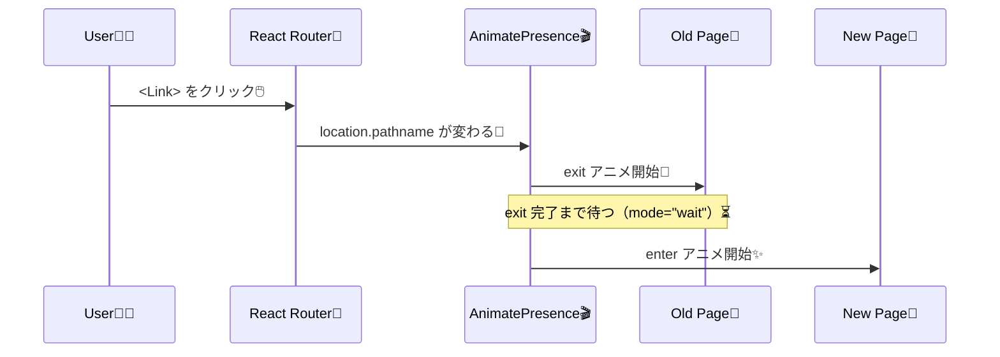

# 第206章：ページ遷移アニメーション

ページを切り替えるときに、**ふわっ✨／すーっ➡️** って気持ちよく動くやつを作るよ〜😊
（React Router + Framer Motion の王道パターン！）

---

## 今日のゴール 🎯

* 画面遷移で **前のページが消える（exit）** → **次のページが入る（enter）** を作れるようにする✨
* 「ガタガタしない」ように、ページを **重ねて** アニメする🧠

---

## まずは仕組みのイメージ 👀✨（図解）



`mode="wait"` にすると、**旧ページの exit が終わってから新ページが入る**よ（見た目がキレイ！）([Motion][1])

---

## セットアップ 🧰✨

### 1) インストール（まだなら）

```bash
npm i framer-motion
```

ちなみに、2025年末時点で `framer-motion` は **12.x 系**が更新されてるよ([npm][2])
（やることは同じなので安心してOK😊）

---

## 最小構成で「ページ遷移アニメ」を作る 💫

### フォルダ例 📁

```txt
src/
  main.tsx
  App.tsx
  pages/
    Home.tsx
    About.tsx
```

---

## Step 1：Router を用意する 🧭

### `src/main.tsx`

```tsx
import React from "react";
import ReactDOM from "react-dom/client";
import { BrowserRouter } from "react-router-dom";
import App from "./App";

ReactDOM.createRoot(document.getElementById("root")!).render(
  <React.StrictMode>
    <BrowserRouter>
      <App />
    </BrowserRouter>
  </React.StrictMode>
);
```

---

## Step 2：Routes を AnimatePresence で包む 🎬

ポイントはここ！👇

* `useLocation()` で現在の場所を取る
* `Routes` に `location` を渡す
* `key={location.pathname}` で「ページが変わった！」を確実に伝える🔑

### `src/App.tsx`

```tsx
import { Link, Route, Routes, useLocation } from "react-router-dom";
import { AnimatePresence } from "framer-motion";
import Home from "./pages/Home";
import About from "./pages/About";

export default function App() {
  const location = useLocation();

  return (
    <div style={{ padding: 16 }}>
      <nav style={{ display: "flex", gap: 12, marginBottom: 16 }}>
        <Link to="/">Home</Link>
        <Link to="/about">About</Link>
      </nav>

      {/* ページを重ねてアニメするための“舞台” 🎭 */}
      <div style={{ position: "relative", overflow: "hidden", minHeight: 200 }}>
        <AnimatePresence mode="wait" initial={false}>
          <Routes location={location} key={location.pathname}>
            <Route path="/" element={<Home />} />
            <Route path="/about" element={<About />} />
          </Routes>
        </AnimatePresence>
      </div>
    </div>
  );
}
```

`mode="wait"` は「新しい要素は、古い要素の exit 完了まで待つ」って動きだよ([Motion][1])

---

## Step 3：各ページを motion で作る（enter/exit）✨

### 共通のアニメ設定（イメージ）

* 入るとき：右からスッ➡️＋透明からふわっ✨
* 出るとき：左へスッ⬅️＋透明へ🫥

### `src/pages/Home.tsx`

```tsx
import { motion } from "framer-motion";

const pageStyle: React.CSSProperties = {
  position: "absolute",
  inset: 0,
};

export default function Home() {
  return (
    <motion.main
      style={pageStyle}
      initial={{ opacity: 0, x: 30 }}
      animate={{ opacity: 1, x: 0 }}
      exit={{ opacity: 0, x: -30 }}
      transition={{ duration: 0.25 }}
    >
      <h1>Home 🏠✨</h1>
      <p>ここがホームだよ〜😊</p>
    </motion.main>
  );
}
```

### `src/pages/About.tsx`

```tsx
import { motion } from "framer-motion";

const pageStyle: React.CSSProperties = {
  position: "absolute",
  inset: 0,
};

export default function About() {
  return (
    <motion.main
      style={pageStyle}
      initial={{ opacity: 0, x: 30 }}
      animate={{ opacity: 1, x: 0 }}
      exit={{ opacity: 0, x: -30 }}
      transition={{ duration: 0.25 }}
    >
      <h1>About 🐣💡</h1>
      <p>ページ遷移が気持ちいい〜！🥳</p>
    </motion.main>
  );
}
```

✅ これで完成！🎉
リンクを押すたびに、**旧ページが exit → 新ページが enter** になるよ😍

---

## よくあるハマりどころ集 💥（ここ大事！）

### 1) exit が動かない 😭

だいたいこれ👇

* `AnimatePresence` で包んでない
* `key={location.pathname}` がない
* ページ側に `exit` がない

### 2) ページがガタッとズレる 😵‍💫

ページは **重ねて** 動かすのがコツ！
だからページ（`motion.main`）に
`position: "absolute"` + 親に `position: "relative"` が効くよ🎭✨

### 3) 遷移中に2ページ見えてモヤる 🙈

`mode="wait"` が効くよ！
（旧ページの exit が終わるまで新ページが入らない）([Motion][1])
※ `wait` は基本「同時に複数の子をうまく扱わない」前提だから、ページ遷移みたいに**常に1枚だけ表示**の用途にぴったりだよ👍([Motion][1])

---

## ミニ練習 📝✨

1. `Home` は「下から上へ」⬆️、`About` は「上から下へ」⬇️ みたいに、ページごとに動きを変えてみよう🎨
2. `transition={{ duration: 0.4, ease: "easeInOut" }}` にして、好みの気持ちよさを探してみよう🎧✨

---

次の章（第207章）では、ホバーしたときの「ぷにっ👆」とか、押したときの「ぎゅっ🤏」みたいな **触感フィードバック**を作っていくよ〜😆💖

[1]: https://motion.dev/docs/react-animate-presence?utm_source=chatgpt.com "AnimatePresence — React exit animations - Motion"
[2]: https://www.npmjs.com/package/framer-motion?utm_source=chatgpt.com "framer-motion"
