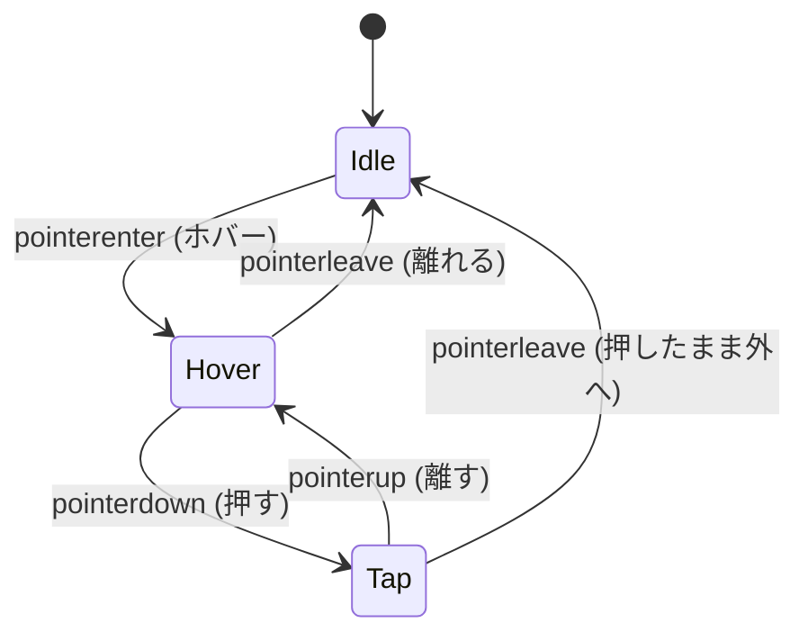

# 第207章：ホバーとタップのフィードバック

「押せる！」「反応した！」って伝わる“小さな気持ちよさ”を作っていくよ〜🫶💡
今日は **Framer Motion の `whileHover` と `whileTap`** を使って、ボタンやカードに“触った感”を足していきます🎀

---

## 1) 今日はなにができるようになる？ 🎯

* ホバーしたらフワッと浮く（PC向け）🖱️✨
* 押した瞬間にキュッと沈む（スマホでも効く）📱👉
* “やりすぎない”ちょうどいい数値がわかる💗
* 動きを減らしたい人（設定）にもやさしい対応ができる🍀

---

## 2) まずは準備（Framer Motionを入れる）🧰

プロジェクトのフォルダでこれ👇

```bash
npm i framer-motion
```

---

## 3) ホバー＆タップって、内部ではこう動くよ 🧠✨（図解）

「通常 → ホバー → 押す → 戻る」って感じ！



---

## 4) 最小コードで“気持ちいいボタン”を作る 😆💥

### 4-1) `FeedbackButton.tsx` を作ろう 🧩

`src/components/FeedbackButton.tsx`

```tsx
import { motion, useReducedMotion } from "framer-motion";

type Props = {
  label: string;
  onClick?: () => void;
  disabled?: boolean;
};

export function FeedbackButton({ label, onClick, disabled = false }: Props) {
  const reduce = useReducedMotion();

  return (
    <motion.button
      type="button"
      onClick={onClick}
      disabled={disabled}
      whileHover={
        reduce || disabled
          ? undefined
          : {
              y: -1,
              scale: 1.02,
              boxShadow: "0 10px 20px rgba(0,0,0,0.12)",
            }
      }
      whileTap={reduce || disabled ? undefined : { y: 0, scale: 0.98 }}
      transition={{ type: "spring", stiffness: 500, damping: 30, mass: 0.6 }}
      style={{
        padding: "12px 16px",
        borderRadius: 14,
        border: "1px solid rgba(0,0,0,0.12)",
        background: disabled ? "rgba(0,0,0,0.06)" : "white",
        cursor: disabled ? "not-allowed" : "pointer",
        fontWeight: 700,
        userSelect: "none",
      }}
    >
      {label}
    </motion.button>
  );
}
```

ポイント👀✨

* `whileHover`：ホバー中だけの動き（PC向け）🖱️
* `whileTap`：押してる間だけの動き（スマホでも効く）📱
* `useReducedMotion()`：動きを減らしたい人の設定を尊重🍀（優しさ…！）

---

### 4-2) `App.tsx` で試すよ 🧪💕

`src/App.tsx`

```tsx
import { useState } from "react";
import { FeedbackButton } from "./components/FeedbackButton";

export default function App() {
  const [count, setCount] = useState(0);

  return (
    <div style={{ padding: 24, display: "grid", gap: 16 }}>
      <h1 style={{ margin: 0 }}>第207章：ホバーとタップのフィードバック ✨</h1>

      <p style={{ margin: 0 }}>カウント: {count} 🎉</p>

      <div style={{ display: "flex", gap: 12, flexWrap: "wrap" }}>
        <FeedbackButton label="いいね！👍" onClick={() => setCount((c) => c + 1)} />
        <FeedbackButton label="無効ボタン 🚫" disabled />
      </div>

      <p style={{ margin: 0, opacity: 0.7 }}>
        ヒント: スマホ/タッチ操作だと「ホバー」は基本起きないよ📱
        でも「タップの沈み」はちゃんと効くから安心😊
      </p>
    </div>
  );
}
```

起動👇

```bash
npm run dev
```

---

## 5) よく使う“気持ちいい”パターン集 🎁✨

### ✅ 王道：ちょい拡大（hover）＋ちょい縮小（tap）

* hover：`scale: 1.01〜1.05` 🫧
* tap：`scale: 0.96〜0.99` 🫶
  「やりすぎると安っぽく見える」ので、**控えめが正義**👑✨

### ✅ “押せる感”を上げる小技

* hoverで `boxShadow` をちょい足し 🌙
* tapで `y: 1` みたいにほんの少し沈める 🧸

---

## 6) ありがちな失敗あるある 😵‍💫➡️😄

* ❌ ホバーで `scale: 1.15` とかにして巨大化 → うるさい＆レイアウト崩れがち💥
* ❌ いろんな場所が全部動く → ユーザーが疲れる🥱
* ✅ “押したところだけ”に絞ると上品✨

---

## 7) ミニ練習（15分）⏰💗

次のどっちかやってみてね👇（両方できたら優勝🏆）

### 練習A：カードにもホバー＆タップを付ける 🗂️✨

* `motion.div` にして
* hoverで少し浮く
* tapで少し沈む

### 練習B：押したら一瞬だけ“ぷるん”感を出す 🍮

* `transition` の `stiffness` を上げる（反発UP）
* `damping` を下げすぎるとビヨンビヨンするので注意😆

---

## 8) まとめ 🎀

* `whileHover`：触れた時の「反応したよ」🖱️✨
* `whileTap`：押した瞬間の「押せたよ」📱👉
* 数値は控えめが一番おしゃれ💅
* `useReducedMotion` でやさしさもセット🍀

---

次の章（第208章：ドラッグ操作）に行く前に、よかったら
「ボタン」「カード」「リストのアイテム」どれに動きをつけたいか教えて〜😊✨
それに合わせて“ちょうどいい演出レシピ”作るよ🫶🎁
