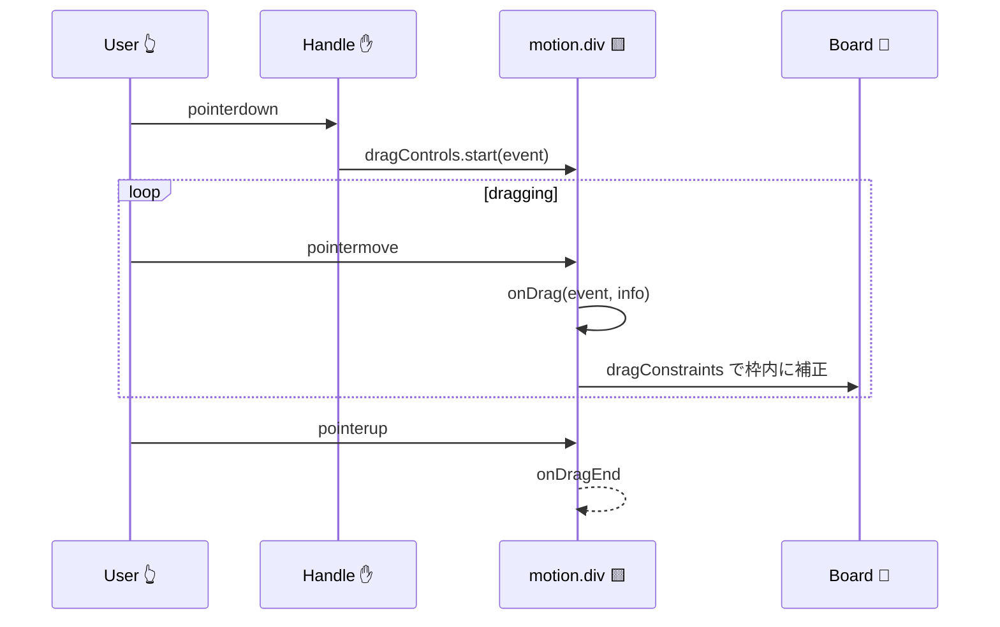

# 第208章：ドラッグ操作の実装

この章では「つかんで動かせるUI」を作ります✨
付箋（ふせん）みたいなカードを、ボードの中だけでドラッグできるようにして、**つかむ場所（ハンドル）だけで動く**ようにもします✋

> Motion は `drag` を付けるだけでドラッグできて、`dragConstraints` で範囲制限、`useDragControls` で「ハンドルだけでドラッグ開始」みたいな制御もできます。 ([Motion][1])

---

## 1) 今日作るもののイメージ 🎯

* ボード（枠）の中でだけ付箋が動く🧩
* 付箋の上の「つかむとこ✋」を押したときだけドラッグ開始
* ドラッグ中はちょい拡大して気持ちよく✨
* 座標や速度も表示（デバッグ用）👀

```mermaid
flowchart TD
  A[つかむとこ✋を押す] --> B[dragControls.start(event)]
  B --> C[ドラッグ中 onDrag]
  C --> D[dragConstraints で枠内に制限]
  D --> E[離す]
  E --> F{dragMomentum}
  F -->|true| G[慣性でスーッ🌀]
  F -->|false| H[ピタッ🧊]
  G --> I[onDragEnd]
  H --> I
```

---

## 2) インストール（Motionの入れ方）📦

最近の公式ドキュメントは **`motion` パッケージ + `motion/react` import** が基本です。 ([Motion][2])

* まだ入れてないなら：

```bash
npm install motion
```

* もし `framer-motion` が入っていて、公式推奨の形に寄せたいなら：

```bash
npm uninstall framer-motion
npm install motion
```

---

## 3) 実装してみよう（完成コード）🛠️✨

### ファイル構成（追加するやつ）📁

* `src/DragPlayground.tsx`
* `src/DragPlayground.module.css`

---

### `src/DragPlayground.tsx` 🧷

```tsx
import { motion, useDragControls } from "motion/react";
import { useRef, useState } from "react";
import styles from "./DragPlayground.module.css";

type DebugInfo = {
  offsetX: number;
  offsetY: number;
  velocityX: number;
  velocityY: number;
};

export function DragPlayground() {
  const constraintsRef = useRef<HTMLDivElement | null>(null);
  const dragControls = useDragControls();

  const [debug, setDebug] = useState<DebugInfo>({
    offsetX: 0,
    offsetY: 0,
    velocityX: 0,
    velocityY: 0,
  });

  // 「つかむとこ」からドラッグを開始する ✋
  const startDrag = (e: React.PointerEvent<HTMLDivElement>) => {
    dragControls.start(e, { snapToCursor: true });
  };

  return (
    <div className={styles.page}>
      <h1 className={styles.title}>ドラッグで動く付箋 🧷</h1>
      <p className={styles.lead}>上の「つかむとこ✋」を押して動かしてみてね〜！😊</p>

      <div ref={constraintsRef} className={styles.board}>
        <motion.div
          className={styles.sticky}
          drag
          dragControls={dragControls}
          dragListener={false} // 付箋本体を押しても動かない（ハンドル限定）
          dragConstraints={constraintsRef} // 枠の中だけで動く
          dragElastic={0.15} // ちょいゴム感
          dragMomentum={true} // 離したとき慣性でスーッ
          whileDrag={{
            scale: 1.03,
            boxShadow: "0px 14px 30px rgba(0,0,0,0.18)",
          }}
          onDrag={(_, info) => {
            // info.offset / info.velocity が便利✨
            setDebug({
              offsetX: Math.round(info.offset.x),
              offsetY: Math.round(info.offset.y),
              velocityX: Math.round(info.velocity.x),
              velocityY: Math.round(info.velocity.y),
            });
          }}
        >
          <div className={styles.handle} onPointerDown={startDrag}>
            つかむとこ ✋
          </div>

          <div className={styles.body}>
            <p className={styles.memoTitle}>メモ：買い物🛒</p>
            <ul className={styles.list}>
              <li>牛乳🥛</li>
              <li>チョコ🍫</li>
              <li>りんご🍎</li>
            </ul>

            <div className={styles.debug}>
              <div>offset: ({debug.offsetX}, {debug.offsetY})</div>
              <div>velocity: ({debug.velocityX}, {debug.velocityY})</div>
            </div>
          </div>
        </motion.div>
      </div>
    </div>
  );
}
```

> `onDrag` の `info` には `point / delta / offset / velocity` が入ってて超便利です👀 ([Motion][1])
> `dragControls.start()` と `dragListener={false}` の組み合わせで「ハンドルからだけ開始」ができます✋ ([Motion][1])

---

### `src/DragPlayground.module.css` 🎨

```css
.page {
  padding: 18px;
}

.title {
  font-size: 24px;
  margin: 0 0 6px;
}

.lead {
  margin: 0 0 14px;
  opacity: 0.8;
}

.board {
  width: min(780px, 94vw);
  height: 360px;
  margin: 0 auto;
  border: 2px dashed rgba(0, 0, 0, 0.25);
  border-radius: 18px;
  background: linear-gradient(180deg, rgba(120, 140, 255, 0.08), rgba(255, 170, 120, 0.07));
  position: relative;
  overflow: hidden;
  padding: 14px;
}

.sticky {
  width: 260px;
  border-radius: 16px;
  background: #fff6a5;
  box-shadow: 0px 10px 20px rgba(0, 0, 0, 0.16);
}

.handle {
  padding: 10px 12px;
  border-top-left-radius: 16px;
  border-top-right-radius: 16px;
  background: rgba(0, 0, 0, 0.08);
  font-weight: 700;
  user-select: none;
  cursor: grab;

  /* スマホでスクロールと競合したら有効にすると快適かも📱 */
  touch-action: none;
}

.handle:active {
  cursor: grabbing;
}

.body {
  padding: 12px 14px 14px;
}

.memoTitle {
  margin: 0 0 8px;
  font-weight: 700;
}

.list {
  margin: 0;
  padding-left: 18px;
}

.debug {
  margin-top: 12px;
  font-size: 12px;
  opacity: 0.78;
}
```

---

### `src/App.tsx` に表示をつなぐ 🔌

```tsx
import { DragPlayground } from "./DragPlayground";

export default function App() {
  return <DragPlayground />;
}
```

---

## 4) ここが大事！ドラッグ系プロパティまとめ 🧠✨

### ✅ ① ドラッグ開始：`drag`

* `drag` → 自由に（xもyも）
* `drag="x"` → 横だけ
* `drag="y"` → 縦だけ ([Motion][1])

### ✅ ② 範囲制限：`dragConstraints`

* ピクセルで指定もできるし
* `ref` で「この枠の中」って指定もできる ([Motion][3])

### ✅ ③ ふわっと持ち上げ演出：`whileDrag`

ドラッグ中だけ `scale` や `boxShadow` を変えられるよ✨ ([Motion][1])

### ✅ ④ ゴム感：`dragElastic`

`0` に近いほど固く、`1` に近いほどビヨ〜ン😆 ([Motion][3])

### ✅ ⑤ 離した後の慣性：`dragMomentum`

`false` にすると「ピタッ」って止まる🧊 ([Motion][3])

---

## 5) 図でイベントの流れもつかもう 📚👆



---

## 6) ミニ練習（ちょい足し）🏃‍♀️💨

### 🌟 練習1：横だけにしてみよ！

`drag` を `drag="x"` に変えるだけ👉

### 🌟 練習2：慣性をOFFにして「ピタッ」停止🧊

`dragMomentum={false}` にしてみよ〜！ ([Motion][3])

### 🌟 練習3：ドラッグ方向ロック（最初に動いた方向に固定）🔒

`dragDirectionLock` を付けてみてね！ ([Motion][1])

---

## 7) よくあるつまずき（先回り）🧯

* **動かない！😵**

  * `dragListener={false}` にしてるなら、**必ず** `dragControls.start()` を呼ぶ導線（今回だとハンドル）を作る！
* **枠からはみ出す！🫠**

  * `dragConstraints={constraintsRef}` は **ref を付けた要素がちゃんとサイズを持ってる**必要あり（`height` とか） ([Motion][3])

---

次の第209章は「スクロール連動アニメーション」だね📜✨
その前に、付箋を **2枚に増やして**、それぞれドラッグできるようにしてみる？😊

[1]: https://motion.dev/docs/react-drag "React drag animation guide | Motion"
[2]: https://motion.dev/docs/react-upgrade-guide "Motion & Framer Motion upgrade guide | Motion"
[3]: https://motion.dev/docs/react-motion-component "React <motion /> component | Motion"
