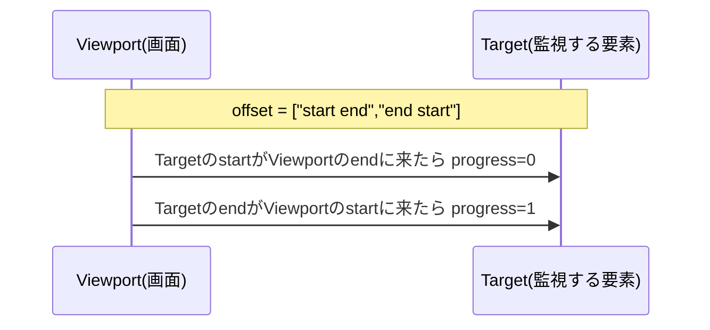

# 第209章：スクロール連動アニメーション

この章では、スクロール量に合わせて**アニメーションがリアルタイムに変化**する演出を作ります😊
（「スクロールした分だけ、ちょっとずつ動く」＝スクロール連動！）

---

## 今日つくるもの 🎁

1. **ページ上部のスクロール進捗バー**（読み進めた分だけ伸びる）📈
2. **ヒーローのパララックス**（背景や見出しがふわ〜っとズレる）🌤️
3. **セクションのフェード＆スライド**（その位置に来たら “じわっ” と出る）🌸

---

## まず大事なイメージ：スクロール → 値(0〜1) → 見た目 ✨

```mermaid
flowchart LR
  A[スクロール] --> B[useScroll()]
  B --> C[scrollYProgress (0〜1)]
  C --> D[useTransform / useSpring]
  D --> E[motion.div の style]
  E --> F[画面がヌルっと変化]
```

`scrollYProgress` は **0〜1の数字**で、「どれくらいスクロールしたか」を表してくれます。([Motion][1])
これを `useTransform` で **好きな動きに変換**して、`style` にそのまま突っ込むのが基本です😊

---

## 0. セットアップ（Motion を入れる）🧰

プロジェクトのフォルダで👇

```bash
npm install motion
```

Vite なら特別設定なしでOKです🎉([Motion][2])
使うときはこう import します👇([Motion][2])

```ts
import { motion, useScroll, useSpring, useTransform } from "motion/react";
```

---

## 1. 上に “進捗バー” を出す 📈✨（超かんたん）

### `src/App.tsx`

```tsx
import { useRef } from "react";
import { motion, useScroll, useSpring, useTransform } from "motion/react";
import "./App.css";

export default function App() {
  // ページ全体のスクロール（デフォルトで page scroll を追います）
  const { scrollYProgress } = useScroll(); // 0〜1 :contentReference[oaicite:3]{index=3}

  // そのままだとビシッと動くので、springで “ぬるっ” とさせる
  const progressX = useSpring(scrollYProgress, {
    stiffness: 200,
    damping: 30,
    mass: 0.2,
  }); // useScrollの値はuseSpringと合成できる :contentReference[oaicite:4]{index=4}

  // ヒーローのパララックス（ちょい上にズレていく）
  const heroY = useTransform(scrollYProgress, [0, 1], [0, -180]);

  // セクション単位で追いたい時は target を使う（後で使うよ）
  const featureRef = useRef<HTMLDivElement | null>(null);
  const { scrollYProgress: featureProgress } = useScroll({
    target: featureRef,
    offset: ["start end", "end start"], // 後で図で説明するね :contentReference[oaicite:5]{index=5}
  });

  const featureOpacity = useTransform(featureProgress, [0, 0.3, 1], [0, 1, 1]);
  const featureY = useTransform(featureProgress, [0, 1], [40, 0]);

  return (
    <div className="page">
      {/* 進捗バー */}
      <motion.div className="progressBar" style={{ scaleX: progressX }} />

      {/* ヒーロー（パララックス） */}
      <header className="hero">
        <motion.div className="heroInner" style={{ y: heroY }}>
          <h1>スクロール連動アニメーション 🌀✨</h1>
          <p>
            スクロールすると、進捗バー・背景・セクションが気持ちよく動くよ〜😄💖
          </p>
          <p className="hint">下にスクロールしてみてね👇👇👇</p>
        </motion.div>
      </header>

      {/* ダミーの文章（スクロール量を作る） */}
      <section className="block">
        <h2>読みものエリア 📚</h2>
        <p>
          ここはスクロールのための文章ゾーン！ 進捗バーが伸びていくのを見てみてね😊
        </p>
        <div className="filler" />
      </section>

      {/* ここから “要素単位” のスクロール連動 */}
      <section className="block">
        <h2>ここからが本番 🌸</h2>
        <p>次のカードは、見えてくるにつれて ふわっと出るよ✨</p>

        <div ref={featureRef}>
          <motion.div
            className="featureCard"
            style={{ opacity: featureOpacity, y: featureY }}
          >
            <h3>ふわっ…✨</h3>
            <p>
              これは <code>target</code> で “この要素の進捗” を見てるよ😋
            </p>
          </motion.div>
        </div>

        <div className="fillerSmall" />
      </section>

      <footer className="footer">
        <p>おつかれ！ ここまで来たら進捗100%だね🎉🎉🎉</p>
      </footer>
    </div>
  );
}
```

---

## 2. CSS（それっぽく見せる）🎨✨

### `src/App.css`

```css
.page {
  min-height: 100vh;
  font-family: system-ui, -apple-system, "Segoe UI", sans-serif;
}

.progressBar {
  position: fixed;
  top: 0;
  left: 0;
  right: 0;

  height: 6px;
  transform-origin: 0 50%;
  background: linear-gradient(90deg, #7c3aed, #22c55e);
  z-index: 10;
}

.hero {
  position: relative;
  height: 70vh;
  display: grid;
  place-items: center;
  padding: 24px;
  background:
    radial-gradient(circle at 30% 30%, rgba(124, 58, 237, 0.25), transparent 40%),
    radial-gradient(circle at 70% 40%, rgba(34, 197, 94, 0.25), transparent 45%),
    #0b1020;
  color: white;
  overflow: hidden;
}

.heroInner {
  max-width: 840px;
}

.hero h1 {
  font-size: 40px;
  margin: 0 0 12px;
}

.hero p {
  margin: 8px 0;
  line-height: 1.7;
  opacity: 0.9;
}

.hint {
  margin-top: 18px;
  opacity: 0.75;
}

.block {
  max-width: 900px;
  margin: 0 auto;
  padding: 48px 24px;
}

.filler {
  height: 900px;
  border-radius: 16px;
  background: linear-gradient(180deg, rgba(124, 58, 237, 0.08), rgba(34, 197, 94, 0.08));
  margin-top: 24px;
}

.fillerSmall {
  height: 600px;
}

.featureCard {
  border-radius: 18px;
  padding: 20px;
  background: white;
  box-shadow: 0 10px 30px rgba(0, 0, 0, 0.12);
  border: 1px solid rgba(0, 0, 0, 0.06);
}

.featureCard h3 {
  margin: 0 0 8px;
}

.footer {
  padding: 40px 24px 60px;
  text-align: center;
  opacity: 0.8;
}
```

---

## 3. `offset` の感覚（ここがわかると一気に強くなる）🧠✨

今回使った👇

* `offset: ["start end", "end start"]`

これは「**ターゲット要素が、画面に入ってきてから出ていくまで**」を 0→1 にしてくれる感じです。([Motion][1])



---

## 4. コツ（スクロール連動は “State” にしない）⚠️

スクロール量を `useState` で受けて毎回 setState すると、**スクロール中ずっと再レンダリング**で重くなりがち😵‍💫
でも Motion の `MotionValue` は `style` に直結できて、**再レンダリング少なめ**で気持ちよく動きます✨（`useScroll` は MotionValue を返すよ）([Motion][1])

---

## 5. ミニ練習（3分でできる）🧪💕

### 練習A：カードを “拡大しながら” 出す 🔍✨

`featureCard` に `scale` を追加してみよ！

ヒント👇

```ts
const featureScale = useTransform(featureProgress, [0, 1], [0.95, 1]);
```

### 練習B：ヒーロー文字を少し透明にする 🌫️

スクロールが進むほど文字が薄くなる（やりすぎ注意！笑）

---

## 6. よくあるつまずき ✅

* **動かない** → スクロールできる高さが足りないかも！`filler` の高さを増やしてみてね👇
* **target が効かない** → `ref` が付いてる要素が `null` のままになってないか確認！（`ref={...}` の付け忘れ多い！）
* **カクつく** → `useSpring` を挟むと改善しやすいよ〜😊([Motion][1])

---

## まとめ 🎉

* `useScroll()` で **スクロール量（0〜1）** が取れる！([Motion][1])
* `useTransform()` で **動きに変換**して `style` に直結！
* `useSpring()` で **ぬるっと上質**にできる！([Motion][1])
* `target` + `offset` で **要素ごとの進捗**も作れる！([Motion][1])

---

次の章（第210章）は、これを TODO リストに入れて「触って気持ちいいアプリ」まで仕上げるよ〜🥳🧡

[1]: https://motion.dev/docs/react-use-scroll "useScroll — React scroll-linked animations | Motion"
[2]: https://motion.dev/docs/react-installation "How to install Motion for React | Motion"
