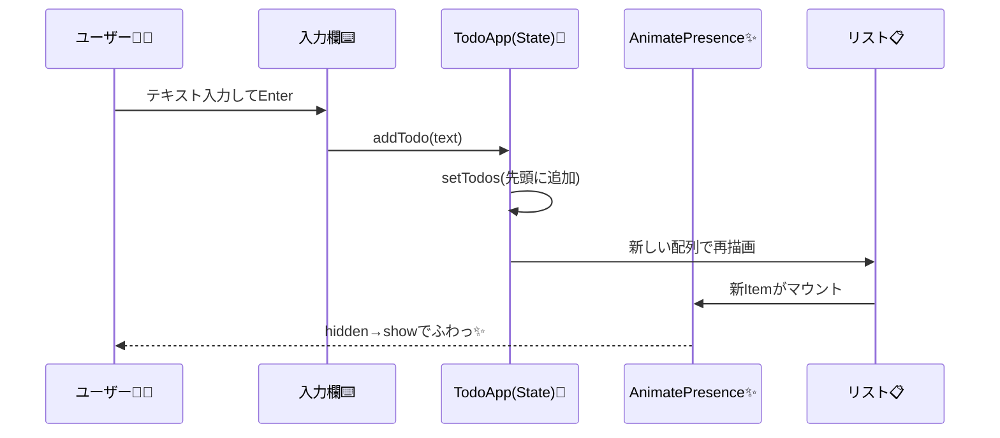

# 第210章：練習：TODOリストに気持ちいい動きをつける

この章では、いつものTODOリストに **「触って気持ちいい」アニメーション** を入れていくよ〜！🥰
追加・削除・並び替えが **ぬるぬる** 動くと、一気にアプリっぽくなる✨

---

## この章でできるようになること ✅🎯

* TODOを追加したとき **ふわっ** と出る✨
* TODOを削除したとき **すーっ** と消える🫥
* TODOをドラッグして並び替えると **自然に追従** して動く🧲
* ホバーやタップで **押せてる感** を出す👇✨

---

## まず入れるもの 📦💻

プロジェクトのフォルダでこれ👇（ターミナル / PowerShell どっちでもOK）

```bash
npm i framer-motion
```

---

## 仕上がりの全体像（部品の関係）🧩

```mermaid
flowchart TD
  A[TodoApp] --> B[Inputエリア<br/>text + 追加ボタン]
  A --> C[Reorder.Group<br/>TODOリスト]
  C --> D[TodoItem (Reorder.Item)]
  D -->|完了トグル| A
  D -->|削除| A
  C -->|ドラッグで並び替え| A
```

---

## 作るファイル構成 📁✨

こんな感じにするよ（すでにあるなら合わせてOK）😊

* `src/TodoApp.tsx`
* `src/TodoApp.module.css`
* `src/App.tsx`（呼び出すだけ）

---

## 1) `src/App.tsx`（表示するだけ）🪄

```tsx
import TodoApp from "./TodoApp";

export default function App() {
  return <TodoApp />;
}
```

---

## 2) `src/TodoApp.module.css`（見た目をちょい可愛く）🎀

```css
.wrapper {
  max-width: 720px;
  margin: 32px auto;
  padding: 24px;
}

.title {
  font-size: 22px;
  font-weight: 700;
  margin-bottom: 16px;
}

.card {
  border: 1px solid #e7e7e7;
  border-radius: 16px;
  padding: 16px;
  box-shadow: 0 6px 18px rgba(0,0,0,0.06);
  background: #fff;
}

.row {
  display: flex;
  gap: 10px;
  align-items: center;
}

.input {
  flex: 1;
  border: 1px solid #ddd;
  border-radius: 12px;
  padding: 10px 12px;
  font-size: 16px;
}

.addBtn {
  border: 0;
  border-radius: 12px;
  padding: 10px 14px;
  font-size: 16px;
  cursor: pointer;
}

.hint {
  margin-top: 10px;
  font-size: 13px;
  opacity: 0.75;
}

.list {
  list-style: none;
  padding: 0;
  margin: 16px 0 0 0;
  display: grid;
  gap: 10px;
}

.item {
  border: 1px solid #eee;
  border-radius: 14px;
  padding: 12px 12px;
  display: flex;
  align-items: center;
  gap: 10px;
  background: #fafafa;
}

.check {
  width: 18px;
  height: 18px;
}

.text {
  flex: 1;
  font-size: 16px;
}

.done {
  text-decoration: line-through;
  opacity: 0.6;
}

.delBtn {
  border: 0;
  border-radius: 12px;
  padding: 8px 10px;
  cursor: pointer;
}

.empty {
  margin-top: 14px;
  padding: 14px;
  border-radius: 14px;
  border: 1px dashed #ddd;
  background: #fcfcfc;
  opacity: 0.85;
}
```

---

## 3) `src/TodoApp.tsx`（本体：アニメ全部ここ！）🔥💃

ポイントはここ👇

* `AnimatePresence`：**消えるアニメ**（exit）を可能にする✨
* `Reorder.Group / Reorder.Item`：**ドラッグ並び替え**が一気にできる🧲
* `layout`：並び替え時の **追従アニメ** がきれい😍
* `useReducedMotion()`：動き苦手な人向けに配慮（やさしさ）🫶

```tsx
import { useMemo, useState } from "react";
import { AnimatePresence, Reorder, motion, useReducedMotion } from "framer-motion";
import styles from "./TodoApp.module.css";

type Todo = {
  id: string;
  text: string;
  done: boolean;
  createdAt: number;
};

function createTodo(text: string): Todo {
  return {
    id: crypto.randomUUID(),
    text,
    done: false,
    createdAt: Date.now(),
  };
}

export default function TodoApp() {
  const [text, setText] = useState("");
  const [todos, setTodos] = useState<Todo[]>(() => [
    createTodo("ゼミの資料つくる📄"),
    createTodo("コンビニでお茶買う🍵"),
    createTodo("Reactちょっと触る💻✨"),
  ]);

  const reduceMotion = useReducedMotion();

  const itemVariants = useMemo(() => {
    // reduceMotion のときは「移動」を減らして、目にやさしく🫶
    const yFrom = reduceMotion ? 0 : 10;
    const yExit = reduceMotion ? 0 : -10;

    return {
      hidden: { opacity: 0, y: yFrom, scale: reduceMotion ? 1 : 0.98 },
      show: { opacity: 1, y: 0, scale: 1 },
      exit: { opacity: 0, y: yExit, scale: reduceMotion ? 1 : 0.98 },
    };
  }, [reduceMotion]);

  const spring = useMemo(() => {
    return reduceMotion
      ? { duration: 0 }
      : { type: "spring", stiffness: 520, damping: 34, mass: 0.7 };
  }, [reduceMotion]);

  function addTodo() {
    const t = text.trim();
    if (!t) return;

    setTodos((prev) => [createTodo(t), ...prev]);
    setText("");
  }

  function toggleDone(id: string) {
    setTodos((prev) =>
      prev.map((todo) => (todo.id === id ? { ...todo, done: !todo.done } : todo))
    );
  }

  function removeTodo(id: string) {
    setTodos((prev) => prev.filter((todo) => todo.id !== id));
  }

  return (
    <div className={styles.wrapper}>
      <h1 className={styles.title}>TODOリスト（気持ちいい動き付き）✨📝</h1>

      <div className={styles.card}>
        <div className={styles.row}>
          <input
            className={styles.input}
            value={text}
            onChange={(e) => setText(e.target.value)}
            placeholder="例：レポート提出する📮"
            onKeyDown={(e) => {
              if (e.key === "Enter") addTodo();
            }}
          />

          <motion.button
            className={styles.addBtn}
            onClick={addTodo}
            whileHover={{ scale: reduceMotion ? 1 : 1.03 }}
            whileTap={{ scale: reduceMotion ? 1 : 0.98 }}
            transition={spring}
          >
            追加➕
          </motion.button>
        </div>

        <div className={styles.hint}>
          💡 ドラッグで並び替えできるよ！ / Enterでも追加できるよ！
        </div>

        <Reorder.Group
          axis="y"
          values={todos}
          onReorder={setTodos}
          className={styles.list}
        >
          <AnimatePresence initial={false}>
            {todos.map((todo) => (
              <Reorder.Item
                key={todo.id}
                value={todo}
                className={styles.item}
                layout
                variants={itemVariants}
                initial="hidden"
                animate="show"
                exit="exit"
                transition={spring}
                whileHover={{ scale: reduceMotion ? 1 : 1.01 }}
                whileTap={{ scale: reduceMotion ? 1 : 0.99 }}
              >
                <input
                  className={styles.check}
                  type="checkbox"
                  checked={todo.done}
                  onChange={() => toggleDone(todo.id)}
                />

                <motion.span
                  className={`${styles.text} ${todo.done ? styles.done : ""}`}
                  layout
                  transition={spring}
                >
                  {todo.text}
                </motion.span>

                <motion.button
                  className={styles.delBtn}
                  onClick={() => removeTodo(todo.id)}
                  whileHover={{ scale: reduceMotion ? 1 : 1.05 }}
                  whileTap={{ scale: reduceMotion ? 1 : 0.95 }}
                  transition={spring}
                  aria-label="削除"
                  title="削除"
                >
                  🗑️
                </motion.button>
              </Reorder.Item>
            ))}
          </AnimatePresence>
        </Reorder.Group>

        <AnimatePresence>
          {todos.length === 0 && (
            <motion.div
              className={styles.empty}
              initial={{ opacity: 0, y: reduceMotion ? 0 : 8 }}
              animate={{ opacity: 1, y: 0 }}
              exit={{ opacity: 0, y: reduceMotion ? 0 : -8 }}
              transition={spring}
            >
              いまTODOゼロだね〜！えらい！🥳✨ 新しいTODO入れてみよっ
            </motion.div>
          )}
        </AnimatePresence>
      </div>
    </div>
  );
}
```

---

## 動きが起きる流れ（追加の瞬間）🧠✨



---

## よくあるつまづきポイント 🧯😵‍💫

* **アニメが消える（exitしない）**
  → `AnimatePresence` を忘れてる可能性大！👀✨
* **ドラッグできない**
  → `Reorder.Group` の `values` と `onReorder` がセットになってるか確認🧲
* **キーが変で挙動が変**
  → `key` は `todo.id` みたいに **絶対ユニーク** にする🪪✨

---

## ミニ課題（やると一気に上達）🎓💪✨

1. 完了（done）のとき、アイテムの背景を少し変えてみよ🎨
2. 削除ボタンを押したとき、ちょい回転させてみよ🌀（`whileTap={{ rotate: ... }}` とか）
3. 「完了だけ表示」フィルタを作って、切り替えも `AnimatePresence` で気持ちよく✨

---

必要なら、このTODOリストを「ページ遷移アニメーション（第206章）」っぽくして、ルート分割まで含めた“ミニアプリ化”にもできるよ〜！🚀💖
