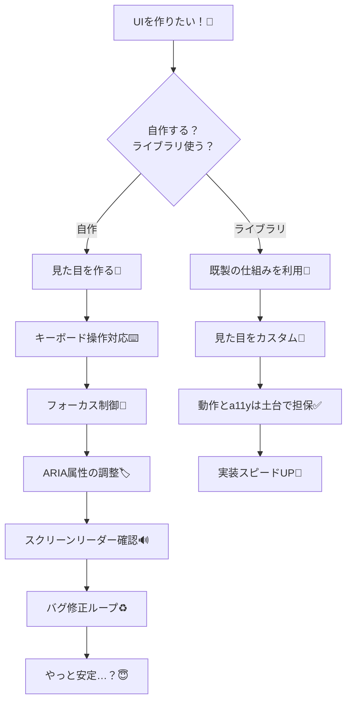
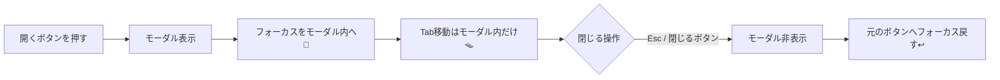

# 第211章：全部自作してると日が暮れる

こんにちは〜😊✨
この章はズバリ、「UIをぜんぶ自作するの、時間もバグも増えがちだよね…」って話だよ〜🧩💦
そして最大の落とし穴が **アクセシビリティ（a11y）**！👀⌨️🔊

---

## この章でわかること 🎯✨

* 「UIを自作し続ける」と何がつらいのか 😵‍💫
* アクセシビリティって何で大事なの？🙌
* **自作UIで“やりがち事故”**（モーダルやメニュー）😇
* UIライブラリを使うと何がラクになるの？🚀

---

## まず結論：見た目だけ作っても、UIは完成じゃない 🥺🎨

ボタンやモーダルって、見た目はそれっぽく作れるんだけど…
**“操作できること”** が本体なの！💡

たとえばモーダル（ダイアログ）って、見た目以外にこんな仕事があるよ👇

* `Esc` で閉じる ⌨️🧯
* 開いた瞬間、フォーカスを中に移す 👀👉
* `Tab` でフォーカスがモーダル外に逃げない（フォーカストラップ）🪤
* 閉じたら元のボタンにフォーカスを戻す ↩️
* スクリーンリーダー向けに “これはダイアログだよ” を伝える 🔊
* 背景を操作できないようにする（意図しないクリック防止）🧱

これ、地味に全部つらい〜〜〜😇😇😇

---

## 自作し続けると何が起きる？あるある地獄 🔥

* 同じUIを毎回作る（コピペ増殖）📄📄📄
* 仕様がちょっと違って「似てるのに別物」だらけ 😵‍💫
* バグが出たら全箇所修正（修羅）⚔️
* キーボード操作対応が抜けがち ⌨️💥
* ARIA属性が「これで合ってる…？」って不安になる 🫠
* 画面読み上げで崩壊してても気づきにくい 🔊😢

---

## 図で見る：自作 vs ライブラリ 🆚✨（ざっくりイメージ）



「自作」は勉強になるけど、**ずっと自作だけ**だと消耗しがち…って感じだね🥹💦

---

## アクセシビリティ（a11y）ってなに？🌈

一言でいうと、

> **いろんな人が、いろんな状況でも使えるUIにすること** 🙌

たとえばこんな人に効くよ👇（ぜんぶ“特別”じゃなくて、普通に起こる！）

* マウスが使えない（腱鞘炎・片手・タッチ端末）🖐️📱
* キーボードだけで操作したい ⌨️
* 画面を読み上げで使う 🔊
* 明るい屋外で見えにくい ☀️
* 集中力が落ちてるときに迷いやすい 😵‍💫
* 目が疲れてる（あるある）👀💤

つまり、**自分にも未来に効く**やつ！✨

---

## 自作UIの“事故ポイント”を体験しよう：モーダル編 😈🚪

モーダルを自作するとき、やりがちな「見た目だけOK」状態👇

* 背景のボタンが `Tab` で選べちゃう（モーダルの意味がない）🏃‍♀️💨
* 開いたのにフォーカスがどこにも行かない（迷子）😵‍💫
* `Esc` が効かない（閉じれない恐怖）😱
* スクリーンリーダーが「何が起きたかわからない」🔊❓

モーダルの理想の流れ（超重要）👇



これを毎回自作で完璧にやるの、けっこう大変…！😇

---

## “最低限”これだけは覚えておくチェックリスト ✅📝

### 1) まずはセマンティックHTMLを使う 🧱

* クリックするなら `div` じゃなくて `button` を使う！🖲️✨
  → それだけでキーボード操作とかが一気に助かること多いよ

### 2) 状態を伝える属性をつける（例：開いてる？）🏷️

* `aria-expanded`（開閉）
* `aria-controls`（どれを開閉してるか）
* `role="dialog"`（これはダイアログ！）

### 3) フォーカスの行き先を設計する 👀

* 開いたら中へ
* 閉じたら元へ

---

## ちょい例：ダメなやつ→マシなやつ（メニューの入口）🍔

### ❌ダメ寄り（divでクリック）

```tsx
export function BadMenuButton() {
  return <div onClick={() => alert("open")}>メニュー</div>;
}
```

これだと、キーボード操作が弱いし、状態も伝わらない😢

### ✅まずはここから（button + 状態）

```tsx
import { useState } from "react";

export function BetterMenuButton() {
  const [open, setOpen] = useState(false);

  return (
    <button
      type="button"
      aria-expanded={open}
      aria-controls="main-menu"
      onClick={() => setOpen((v) => !v)}
    >
      メニュー {open ? "▲" : "▼"}
    </button>
  );
}
```

これだけでも、かなり“ちゃんとしたUI”に近づくよ〜😊✨
（もちろん、ここから先がまだ深い…！それが次章につながる🔥）

---

## ミニ練習（5〜10分）✍️🌟

次の3つを、自分のプロジェクトで1個だけやってみてね💪😊

1. クリック要素が `div` だったら `button` に変える 🖲️
2. 開閉するUIに `aria-expanded` を付ける 🏷️
3. `Tab` だけで操作して「迷子にならないか」試す ⌨️👀

できたら超えらい👏👏👏✨

---

## まとめ 🌸

* UIは「見た目」だけじゃなく「操作」までがセット！🎁
* 自作だけで全部やると、a11y対応が重くて消耗しがち 😵‍💫
* だから次の章から **Headless UI / Radix / shadcn/ui** みたいな「土台が強い」仕組みを使っていくよ 🧩🚀

---

## 次章予告 🎬✨（第212章）

次は **Headless UI ってなに？**
「見た目は自由なのに、中身（a11yや挙動）は強い」最高の考え方を見ていくよ〜😊🫶
