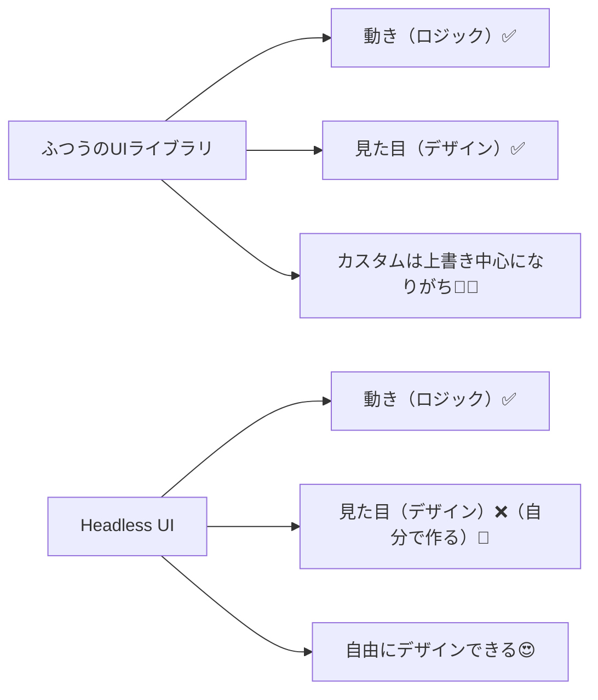
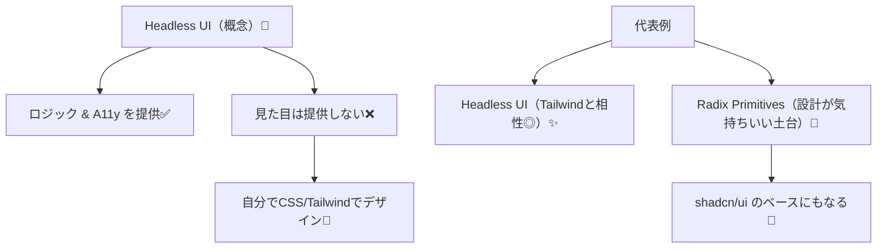

# 第212章：Headless UI ってなに？

今日は「**Headless UI（ヘッドレスUI）**」の正体をつかむ回だよ〜！🕵️‍♀️💡
結論から言うと、Headless UIは **“見た目なし（スタイルなし）で、動きとアクセシビリティだけ用意してくれるUI部品”** のことだよ🎁
（だから、デザインはぜんぶ自分で自由に作れる！🎨✨）

---

## 1) Headless UIってどういう意味？🤔🧠

Headless = “頭（見た目）がない” ってイメージ！
つまり **UIの見た目（CSS）は付けずに**、代わりに👇だけを提供してくれる感じ✨

* キーボード操作（↑↓で選ぶ、Escで閉じる…）⌨️
* フォーカス管理（モーダル開いたら中にフォーカス移す、閉じたら戻す）🎯
* `aria-*` などアクセシビリティ対応♿
* 開閉・選択などの「状態の持ち方」🧠

Headless UI公式も「unstyled（スタイルなし）で accessible（アクセシブル）」って明言してるよ✨ ([Headless UI][1])
Radix Primitivesも「unstyled / accessible」なReactプリミティブだよ✨ ([Radix UI][2])

---

## 2) ふつうのUIライブラリ vs Headless UI 🥊



---

## 3) Radix UI と Headless UI の違い（ざっくり）🧭✨

両方とも「ヘッドレス系」だけど、ノリが少し違うよ〜！

| 観点       | Headless UI（@headlessui/react）         | Radix UI Primitives                                |
| -------- | -------------------------------------- | -------------------------------------------------- |
| 公式の方向性   | Tailwindと相性バツグンに設計✨ ([Headless UI][1]) | Design Systemの「土台」プリミティブ感が強い🧱 ([Radix UI][2])     |
| APIの雰囲気  | コンポーネント + render props多め               | `Root/Trigger/Content` みたいな部品分割が気持ちいい              |
| 便利パターン   | `as="div"` などで要素を変える                   | `asChild` / `Slot` 系の合成が強い✨ ([Radix UI][3])        |
| 周辺エコシステム | Tailwind勢に人気                           | shadcn/ui の土台として超有名（Radix上にスタイルを乗せる） ([Vercel][4]) |

---

## 4) 「Headless」が嬉しい瞬間あるある😍✨

* デザイナーさんの指定が細かいUI（“この角丸は8pxで影はこうで…”）🎨
* ブランドデザインを揃えたい（自社デザインシステム）🏢✨
* 「見た目は自由にしたいけど、アクセシビリティは落としたくない」♿🔥

---

## 5) 触って理解しよ！ミニ体験（Vite + React）🧪💻

### A. Headless UI を入れて “メニュー（ドロップダウン）” 🍔✨

インストール（PowerShell）👇

```bash
npm install @headlessui/react
```

（公式も `npm install @headlessui/react@latest` を案内してるよ） ([GitHub][5])

例：超ミニなメニュー（見た目は最低限だけ）👇

```tsx
// src/components/SimpleMenuHeadless.tsx
import { Menu } from "@headlessui/react";

export function SimpleMenuHeadless() {
  return (
    <Menu as="div" style={{ position: "relative", display: "inline-block" }}>
      <Menu.Button
        style={{
          padding: "8px 12px",
          border: "1px solid #ccc",
          borderRadius: 8,
          background: "white",
          cursor: "pointer",
        }}
      >
        メニュー 🍰
      </Menu.Button>

      <Menu.Items
        style={{
          position: "absolute",
          top: "110%",
          left: 0,
          minWidth: 160,
          border: "1px solid #ddd",
          borderRadius: 10,
          background: "white",
          padding: 6,
        }}
      >
        <Menu.Item>
          {({ active }) => (
            <button
              style={{
                width: "100%",
                textAlign: "left",
                padding: "8px 10px",
                borderRadius: 8,
                border: "none",
                background: active ? "#f2f2f2" : "transparent",
                cursor: "pointer",
              }}
            >
              プロフィールを見る 👀
            </button>
          )}
        </Menu.Item>

        <Menu.Item>
          {({ active }) => (
            <button
              style={{
                width: "100%",
                textAlign: "left",
                padding: "8px 10px",
                borderRadius: 8,
                border: "none",
                background: active ? "#f2f2f2" : "transparent",
                cursor: "pointer",
              }}
            >
              ログアウト 🚪
            </button>
          )}
        </Menu.Item>
      </Menu.Items>
    </Menu>
  );
}
```

ポイント💡

* **スタイルは自分で全部決める**（だから自由！）🎨
* `active` で「ホバー/キーボード選択中」を判定できるのが嬉しい😊✨

---

### B. Radix UI を入れて “ドロップダウン” 🍱✨

インストール👇

```bash
npm install @radix-ui/react-dropdown-menu
```

例：Radix版（Portal込み）👇

```tsx
// src/components/SimpleMenuRadix.tsx
import * as DropdownMenu from "@radix-ui/react-dropdown-menu";

export function SimpleMenuRadix() {
  return (
    <DropdownMenu.Root>
      <DropdownMenu.Trigger
        style={{
          padding: "8px 12px",
          border: "1px solid #ccc",
          borderRadius: 8,
          background: "white",
          cursor: "pointer",
        }}
      >
        メニュー 🍙
      </DropdownMenu.Trigger>

      <DropdownMenu.Portal>
        <DropdownMenu.Content
          sideOffset={8}
          style={{
            minWidth: 160,
            border: "1px solid #ddd",
            borderRadius: 10,
            background: "white",
            padding: 6,
          }}
        >
          <DropdownMenu.Item
            style={{
              padding: "8px 10px",
              borderRadius: 8,
              cursor: "pointer",
            }}
            onSelect={() => {
              console.log("プロフィール");
            }}
          >
            プロフィールを見る 👀
          </DropdownMenu.Item>

          <DropdownMenu.Item
            style={{
              padding: "8px 10px",
              borderRadius: 8,
              cursor: "pointer",
            }}
            onSelect={() => {
              console.log("ログアウト");
            }}
          >
            ログアウト 🚪
          </DropdownMenu.Item>
        </DropdownMenu.Content>
      </DropdownMenu.Portal>
    </DropdownMenu.Root>
  );
}
```

ポイント💡

* `Trigger / Content` みたいに **役割が分かれてて組み立てやすい**🧱
* `Portal` があるから、メニューが親要素の影響を受けにくい（超助かる）✨
* Radixは「unstyled & accessible」な土台ってのが理念だよ ([Radix UI][2])

---

## 6) Radixの「asChild」って何？（ちょい予告）🔮✨

Radixでは「この部品、ボタンじゃなくて自分の `<a>` で使いたい！」みたいなのがあるよね？
そういうときに役立つのが `asChild` / `Slot` 的な考え方💡
`Slot` は「子要素にpropsを合体させる」ためのユーティリティだよ〜 ([Radix UI][3])
（第213章の shadcn/ui にもつながるから、ここめちゃ大事🥳）

---

## 7) 今日のまとめ🎁✨



* Headless UI = **動きだけ用意、見た目は自分で作る**🎨
* Radix / Headless UI はどっちも強い！用途で選べばOK😊
* 次（第213章）で **shadcn/ui** に入るから、今の理解が効いてくるよ〜！🚀

---

## 8) ミニ課題（5〜10分）✍️💕

1. さっきのメニューに「設定 ⚙️」を1項目追加してみよ〜
2. 選択中の項目だけ背景色が変わるようにしてみよ〜（もうできてたらOK！えらい🥰）

必要なら、次の章に向けて「Radixでモーダル（Dialog）を最小構成で出す」テンプレも用意できるよ😉✨

[1]: https://headlessui.com/?utm_source=chatgpt.com "Headless UI - Unstyled, fully accessible UI components"
[2]: https://www.radix-ui.com/primitives?utm_source=chatgpt.com "Radix Primitives"
[3]: https://www.radix-ui.com/primitives/docs/utilities/slot?utm_source=chatgpt.com "Slot – Radix Primitives"
[4]: https://vercel.com/academy/shadcn-ui/why-shadcn-ui-is-different?utm_source=chatgpt.com "Why shadcn/ui is Different | Vercel Academy"
[5]: https://github.com/tailwindlabs/headlessui?utm_source=chatgpt.com "tailwindlabs/headlessui"
