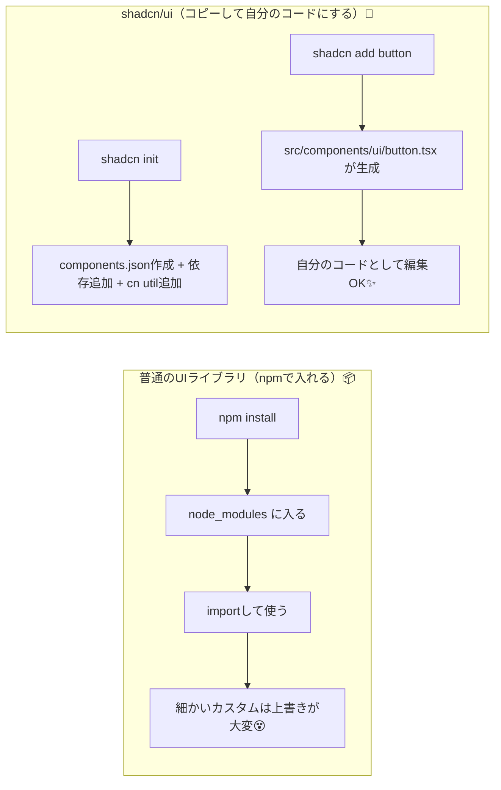

# 第213章：Shadcn UI の概念

### 今日のゴール🎯

* **shadcn/ui が“普通のUIライブラリ”と何が違うか**説明できる🙂
* **どうやって導入・追加していくか**イメージできる🚀
* まずは **`Button` を追加して使う**流れが分かる👍

---

## 1) shadcn/ui って何者？🤔💡

shadcn/ui は、よくある「`npm install` して使うUIライブラリ」じゃないよ〜！🙅‍♀️
公式の説明だと、**“コンポーネントライブラリではない。自分のコンポーネントライブラリを作る方法”**って立ち位置なんだ✨ ([Shadcn UI][1])

さらに、**TypeScript + Tailwind CSS + Radix UI primitives**で作られてて、**Vite**など色んな環境に対応してるよ📦🌈 ([Shadcn UI][2])

---

## 2) 何が“新しい”の？😳✨（最大の特徴）

### ✅ ふつうのUIライブラリ

* `node_modules` の中に本体が入る
* 使うだけなら楽だけど、**見た目や仕様を深く変えたい**ときに「上書き地獄」になりがち😇

### ✅ shadcn/ui

* **CLIを実行すると、コンポーネントのコードがあなたのプロジェクトに“コピー”される**
* つまり **最初から自分のコード**として扱える📝✨（自由に編集OK）

公式も「コードを配布する仕組み」「Open Code（コードが開いてて直せる）」を大事にしてるよ🧠💪 ([Shadcn UI][1])

---

## 3) 仕組みを図でつかむ🗺️✨（Mermaid）



`init` は **依存を入れて、`cn` ユーティリティを追加して、CSS変数などの設定もしてくれる**って明言されてるよ🛠️ ([Shadcn UI][3])

---

## 4) “どこに何が増えるの？”をイメージ👀📁

だいたいこんな感じでファイルが増えることが多いよ👇

* `components.json`（設定ファイル）
* `src/components/ui/`（ButtonとかDialogとか、UI部品の本体コード）
* `src/lib/utils.ts`（`cn()` が入ることが多い）

---

## 5) 導入の流れ（Vite想定）🚀🪟

公式の Vite 手順はこんな流れだよ👇（ここ大事！） ([Shadcn UI][4])

### (A) Tailwind を入れる🌪️

Vite + Tailwind は、公式手順だと `@tailwindcss/vite` を使う形になってるよ（2025っぽい！） ([Shadcn UI][4])
`src/index.css` は **`@import "tailwindcss";` に置き換える**って書かれてる🧴✨ ([Shadcn UI][4])

### (B) import の別名 `@/` を効かせる🔧

Vite は tsconfig が分割されてるので、公式は **`tsconfig.json` と `tsconfig.app.json` の両方に `baseUrl` と `paths` を入れる**って言ってるよ🧠 ([Shadcn UI][4])
さらに `vite.config.ts` にも alias 設定を入れる！ ([Shadcn UI][4])

### (C) CLI を走らせる🏃‍♀️💨

* `shadcn init` を実行してセットアップ ([Shadcn UI][4])
* 欲しい部品を `shadcn add ...` で追加 ([Shadcn UI][4])

---

## 6) まずは Button を入れてみる（最小体験）🔘✨

Windows（PowerShell）で、プロジェクトのルートで👇

```bash
npx shadcn@latest init
npx shadcn@latest add button
```

Vite の公式ページにも、`add button` したら `App.tsx` でこう使えるって載ってるよ👇 ([Shadcn UI][4])

```tsx
import { Button } from "@/components/ui/button"

export default function App() {
  return (
    <div className="flex min-h-svh flex-col items-center justify-center">
      <Button>Click me</Button>
    </div>
  )
}
```

---

## 7) この章のいちばん大事な“考え方”🌟

### ✅ shadcn/ui は「導入して終わり」じゃない

**追加したコンポーネントの中身（例：`src/components/ui/button.tsx`）を開いて読んでOK！**📖✨
むしろそれが本番👏（自分のデザインに合わせて育てていく🌱）

---

## 8) よくあるハマりどころ😵‍💫🧯

* **`@/` が効かなくて import が死ぬ**
  → `tsconfig.json` と `tsconfig.app.json` の両方、さらに `vite.config.ts` の alias を公式どおりに✅ ([Shadcn UI][4])
* **Tailwind が当たらない**
  → `src/index.css` を `@import "tailwindcss";` にしてるかチェック✅ ([Shadcn UI][4])
* **コマンドが古い**
  → いまは基本 `shadcn`（公式CLIページも `shadcn`）✅ ([Shadcn UI][3])

---

## 9) ミニ課題（5〜10分）📝💖

1. `button.tsx` を開いて、クラス名を1個だけ変えてみる（例：角丸を強めるとか）✨
2. `npx shadcn@latest add card` を試して、カードの見た目を少しだけいじる📦
3. 「自分のプロジェクトのデザインっぽい `Button`」を作ってスクショしてニヤニヤする😎📸

---

次の章（第214章）では、いよいよ **アクセシブルなモーダル（Dialog）** を入れて「それっぽいUI」爆速で作っていこうね〜！🥳🪄

[1]: https://ui.shadcn.com/docs "Introduction - shadcn/ui"
[2]: https://ui.shadcn.com/llms.txt?utm_source=chatgpt.com "llms.txt - Shadcn UI"
[3]: https://ui.shadcn.com/docs/cli "shadcn - shadcn/ui"
[4]: https://ui.shadcn.com/docs/installation/vite "Vite - shadcn/ui"
