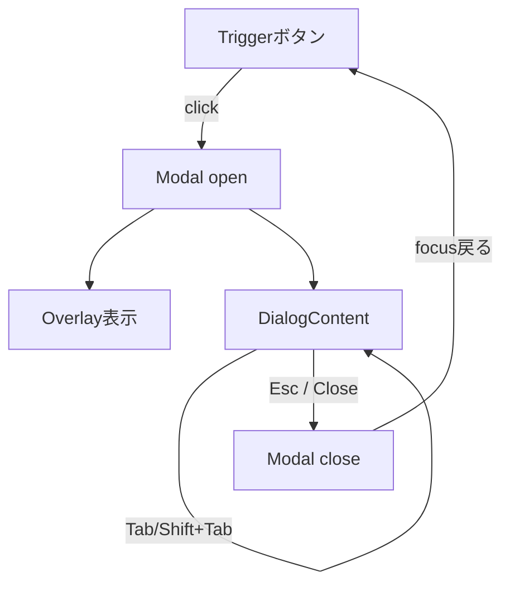

# 第214章：アクセシブルなモーダルを導入する

今日は「**ちゃんとアクセシブルなモーダル（ダイアログ）**」を、UIライブラリの力でサクッと導入するよ〜！😊💖
（ここでは **shadcn/ui の Dialog（中身は Radix UI）** を使う想定だよ）

---

## 今日のゴール 🎯💡

* ボタンを押したら **モーダルが開く** ✅
* **Esc で閉じる** ✅
* **Tab でモーダルの中だけを移動**（フォーカストラップ）✅
* 閉じたら **元のボタンにフォーカスが戻る** ✅
* スクリーンリーダー向けに **タイトル/説明が正しく伝わる** ✅（DialogTitle/Description）

Radix Dialog には「モーダルに必要な挙動（フォーカストラップ等）」が最初から用意されてるよ 🥹✨ ([Radix UI][1])

---

## アクセシブルなモーダルって何が大事？👀🧠

WAI-ARIA のガイド的には、モーダルを「モーダル」って言うなら、

* 背景に触れない（操作できない）🧱
* 見た目も背景が隠れる/弱くなる（オーバーレイ）🌫️
* フォーカスが中に入り、外に逃げない 🔒
* 閉じたら元の場所に戻る ↩️

…みたいな “当たり前セット” が必要なんだよね✨ ([W3C][2])

図でイメージ👇



---

## 導入（shadcn/ui）🛠️💕

### 1) まだ init してないなら（初回だけ）

shadcn/ui の CLI で初期化するよ〜✨（公式は `shadcn@latest init` を案内してるよ）([Shadcn][3])

```bash
# プロジェクト直下で
npx shadcn@latest init
```

> 途中で「components の場所」「utils の場所」「import alias」など聞かれるので、よくある構成なら
> `src/components` / `src/lib` / `@/*` あたりにしておくと気持ちいいよ☺️✨

### 2) Dialog を追加

```bash
npx shadcn@latest add dialog
```

（ついでにボタン部品も使いたいなら👇）

```bash
npx shadcn@latest add button
```

CLI の `add` コマンド自体は公式にもあるよ〜🧰 ([Shadcn][3])

---

## 実装してみよう：プロフィール編集モーダル ✍️🎀

`src/features/profile/ProfileDialog.tsx` を作る想定でいくね！

```tsx
import { useState } from "react"
import { Button } from "@/components/ui/button"
import {
  Dialog,
  DialogTrigger,
  DialogContent,
  DialogHeader,
  DialogTitle,
  DialogDescription,
  DialogFooter,
  DialogClose,
} from "@/components/ui/dialog"

export function ProfileDialog() {
  const [open, setOpen] = useState(false)

  return (
    <Dialog open={open} onOpenChange={setOpen}>
      <DialogTrigger asChild>
        <Button onClick={() => setOpen(true)}>プロフィール編集 ✨</Button>
      </DialogTrigger>

      <DialogContent>
        <DialogHeader>
          <DialogTitle>プロフィール編集</DialogTitle>
          <DialogDescription>
            表示名を変更できます。終わったら「保存」してね 😊
          </DialogDescription>
        </DialogHeader>

        <form
          onSubmit={(e) => {
            e.preventDefault()
            // ここで保存処理（APIなど）をする想定
            setOpen(false)
          }}
          style={{ display: "grid", gap: 12 }}
        >
          <label style={{ display: "grid", gap: 6 }}>
            <span>表示名</span>
            <input
              autoFocus
              name="displayName"
              placeholder="例）あきくん"
              style={{
                padding: "10px 12px",
                border: "1px solid #ccc",
                borderRadius: 8,
              }}
            />
          </label>

          <DialogFooter>
            <DialogClose asChild>
              <Button type="button" variant="secondary">
                キャンセル 🙅‍♀️
              </Button>
            </DialogClose>

            <Button type="submit">保存する 💾</Button>
          </DialogFooter>
        </form>
      </DialogContent>
    </Dialog>
  )
}
```

そして `App.tsx` などで表示👇

```tsx
import { ProfileDialog } from "@/features/profile/ProfileDialog"

export default function App() {
  return (
    <div style={{ padding: 24 }}>
      <h1>モーダル練習 💬</h1>
      <ProfileDialog />
    </div>
  )
}
```

### ここが “アクセシブル” のポイントだよ 😊✨

* Dialog は **スクリーンリーダー向けの Title/Description** を持てる（Radix が想定してる）([Radix UI][1])
* **モーダル内にフォーカスが閉じ込められる**（フォーカストラップ）([Radix UI][1])
* “モーダル” を名乗るなら背景を inert にする等の挙動が必要で、ARIAだけでは挙動は変わらない（だからライブラリが便利！）([MDN Web Docs][4])

---

## 動作チェック（キーボードで確認）⌨️✅

開いたら、これを順番に試してね〜！😆🎉

1. **Tab**：入力 → キャンセル → 保存…みたいに **中だけ回る？**
2. **Shift + Tab**：逆回りできる？
3. **Esc**：閉じる？
4. 閉じた後：**「プロフィール編集」ボタンにフォーカス戻る？**
5. できれば：Windowsなら **NVDA** を入れて、タイトル/説明が読まれるかも確認できると完璧👏✨

---

## よくあるハマりどころ 🕳️😵‍💫

### 1) ドロップダウン/右クリックメニューの中から開くと変になる

shadcn/ui の Dialog は、**Dropdown / ContextMenu の中で使う時に包み方が大事**って注意があるよ⚠️
（「メニュー全体を Dialog で包む」みたいな形）([Shadcn][5])

```tsx
// ざっくり例：メニューの外側に <Dialog> を置いて
// 中で <DialogTrigger> を使うイメージ
<Dialog>
  {/* DropdownMenu / ContextMenu をここに */}
  {/* ... */}
</Dialog>
```

### 2) “タイトルなし” はやめよ〜！🥺

スクリーンリーダー的に「何のダイアログ？」が分からなくなるので、基本は `DialogTitle` を置こうね✨ ([Radix UI][1])

---

## ミニ課題 💪💕（5〜10分）

**「削除確認モーダル」**を作ってみよ〜！🗑️😈

* ボタン「削除」を押すとモーダル
* 本文「本当に削除しますか？」
* ボタン：キャンセル / 削除（赤っぽい見た目にしたくなったら次章以降のスタイルでOK🎨）

できたら、**Escで閉じる / フォーカス戻る / Tabが中だけ** を確認✅

---

## まとめ 🎉✨

* アクセシブルなモーダルは **フォーカス管理が命** 🔥
* `aria-modal="true"` みたいな ARIA は “伝えるだけ” で、挙動は別に実装が必要 🙌 ([MDN Web Docs][4])
* だから Radix（+ shadcn/ui）みたいな **実績ある部品に任せる** のが早くて安全💖 ([Radix UI][1])

次の章（第215章）では、同じノリで **ドロップダウンメニュー** を気持ちよく実装していこ〜！🍔✨

[1]: https://www.radix-ui.com/primitives/docs/components/dialog "Dialog – Radix Primitives"
[2]: https://www.w3.org/WAI/ARIA/apg/patterns/dialog-modal/ " Dialog (Modal) Pattern | APG | WAI | W3C"
[3]: https://ui.shadcn.com/docs/cli "shadcn - shadcn/ui"
[4]: https://developer.mozilla.org/en-US/docs/Web/Accessibility/ARIA/Reference/Attributes/aria-modal "ARIA: aria-modal attribute - ARIA | MDN"
[5]: https://ui.shadcn.com/docs/components/dialog "Dialog - shadcn/ui"
