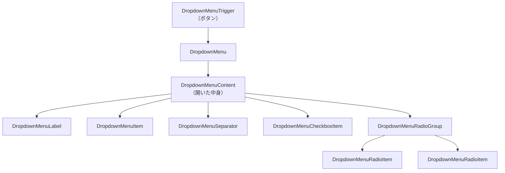

# 第215章：ドロップダウンメニューの実装

今日は「右上のプロフィールボタン押したらメニュー出るやつ」みたいな、**ドロップダウンメニュー**を作るよ〜！😊💕

---

## 1) 今日のゴール🎯🌟

* ボタンを押すとメニューが開く ✅
* キーボード（↑↓/Enter/Esc）でも自然に操作できる ✅（Radixが強い💪）
* `Item / Separator / Checkbox / Radio` も入れて「それっぽい」メニューにする ✅

※shadcn/ui の Dropdown Menu コンポーネントを使うよ ([Shadcn][1])

---

## 2) ざっくり構造を図で把握🗺️👀

（※ここではMermaidの実描画チェックはできないんだけど、公式の構文に沿う形で書いてるよ🙏💦）



---

## 3) セットアップ（まだ入れてない人向け）🛠️🧁

### コンポーネント追加（shadcn CLI）

Dropdown Menu をプロジェクトに追加するよ〜✨
（shadcn CLI の `add` で入れられるよ ([Shadcn][2])）

```bash
npx shadcn@latest add dropdown-menu
npx shadcn@latest add button
```

> もし **React 19 + npm** で依存関係の警告/エラーが出たら、`--force` か `--legacy-peer-deps` を使う選択が出ることがあるよ（CLIが案内してくれるやつ）🧯😵‍💫 ([Shadcn][3])

---

## 4) 実装してみよう！👩‍💻💖（プロフィール風メニュー）

### `src/components/ProfileDropdown.tsx`

* `asChild` を使うと、Trigger を **Buttonそのもの**にできてキレイ✨
* `onSelect` はクリックだけじゃなく、**キーボード選択でも発火**するから便利🎮⌨️
* `CheckboxItem` は `boolean | "indeterminate"` なので `checked === true` で安全に✨

```tsx
import * as React from "react"
import { Button } from "@/components/ui/button"
import {
  DropdownMenu,
  DropdownMenuCheckboxItem,
  DropdownMenuContent,
  DropdownMenuItem,
  DropdownMenuLabel,
  DropdownMenuRadioGroup,
  DropdownMenuRadioItem,
  DropdownMenuSeparator,
  DropdownMenuTrigger,
} from "@/components/ui/dropdown-menu"
import { LogOut, Settings, User } from "lucide-react"

type Props = {
  userName: string
}

type Density = "compact" | "comfortable"

export function ProfileDropdown({ userName }: Props) {
  const [darkMode, setDarkMode] = React.useState(false)
  const [density, setDensity] = React.useState<Density>("comfortable")

  return (
    <DropdownMenu>
      <DropdownMenuTrigger asChild>
        <Button variant="outline">{userName} さん</Button>
      </DropdownMenuTrigger>

      <DropdownMenuContent className="w-56" align="end">
        <DropdownMenuLabel>アカウント</DropdownMenuLabel>
        <DropdownMenuSeparator />

        <DropdownMenuItem onSelect={() => alert("プロフィール画面へ！")}>
          <User className="mr-2 h-4 w-4" />
          プロフィール
        </DropdownMenuItem>

        <DropdownMenuItem onSelect={() => alert("設定画面へ！")}>
          <Settings className="mr-2 h-4 w-4" />
          設定
        </DropdownMenuItem>

        <DropdownMenuSeparator />

        <DropdownMenuCheckboxItem
          checked={darkMode}
          onCheckedChange={(checked) => setDarkMode(checked === true)}
        >
          🌙 ダークモード（見た目だけ）
        </DropdownMenuCheckboxItem>

        <DropdownMenuSeparator />

        <DropdownMenuLabel>表示密度</DropdownMenuLabel>
        <DropdownMenuRadioGroup
          value={density}
          onValueChange={(v) => setDensity(v as Density)}
        >
          <DropdownMenuRadioItem value="compact">
            🧊 コンパクト
          </DropdownMenuRadioItem>
          <DropdownMenuRadioItem value="comfortable">
            🛋️ ゆったり
          </DropdownMenuRadioItem>
        </DropdownMenuRadioGroup>

        <DropdownMenuSeparator />

        <DropdownMenuItem
          className="text-red-600"
          onSelect={(e) => {
            // ✅ メニューは通常「選んだら閉じる」けど、
            // confirm出したいときは preventDefault してもOK！
            e.preventDefault()
            const ok = confirm("ログアウトする？")
            if (ok) alert("ログアウトしました！")
          }}
        >
          <LogOut className="mr-2 h-4 w-4" />
          ログアウト
        </DropdownMenuItem>
      </DropdownMenuContent>
    </DropdownMenu>
  )
}
```

> `@/components/...` が解決できないときは、いったん相対パス（例：`../components/ui/button`）に変えると早いよ〜💡🧭
> （shadcn の初期設定で `@` エイリアスが入ってることが多いけど、環境次第でズレることある🙈）

---

### `src/App.tsx` で表示してみる🌈✨

```tsx
import { ProfileDropdown } from "./components/ProfileDropdown"

export default function App() {
  return (
    <div className="p-6 flex justify-end">
      <ProfileDropdown userName="ゆい" />
    </div>
  )
}
```

---

## 5) 操作感（ここ大事）🎮⌨️💞

* ボタン：クリック / Enter / Space で開く✨
* メニュー内：↑↓ で移動、Enter で決定、Esc で閉じる🫶
* `DropdownMenuItem` は基本「選んだら閉じる」挙動だよ（自然で気持ちいい🥰）

shadcn/ui の Dropdown Menu は Radix ベースで、こういう操作が最初から強いよ ([Shadcn][1])

---

## 6) つまずきポイント集😵‍💫🧯

* **メニューが出ない**

  * `DropdownMenuTrigger` の中にボタンがちゃんとある？
  * `DropdownMenuContent` が `DropdownMenu` の中にある？（外だと無理🙅‍♀️）
* **クリックしても何も起きない**

  * `onClick` じゃなくて `onSelect` を使うと「メニューっぽさ」出やすいよ✨（キーボードでも発火する）
* **メニューからモーダル（Dialog）開くと変な挙動**

  * その場合は `DropdownMenu modal={false}` が必要なケースがあるよ（公式例あり）([Shadcn][1])

---

## 7) ミニ課題🎓💗（5〜15分）

1. Trigger を「…」アイコンボタンにしてみよ！😎✨
2. `DropdownMenuItem disabled` を1個追加して「押せない項目」作ってみよ🚫
3. `align="start"` に変えて、開く位置の違いを見てみよ👀📐

---

次の章（第216章）で「保存しました🍞✨」みたいな **トースト通知**を入れると、今日のドロップダウンと相性バツグンだよ〜！🎉

[1]: https://ui.shadcn.com/docs/components/dropdown-menu "Dropdown Menu - shadcn/ui"
[2]: https://ui.shadcn.com/docs/cli "shadcn - shadcn/ui"
[3]: https://ui.shadcn.com/docs/react-19 "Next.js 15 + React 19 - shadcn/ui"
