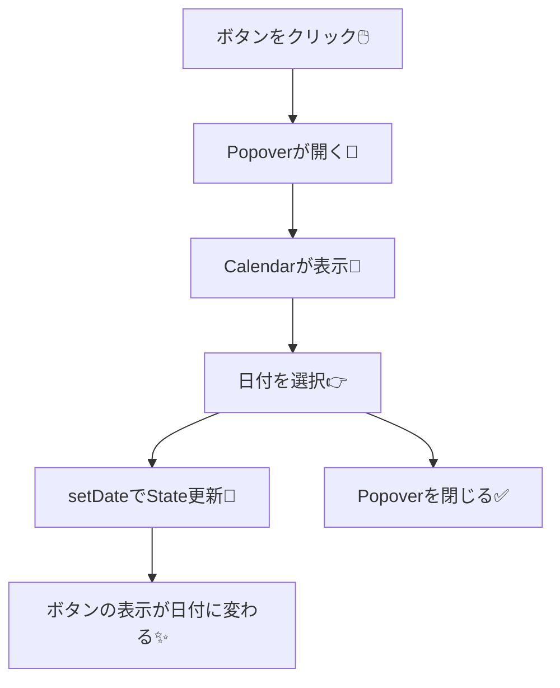

# 第217章：カレンダー・日付選択

今日は **shadcn/ui の `Calendar` + `Popover`** を組み合わせて、**「ボタンを押す → カレンダーが出る → 日付を選ぶ」** を作ります😊
（shadcn公式の Date Picker は、この組み合わせで作る想定だよ〜！）([Shadcn][1])

---

## 1) 今日のゴール🎯

* ボタンに「選んだ日付」を表示する🗓️
* ボタンを押したらカレンダーがポップアップで出る🎈
* 日付を選んだら、自動でポップアップを閉じる✅

---

## 2) しくみを図でイメージ👀（Mermaid）



---

## 3) 必要なUI部品を追加する🧩（shadcn/ui）

> すでに shadcn/ui を init 済みなら「add」だけでOKだよ☺️

### ✅ まだ init してない場合（React 19 だと依存関係の選択が出ることがあるよ）

```bash
npx shadcn@latest init -d
```

React 19 環境だと、インストール時に `--force` / `--legacy-peer-deps` の選択肢が出る案内があるよ。([Shadcn][2])

### ✅ コンポーネント追加（Calendar / Popover / Button）

```bash
npx shadcn@latest add calendar popover button
```

（Popover と Calendar は公式でもこの構成で Date Picker を作る想定だよ）([Shadcn][1])

### ✅ 日付表示をきれいにするため（date-fns）

公式サンプルは `date-fns` の `format()` を使ってるよ💅([Shadcn][1])

```bash
npm i date-fns
```

> もしアイコンでエラーが出たら（`lucide-react` が未導入など）👇

```bash
npm i lucide-react
```

（公式例で `lucide-react` を使ってるよ）([Shadcn][1])

---

## 4) DatePicker コンポーネントを作る✍️💖

### `src/components/DatePicker.tsx` を作成

```tsx
import * as React from "react"
import { format } from "date-fns"
import { Calendar as CalendarIcon } from "lucide-react"

import { Button } from "@/components/ui/button"
import { Calendar } from "@/components/ui/calendar"
import {
  Popover,
  PopoverContent,
  PopoverTrigger,
} from "@/components/ui/popover"

export function DatePicker() {
  const [date, setDate] = React.useState<Date | undefined>(undefined)

  return (
    <Popover>
      <PopoverTrigger asChild>
        <Button
          variant="outline"
          data-empty={!date}
          className="w-[280px] justify-start text-left font-normal data-[empty=true]:text-muted-foreground"
        >
          <CalendarIcon className="mr-2 h-4 w-4" />
          {date ? format(date, "PPP") : <span>日付を選んでね📅</span>}
        </Button>
      </PopoverTrigger>

      <PopoverContent className="w-auto p-0" align="start">
        <Calendar
          mode="single"
          selected={date}
          onSelect={setDate}
          initialFocus
          className="rounded-md border"
        />
      </PopoverContent>
    </Popover>
  )
}
```

この形は shadcn公式の Date Picker / Calendar の使い方そのままベースだよ🧁([Shadcn][1])

---

## 5) `App.tsx` で表示してみる🎉

```tsx
import { DatePicker } from "./components/DatePicker"

export default function App() {
  return (
    <div className="p-6">
      <h1 className="mb-4 text-xl font-bold">日付選択デモ😊</h1>
      <DatePicker />
    </div>
  )
}
```

---

## 6) 「選んだら閉じる」版にしたい人へ✅（ワンランクUP✨）

公式の例みたいに、`open` をStateで持つと「選んだら閉じる」ができるよ！([Shadcn][1])

```tsx
import * as React from "react"
import { ChevronDownIcon } from "lucide-react"

import { Button } from "@/components/ui/button"
import { Calendar } from "@/components/ui/calendar"
import {
  Popover,
  PopoverContent,
  PopoverTrigger,
} from "@/components/ui/popover"

export function DatePickerCloseOnSelect() {
  const [open, setOpen] = React.useState(false)
  const [date, setDate] = React.useState<Date | undefined>(undefined)

  return (
    <Popover open={open} onOpenChange={setOpen}>
      <PopoverTrigger asChild>
        <Button variant="outline" className="w-48 justify-between font-normal">
          {date ? date.toLocaleDateString() : "日付を選んでね📅"}
          <ChevronDownIcon />
        </Button>
      </PopoverTrigger>

      <PopoverContent className="w-auto overflow-hidden p-0" align="start">
        <Calendar
          mode="single"
          selected={date}
          captionLayout="dropdown"
          onSelect={(d) => {
            setDate(d)
            setOpen(false)
          }}
        />
      </PopoverContent>
    </Popover>
  )
}
```

---

## 7) よくあるつまずきポイント🥹🧯

* `@/components/...` が解決できない
  → shadcn の設定でパスエイリアスが入ってない可能性！その場合は相対パスに直してOK🙆‍♀️
* `format is not a function` / `date-fns` がない
  → `npm i date-fns` を入れる（公式例でも使用）([Shadcn][1])
* カレンダー出るけど見た目が崩れる
  → Tailwind の設定（content のパス）や、shadcn のスタイル導入が途中のことが多いよ🌪️

---

## 8) ミニ練習問題🎓✨（5〜10分）

1. 「今日より前の日付は選べない」ようにしてみよ〜🔒
2. 「クリア」ボタンを付けて `setDate(undefined)` できるようにしてみよ〜🧽
3. `captionLayout="dropdown"` を試して、月・年の移動をラクにしてみよ〜🚀（公式例にもあるよ）([Shadcn][1])

---

必要なら次の第218章（アイコンライブラリ選定）につながる形で、「日付ボタンの左にアイコンを切り替える」「用途別にアイコンを使い分ける」みたいな発展も一緒に作れるよ〜😍✨

[1]: https://ui.shadcn.com/docs/components/date-picker "Date Picker - shadcn/ui"
[2]: https://ui.shadcn.com/docs/react-19?utm_source=chatgpt.com "Next.js 15 + React 19 - shadcn/ui"
