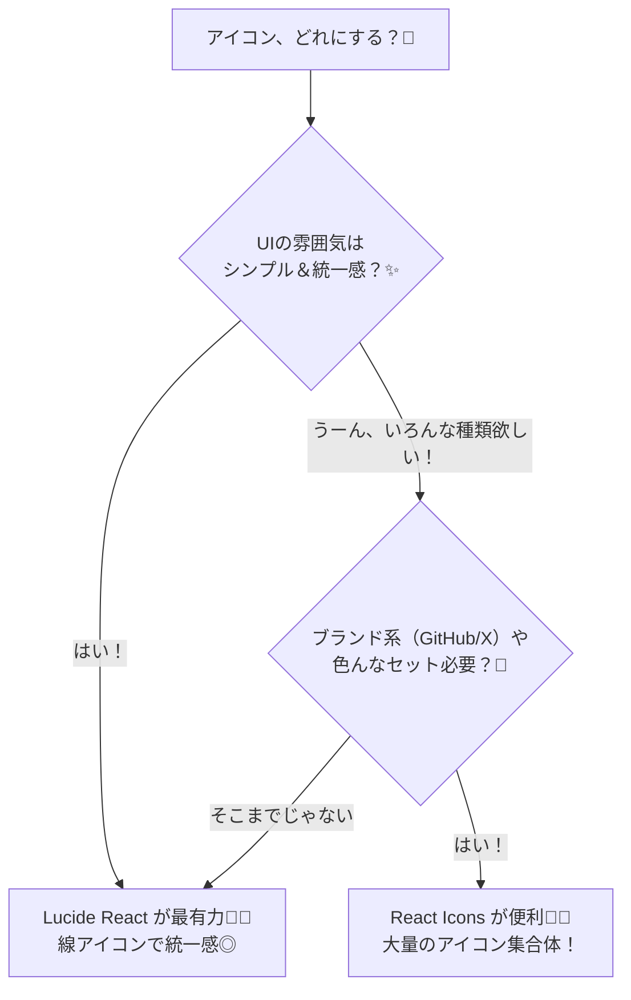

# 第218章：アイコンライブラリの選定

この章は「アイコン、どれ使えばいいの？🥺」をスッキリ解決して、**プロっぽいUI**に一気に近づける回だよ〜！🚀💖

---

### 今日のゴール 🎯

* アイコンライブラリを**迷わず選べる**ようになる🧭✨
* **Lucide React** と **React Icons** を、どっちも使えるようになる💪😊
* ついでに「ボタンにアイコン入れる」をキレイに実装できる🔘🌟

---

## 1) まず：アイコンライブラリって何？🧩

Reactだと、アイコンはだいたい **SVGをReactコンポーネントとして使う**感じになるよ✨
だから、`<Search />` みたいに書けて超ラク〜！😆

---

## 2) どっち選ぶ？最短ルート（図解）🗺️✨



**ざっくり結論🥳**

* **shadcn/ui使うなら Lucide が相性最強**（デフォルトもLucideなことが多いよ）([shadcndesign][1])
* **とにかく種類が必要なら React Icons**（FontAwesomeやMaterialなど色々）([react-icons.github.io][2])

---

## 3) Lucide React 🦊✨（迷ったらコレ寄り）

### 特徴 💡

* **ESMで完全にツリーシェイク** → 使ったアイコンだけが入るよ！軽い！🪶([Lucide][3])
* デフォルトで `currentColor / 24px / strokeWidth 2` っていう扱いやすい設計🎯([Lucide][4])

### インストール（Windows / npm）💻

```bash
npm install lucide-react
```

### 使い方（超基本）📌

```tsx
import { Search, Settings } from "lucide-react";

export function HeaderIcons() {
  return (
    <div style={{ display: "flex", gap: 12 }}>
      <Search size={20} />
      <Settings size={20} strokeWidth={1.5} />
    </div>
  );
}
```

* `size` で大きさ📏
* `strokeWidth` で線の太さ🖊️([Lucide][5])

---

## 4) React Icons 🎁✨（種類の暴力で勝つやつ）

### 特徴 💡

* いろんなアイコンセットをまとめて使える（Font Awesome / Material / etc）🌈
* ES6 importで「使う分だけ」入れる思想だよ〜([react-icons.github.io][2])

### インストール（Windows / npm）💻

```bash
npm install react-icons
```

### 使い方（例：Font Awesome 6）🐙

```tsx
import { FaGithub } from "react-icons/fa6";

export function GithubIcon() {
  return <FaGithub size={22} />;
}
```

### 注意（地味に大事）⚠️

昔の変なimport（`react-icons/lib/...` みたいなの）をすると、**全部入り**で重くなる話が出がち🥲
今は基本、公式の通り `react-icons/xx` から取ればOKだよ！([GitHub][6])

---

## 5) 実戦：アイコン付きボタンを作ろう！🔘💖

「毎回 `<Search />` を直書き」って地味に面倒なので、**部品化**しちゃう😆✨

### ✅ Lucide版：`IconButton.tsx`

```tsx
import type { LucideIcon } from "lucide-react";

type Props = {
  Icon: LucideIcon;
  label: string;
  onClick?: () => void;
};

export function IconButton({ Icon, label, onClick }: Props) {
  return (
    <button
      type="button"
      onClick={onClick}
      style={{
        display: "inline-flex",
        alignItems: "center",
        gap: 8,
        padding: "10px 12px",
        borderRadius: 10,
        border: "1px solid #ddd",
        background: "#fff",
        cursor: "pointer",
      }}
    >
      <Icon size={18} aria-hidden />
      <span>{label}</span>
    </button>
  );
}
```

`LucideIcon` 型はこういう用途で便利だよ〜🫶（型の話も公式側で言及されてる）([GitHub][7])

### ✅ 使ってみる（Lucide）

```tsx
import { IconButton } from "./IconButton";
import { Search, Trash2 } from "lucide-react";

export function Demo() {
  return (
    <div style={{ display: "flex", gap: 12 }}>
      <IconButton Icon={Search} label="検索" onClick={() => alert("検索だよ〜🔎")} />
      <IconButton Icon={Trash2} label="削除" onClick={() => alert("削除だよ〜🗑️")} />
    </div>
  );
}
```

---

## 6) アクセシビリティ小ワザ（超だいじ）🫧

* アイコンが「飾り」なら `aria-hidden` ✅
* ボタンの意味は**文字（label）**で伝えるのが安全💗
  （アイコンだけのボタンにする場合は `aria-label="検索"` みたいなのを付けると◎）

---

## 7) ミニ課題 🎒✨（5〜10分）

次をやってみてね😊💞

* `IconButton` を3つ並べる（例：検索🔎 / 設定⚙️ / お気に入り⭐）
* `size` を 16 / 20 / 24 で変えて、見え方チェック👀
* Lucide と React Icons で **同じUIを作って差し替え**してみる（気分で変えられるの最高🎉）

---

### この章のまとめ 🥳

* **統一感＆軽さ**なら Lucide React 🦊✨([Lucide][3])
* **種類の多さ**なら React Icons 🎁🌈([react-icons.github.io][2])
* アイコンは部品化すると、UIが一気に“ちゃんとして見える”よ〜！💖

次は **第219章：スタイリングのカスタマイズ** で、見た目をもっと「それっぽく」していこ〜😆🎀

[1]: https://www.shadcndesign.com/blog/5-best-icon-libraries-for-shadcn-ui?utm_source=chatgpt.com "5 Best Icon Libraries for React Projects Using shadcn ..."
[2]: https://react-icons.github.io/react-icons/?utm_source=chatgpt.com "React Icons"
[3]: https://lucide.dev/guide/packages/lucide-react?utm_source=chatgpt.com "Lucide React"
[4]: https://lucide.dev/guide/advanced/global-styling?utm_source=chatgpt.com "Global Styling"
[5]: https://lucide.dev/guide/basics/stroke-width?utm_source=chatgpt.com "Stroke width"
[6]: https://github.com/react-icons/react-icons/issues/154?utm_source=chatgpt.com "React Icons Imports everything even when included 2 or 3 ..."
[7]: https://github.com/lucide-icons/lucide/discussions/1869?utm_source=chatgpt.com "Hi. what the type of a lucide-react icon is? #1869"
