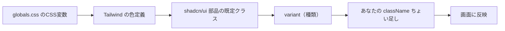

# 第219章：スタイリングのカスタマイズ

### 今日できるようになること ✅

* shadcn/ui の見た目を **“自分のアプリっぽく”** 変えられるようになる 🎨
* **テーマカラー（primary など）** をまとめて変更できる 💅
* `className` でちょい足し → `variant` 追加で本格カスタムまでできる 🧩

shadcn/ui は「コンポーネントを自分のプロジェクトにコピーして使う」スタイルなので、**自分でガンガン編集してOK**なのが強みだよ〜！✂️✨ ([Shadcn][1])

---

## まず全体像：どこを触ると見た目が変わるの？🧭



shadcn/ui は **CSS変数（--primary など）でテーマ管理するのが基本**で、公式もその方向を推してるよ 🥰 ([Shadcn][2])

---

## 1) テーマを変える（いちばん効く！）🎨✨

### 触る場所：`src/styles/globals.css`（または `src/index.css`）

shadcn/ui は `:root` に **色の変数** を置いて、`.dark` 側にも別の色を置く感じが多いよ〜！ ([Shadcn][2])

例：`--primary` を「ピンク寄り」にしてみる 💗（HSLの数値を変えるだけ）

```css
/* src/styles/globals.css のイメージ */
@import "tailwindcss";

:root {
  --background: 0 0% 100%;
  --foreground: 222.2 84% 4.9%;

  /* ここが「テーマの主役」✨ */
  --primary: 330 85% 55%;
  --primary-foreground: 0 0% 100%;
}

.dark {
  --background: 222.2 84% 4.9%;
  --foreground: 210 40% 98%;

  --primary: 330 85% 60%;
  --primary-foreground: 0 0% 100%;
}
```

> ポイント：`primary` を変えると、Buttonとかの「メイン色」がまとめて変わるよ〜！🎀

---

## 2) Tailwind 側が “CSS変数の色” を使える理由 🧠💡

多くの shadcn/ui セットアップでは Tailwind 側でこういう感じにして、
`bg-primary` みたいなクラスが **CSS変数を参照**するようになってるの 💞 ([Shadcn][2])

```ts
// tailwind.config.ts のイメージ
export default {
  theme: {
    extend: {
      colors: {
        primary: "hsl(var(--primary))",
        "primary-foreground": "hsl(var(--primary-foreground))",
      },
    },
  },
} satisfies import("tailwindcss").Config;
```

そして `components.json` でも「CSS変数でテーマやるよ」って設定になってることが多いよ ✅ ([Shadcn][3])

---

## 3) 部品ごとに“ちょい足し”カスタム（最速で楽しい）💄✨

### 3-1. いちばん簡単：`className` を足す 🧁

例えばボタンを「丸め・影つき」にするだけで一気にそれっぽくなる！

```tsx
import { Button } from "@/components/ui/button";

export function Example() {
  return (
    <Button className="rounded-full shadow-md px-6">
      かわいいボタン💗
    </Button>
  );
}
```

### `cn()` って何者？👀

shadcn/ui でよく出てくる `cn()` は、`clsx` と `tailwind-merge` を組み合わせて
**クラス名をいい感じに合成して、Tailwindの衝突も整理してくれる**便利関数だよ〜！🧹✨ ([Zenn][4])

---

## 4) “本気カスタム”：variant（種類）を増やす 🎛️🔥

「成功ボタン（success）」みたいな **新しい見た目の種類** を増やしたいときは、
`button.tsx` の variant を増やすのが定番だよ✨

例：`success` を追加してみる 🍀

```tsx
// components/ui/button.tsx（イメージ：中の variants に追加する）
variants: {
  variant: {
    default: "bg-primary text-primary-foreground hover:opacity-90",
    outline: "border border-input bg-background hover:bg-accent",
    success: "bg-emerald-600 text-white hover:bg-emerald-700",
  },
}
```

使う側はこう！👇

```tsx
<Button variant="success">保存できた！🍀</Button>
```

> こうすると「このアプリのボタン設計」が育っていく感じで、めっちゃ楽しいよ〜！✨🥹

---

## 5) ダークモードのスタイリング小ワザ 🌙🖤

shadcn/ui は `.dark` クラスで切り替える設計が多いよ〜！
（Tailwind v4 系だと `dark` の扱いもセットアップ側に含まれてたりする） ([Shadcn][5])

とりあえず動作確認したいなら、コンソールでこれだけでもOK👇

```js
document.documentElement.classList.toggle("dark");
```

---

## 6) よくある「崩れた😭」の直し方（あるある救急箱）🧰💦

* **className の順番**で勝ったり負けたりする

  * shadcn側の既定クラス vs あなたの追記、どっちが後？👀
* Tailwind の競合は `cn()` がある程度助けてくれる ✅ ([pystyle][6])
* 最終手段：`!`（important）で勝つ

  * 例：`!rounded-none` みたいに強制する（使いすぎ注意⚠️）

---

## ミニ演習（10〜15分）✍️✨

### 演習A：テーマ色を変える 🎨

1. `globals.css` の `--primary` を好きな色に変更（例：ラベンダー💜）
2. 画面のメインボタンの色が変わるのを確認！

### 演習B：Button に `success` variant を追加 🍀

1. `components/ui/button.tsx` に `success` を追加
2. `<Button variant="success">` を置いて確認！

### 演習C：Card を「ふわっ」とさせる ☁️

* `className="shadow-lg rounded-2xl"` を足して、ちょっとリッチに✨

---

## まとめ 🎁

* **全体の雰囲気を変えるなら** `globals.css` の CSS変数が最強 🎨 ([Shadcn][2])
* **部分的に変えるなら** `className` ちょい足しが最速 💄
* **設計として育てるなら** variant 追加が気持ちいい 🎛️✨

次の第220章で「ダッシュボード画面」を組むとき、今日のカスタムがめっちゃ効いてくるよ〜！📊💖

[1]: https://ui.shadcn.com/docs/installation/vite?utm_source=chatgpt.com "Vite - Shadcn UI"
[2]: https://ui.shadcn.com/docs/theming?utm_source=chatgpt.com "Theming - shadcn/ui"
[3]: https://ui.shadcn.com/docs/components-json?utm_source=chatgpt.com "components.json - Shadcn UI"
[4]: https://zenn.dev/lila/scraps/50e9f9d962742f?utm_source=chatgpt.com "shadcn/uiのお勉強"
[5]: https://ui.shadcn.com/docs/installation/manual?utm_source=chatgpt.com "Manual Installation - Shadcn UI"
[6]: https://pystyle.info/react-shadcn-ui-cn/?utm_source=chatgpt.com "React – shadcn/ui のユーティリティ関数 cn() について解説"
