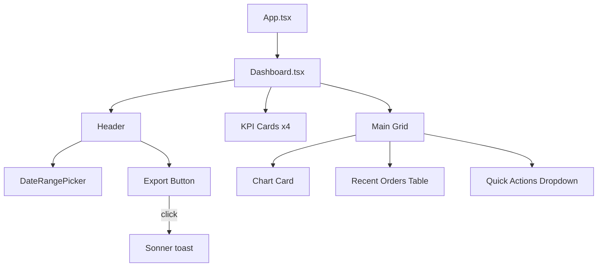

# 第220章：練習：UIライブラリを使ってダッシュボード画面を組む

今回は **shadcn/ui（中身はRadix UI + Tailwind）** を使って、**それっぽい管理画面（ダッシュボード）** をサクッと組みます🙌
完成イメージはこんな要素があるやつ👇

* 上部ヘッダー（タイトル / 期間選択 / Exportボタン）🗓️⬇️
* KPIカード4枚（売上・注文・ユーザー…みたいな）📈
* グラフ（Bar chart）📊
* 最近の注文テーブル🧾
* ちょいアクション（ドロップダウン / トースト）🍞✨

> ✅ shadcn/ui は「ライブラリを入れて終わり」じゃなくて、**必要な部品を “プロジェクトにコピーして使う”** 感じだよ〜！
> インストール手順や `add` コマンドは公式手順に沿って進めようね🧩 ([Shadcn][1])

---

## 0) ダッシュボードの部品関係（図解）🧠🧩



---

## 1) 事前準備（できてたら読み飛ばしOK）✅🛠️

### A. Vite + Tailwind + shadcn/ui（最短ルート）🚀

公式の Vite 手順はこんな流れ👇（Tailwind導入・パスエイリアス・`shadcn init` など） ([Shadcn][1])

**（例）新規プロジェクトなら：**

```bash
npm create vite@latest my-dashboard -- --template react-ts
cd my-dashboard
npm install
```

**Tailwind（Vite用）**

```bash
npm install tailwindcss @tailwindcss/vite
```

**`src/index.css` をこれに（全部置き換え）**

```css
@import "tailwindcss";
```

**shadcn/ui 初期化**

```bash
npx shadcn@latest init
```

> 途中で `@/*` エイリアス（`@` → `src`）設定や `vite.config.ts` 編集が出てくるよ。公式のVite手順どおりでOK🙆‍♀️ ([Shadcn][1])

---

## 2) 今回使う shadcn/ui コンポーネントを追加する🧩✨

この章で使う部品たち👇（必要最低限 + 便利セット）

```bash
npx shadcn@latest add button card badge table tabs dropdown-menu popover calendar sonner chart
```

* トーストは **Toast（旧）は非推奨**で、今は **Sonner** 推しだよ🍞 ([Shadcn][2])
* Chart は **Recharts** ベースの “コピペできるチャート部品” だよ📊 ([Shadcn][3])

---

## 3) つまずきポイント先回り（React 19 + npm の依存関係）🧯💡

もし `npm install` や `shadcn add` の途中で **ERESOLVE（依存関係）** が出たら、公式でも案内されてる通り👇

* `--legacy-peer-deps`（または `--force`）を使う選択肢が出ることがあるよ ([Shadcn][4])
* Chart（Recharts）周りは、状況によって `react-is` の override が必要になるケースも案内があるよ（公式ノート） ([Shadcn][4])

> まずは **CLIが聞いてきた選択肢に従う** のがいちばん安全🙆‍♀️

---

## 4) 実装していこう〜！📦💻✨

### フォルダ構成（今回）

* `src/pages/Dashboard.tsx`
* `src/components/dashboard/DateRangePicker.tsx`
* `src/components/dashboard/SalesChart.tsx`
* `src/components/dashboard/RecentOrdersTable.tsx`

---

## 4-1) `src/App.tsx`（Toaster を置く🍞）

Sonner は `<Toaster />` をどこかに置けばOKだよ〜！ ([Shadcn][5])

```tsx
import { Toaster } from "@/components/ui/sonner"
import { Dashboard } from "@/pages/Dashboard"

export default function App() {
  return (
    <div className="min-h-svh bg-muted/40">
      <div className="mx-auto max-w-6xl p-4 md:p-8">
        <Dashboard />
      </div>
      <Toaster />
    </div>
  )
}
```

---

## 4-2) `src/components/dashboard/DateRangePicker.tsx`（期間選択🗓️）

Date Picker は **Popover + Calendar** の合体で作るのが公式スタイルだよ✨ ([Shadcn][6])

```tsx
import * as React from "react"
import { addDays, format } from "date-fns"
import type { DateRange } from "react-day-picker"
import { CalendarIcon } from "lucide-react"

import { cn } from "@/lib/utils"
import { Button } from "@/components/ui/button"
import { Calendar } from "@/components/ui/calendar"
import { Popover, PopoverContent, PopoverTrigger } from "@/components/ui/popover"

type Props = {
  value: DateRange | undefined
  onChange: (value: DateRange | undefined) => void
}

export function DateRangePicker({ value, onChange }: Props) {
  const label = React.useMemo(() => {
    if (!value?.from) return "期間を選ぶ"
    if (!value.to) return `${format(value.from, "yyyy/MM/dd")} 〜`
    return `${format(value.from, "yyyy/MM/dd")} 〜 ${format(value.to, "yyyy/MM/dd")}`
  }, [value])

  return (
    <Popover>
      <PopoverTrigger asChild>
        <Button
          variant="outline"
          className={cn("w-[260px] justify-start text-left font-normal", !value && "text-muted-foreground")}
        >
          <CalendarIcon className="mr-2 size-4" />
          {label}
        </Button>
      </PopoverTrigger>

      <PopoverContent className="w-auto p-0" align="start">
        <Calendar
          initialFocus
          mode="range"
          numberOfMonths={2}
          defaultMonth={value?.from ?? addDays(new Date(), -7)}
          selected={value}
          onSelect={onChange}
        />
      </PopoverContent>
    </Popover>
  )
}
```

---

## 4-3) `src/components/dashboard/SalesChart.tsx`（グラフ📊）

shadcn/ui の Chart は **Recharts をそのまま使いつつ、見た目用の薄い部品（ChartContainer等）** を足す感じだよ〜 ([Shadcn][3])

```tsx
import { Bar, BarChart, CartesianGrid, XAxis } from "recharts"

import { Card, CardContent, CardHeader, CardTitle } from "@/components/ui/card"
import {
  ChartContainer,
  ChartTooltip,
  ChartTooltipContent,
  type ChartConfig,
} from "@/components/ui/chart"

const chartData = [
  { month: "7月", desktop: 186, mobile: 80 },
  { month: "8月", desktop: 305, mobile: 200 },
  { month: "9月", desktop: 237, mobile: 120 },
  { month: "10月", desktop: 73, mobile: 190 },
  { month: "11月", desktop: 209, mobile: 130 },
  { month: "12月", desktop: 214, mobile: 140 },
]

const chartConfig = {
  desktop: { label: "Desktop", color: "hsl(var(--chart-1))" },
  mobile: { label: "Mobile", color: "hsl(var(--chart-2))" },
} satisfies ChartConfig

export function SalesChart() {
  return (
    <Card>
      <CardHeader>
        <CardTitle>アクセス（端末別）</CardTitle>
      </CardHeader>

      <CardContent>
        <ChartContainer config={chartConfig} className="min-h-[240px] w-full">
          <BarChart accessibilityLayer data={chartData}>
            <CartesianGrid vertical={false} />
            <XAxis dataKey="month" tickLine={false} axisLine={false} />
            <ChartTooltip content={<ChartTooltipContent />} />

            <Bar dataKey="desktop" fill="var(--color-desktop)" radius={6} />
            <Bar dataKey="mobile" fill="var(--color-mobile)" radius={6} />
          </BarChart>
        </ChartContainer>
      </CardContent>
    </Card>
  )
}
```

### ✅ 重要：Chart 用のCSS変数を `src/index.css` に追加

Chart ドキュメントでも「CSS変数を足してね」ってあるので、`@import "tailwindcss";` の下に追記してね🧡 ([Shadcn][3])

```css
@import "tailwindcss";

@layer base {
  :root {
    --chart-1: 220 70% 50%;
    --chart-2: 160 60% 45%;
    --chart-3: 30 80% 55%;
    --chart-4: 280 65% 55%;
    --chart-5: 10 75% 55%;
  }
}
```

---

## 4-4) `src/components/dashboard/RecentOrdersTable.tsx`（テーブル🧾）

```tsx
import { Badge } from "@/components/ui/badge"
import {
  Table,
  TableBody,
  TableCell,
  TableHead,
  TableHeader,
  TableRow,
} from "@/components/ui/table"
import { Card, CardContent, CardHeader, CardTitle } from "@/components/ui/card"

type Order = {
  id: string
  customer: string
  amount: number
  status: "paid" | "pending" | "failed"
}

const orders: Order[] = [
  { id: "ORD-1042", customer: "山田 花子", amount: 12800, status: "paid" },
  { id: "ORD-1043", customer: "佐藤 さくら", amount: 5400, status: "pending" },
  { id: "ORD-1044", customer: "鈴木 みお", amount: 22000, status: "paid" },
  { id: "ORD-1045", customer: "高橋 りん", amount: 9800, status: "failed" },
]

const statusLabel: Record<Order["status"], string> = {
  paid: "支払い済み",
  pending: "保留",
  failed: "失敗",
}

export function RecentOrdersTable() {
  return (
    <Card>
      <CardHeader>
        <CardTitle>最近の注文</CardTitle>
      </CardHeader>

      <CardContent>
        <Table>
          <TableHeader>
            <TableRow>
              <TableHead>注文ID</TableHead>
              <TableHead>お客様</TableHead>
              <TableHead>状態</TableHead>
              <TableHead className="text-right">金額</TableHead>
            </TableRow>
          </TableHeader>

          <TableBody>
            {orders.map((o) => (
              <TableRow key={o.id}>
                <TableCell className="font-medium">{o.id}</TableCell>
                <TableCell>{o.customer}</TableCell>
                <TableCell>
                  <Badge
                    variant={
                      o.status === "paid"
                        ? "default"
                        : o.status === "pending"
                        ? "secondary"
                        : "destructive"
                    }
                  >
                    {statusLabel[o.status]}
                  </Badge>
                </TableCell>
                <TableCell className="text-right">¥{o.amount.toLocaleString()}</TableCell>
              </TableRow>
            ))}
          </TableBody>
        </Table>
      </CardContent>
    </Card>
  )
}
```

---

## 4-5) `src/pages/Dashboard.tsx`（全部合体✨）

```tsx
import * as React from "react"
import { Download, MoreHorizontal } from "lucide-react"
import { toast } from "sonner"
import type { DateRange } from "react-day-picker"
import { addDays } from "date-fns"

import { Button } from "@/components/ui/button"
import { Card, CardContent, CardHeader, CardTitle } from "@/components/ui/card"
import { Tabs, TabsList, TabsTrigger } from "@/components/ui/tabs"
import {
  DropdownMenu,
  DropdownMenuContent,
  DropdownMenuItem,
  DropdownMenuTrigger,
} from "@/components/ui/dropdown-menu"

import { DateRangePicker } from "@/components/dashboard/DateRangePicker"
import { SalesChart } from "@/components/dashboard/SalesChart"
import { RecentOrdersTable } from "@/components/dashboard/RecentOrdersTable"

function KpiCard(props: { title: string; value: string; hint: string }) {
  return (
    <Card>
      <CardHeader className="pb-2">
        <CardTitle className="text-sm font-medium text-muted-foreground">{props.title}</CardTitle>
      </CardHeader>
      <CardContent>
        <div className="text-2xl font-semibold">{props.value}</div>
        <p className="mt-1 text-xs text-muted-foreground">{props.hint}</p>
      </CardContent>
    </Card>
  )
}

export function Dashboard() {
  const [range, setRange] = React.useState<DateRange | undefined>({
    from: addDays(new Date(), -7),
    to: new Date(),
  })

  const [tab, setTab] = React.useState<"overview" | "sales">("overview")

  return (
    <div className="space-y-6">
      {/* Header */}
      <div className="flex flex-col gap-3 sm:flex-row sm:items-center sm:justify-between">
        <div>
          <h1 className="text-2xl font-bold">ダッシュボード</h1>
          <p className="text-sm text-muted-foreground">今日もえらい！ここで全部見える化しよ〜😺✨</p>
        </div>

        <div className="flex flex-wrap items-center gap-2">
          <DateRangePicker value={range} onChange={setRange} />

          <Tabs value={tab} onValueChange={(v) => setTab(v as typeof tab)}>
            <TabsList>
              <TabsTrigger value="overview">Overview</TabsTrigger>
              <TabsTrigger value="sales">Sales</TabsTrigger>
            </TabsList>
          </Tabs>

          <Button
            onClick={() =>
              toast.success("エクスポートしたよ！", {
                description: "CSVを出力した想定（ダミー）です📁✨",
              })
            }
          >
            <Download className="mr-2 size-4" />
            Export
          </Button>

          <DropdownMenu>
            <DropdownMenuTrigger asChild>
              <Button variant="outline" size="icon" aria-label="More">
                <MoreHorizontal className="size-4" />
              </Button>
            </DropdownMenuTrigger>
            <DropdownMenuContent align="end">
              <DropdownMenuItem onClick={() => toast("設定はまだ！でも押せたね😂")}>
                設定
              </DropdownMenuItem>
              <DropdownMenuItem onClick={() => toast("プロフィール画面へ（の気持ち）🐣")}>
                プロフィール
              </DropdownMenuItem>
            </DropdownMenuContent>
          </DropdownMenu>
        </div>
      </div>

      {/* KPI */}
      <div className="grid gap-3 sm:grid-cols-2 lg:grid-cols-4">
        <KpiCard title="売上" value="¥128,400" hint="先週比 +12.4% 📈" />
        <KpiCard title="注文" value="342" hint="先週比 +6.1% 🧾" />
        <KpiCard title="新規ユーザー" value="89" hint="先週比 +2.0% 👤" />
        <KpiCard title="解約" value="3" hint="先週比 -1.0% 😮‍💨" />
      </div>

      {/* Main grid */}
      <div className="grid gap-3 lg:grid-cols-3">
        <div className="lg:col-span-2">
          <SalesChart />
        </div>

        <Card>
          <CardHeader>
            <CardTitle>クイックアクション</CardTitle>
          </CardHeader>
          <CardContent className="space-y-2">
            <Button className="w-full" onClick={() => toast("新規作成したよ（の気持ち）🪄")}>
              新規作成
            </Button>
            <Button
              variant="outline"
              className="w-full"
              onClick={() => toast.info("通知設定を開く想定だよ🔔")}
            >
              通知設定
            </Button>
            <p className="pt-2 text-xs text-muted-foreground">
              右上のタブ（{tab}）もちゃんとStateで切り替わってるよ〜😺
            </p>
          </CardContent>
        </Card>
      </div>

      <RecentOrdersTable />
    </div>
  )
}
```

---

## 5) 動作確認🎉🖥️

```bash
npm run dev
```

見るポイント👀✨

* 期間ボタンを押すとカレンダーが出る🗓️
* Export押すとトーストが出る🍞
* ドロップダウン押すとメニューが出る☰
* KPI・チャート・テーブルがレイアウト崩れず並ぶ📐

---

## 6) ミニ課題（できたら強い💪💕）

1. KPIカードを **6枚** に増やして、レスポンシブでも崩れないようにしてみよ📱✨
2. 「Sales」タブのときだけ、チャートのタイトルを変えてみよ（例：売上推移💰）
3. `RecentOrdersTable` に「日時」列を追加して、`toLocaleString()` で表示してみよ⏰

---

必要なら、次はこのダッシュボードを **本物のAPI（TanStack Query）** につないで「リアル管理画面」に進化させよっか？😺🔥

[1]: https://ui.shadcn.com/docs/installation/vite "Vite - shadcn/ui"
[2]: https://ui.shadcn.com/docs/components/toast "Toast - shadcn/ui"
[3]: https://ui.shadcn.com/docs/components/chart "Chart - shadcn/ui"
[4]: https://ui.shadcn.com/docs/react-19 "Next.js 15 + React 19 - shadcn/ui"
[5]: https://ui.shadcn.com/docs/components/sonner "Sonner - shadcn/ui"
[6]: https://ui.shadcn.com/docs/components/date-picker "Date Picker - shadcn/ui"
