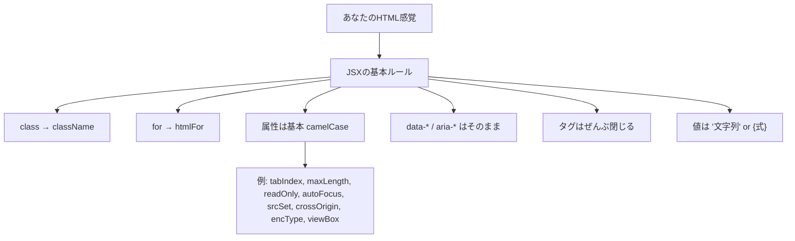

# 第13章：JSXのルール (2)

**— HTMLとちょっと違うところを一気にマスター！ —**
（`class` → `className`、`for` → `htmlFor`、イベント名はキャメルケースなどなど🌸）

---

## きょうのゴール 🎯

* HTMLからJSXへの**置き換えルール**をスラスラ言えるようになる
* **属性名の違い／大文字小文字**の注意を体で覚える
* すぐ使える**変換チート表**＆**ハンズオン**で定着させる

---

## HTML ↔ JSX ざっくり地図 🗺️



---

## まずは超重要：`class` と `for` ✨

### ✅ これに置き換え！

* `class` **→** `className`
* `for` **→** `htmlFor`（`<label>` と `<input id="...">` をつなぐやつ）

```tsx
// HTMLの感覚
// <label for="email" class="label">メール</label>

// JSXではこう！
<label htmlFor="email" className="label">メール</label>
<input id="email" type="email" />
```

---

## DOM属性は**基本 camelCase** 🐪

HTMLのハイフン表記が、JSXでは**大文字小文字**になるよ（JSのプロパティに寄せている感じ）。

| HTML           | JSX（camelCase）         | 例                                        |
| -------------- | ---------------------- | ---------------------------------------- |
| `tabindex`     | `tabIndex`             | `<button tabIndex={0} />`                |
| `maxlength`    | `maxLength`            | `<input maxLength={20} />`               |
| `readonly`     | `readOnly`             | `<input readOnly />`                     |
| `autofocus`    | `autoFocus`            | `<input autoFocus />`                    |
| `enctype`      | `encType`              | `<form encType="multipart/form-data" />` |
| `crossorigin`  | `crossOrigin`          | ``        |
| `srcset`       | `srcSet`               | `` |
| （SVG）`viewBox` | `viewBox`（**大小文字どおり**） | `<svg viewBox="0 0 100 100" />`          |

> **例外的にそのまま**でOKなのは `data-*` と `aria-*`（アクセシビリティ）だよ🌟

```tsx
<div data-user-id="u123" aria-live="polite">更新あり🛎️</div>
```

---

## 値の書き方：**"文字列"** と **\{式\}** 🎀

* **文字列**はダブルクォートで `"…"`
* **JSの値や変数**は `{ ... }`（数値・真偽値・計算結果など）

```tsx
const size = 24;
const isDisabled = true;

<button className="primary" disabled={isDisabled}>
  保存（{size}pxアイコンつき）
</button>
```

> `{true}` は省略できる属性もある（`disabled` などの**真偽属性**）。
> でも、**値が変数や計算なら `{...}` を使う**のが鉄則だよ💪

---

## タグは**ぜんぶ閉じる**／**自己終了**が必要 ✂️

HTMLだと省略しがちな `` や `<input>` なども、**JSXでは必ず**自己終了スラッシュ `/` をつけよう。

```tsx

<input type="text" />
<br />
<hr />
```

---

## イベント名は**onXxx**（キャメルケース）⚡

HTMLの `onclick` → **`onClick`**、`onchange` → **`onChange`** みたいに**大文字小文字**がポイント！

```tsx
<button onClick={() => alert("ぽちっ✨")}>押す</button>

<input
  onChange={(e) => console.log("値:", e.currentTarget.value)}
  placeholder="タイプしてみてね"
/>
```

> ここでの `e` はイベントオブジェクト（次のModuleで型も学ぶよ！）
> チェックボックスの `onChange` は**切り替わるたび**に発火するよ☑️

---

## まとめチート表 🧾💨

* `class` → **`className`**
* `for` → **`htmlFor`**
* 属性は基本 **camelCase**（例：`tabIndex`、`maxLength`、`readOnly`、`autoFocus`、`encType`、`crossOrigin`、`srcSet`、`viewBox`）
* **`data-*` と `aria-*` はそのまま**
* 値は `"文字列"` または **`{式}`**
* **真偽属性**は存在だけで `true`（`disabled` など）。動的に変えるなら `{isDisabled}`
* タグは**必ず閉じる**（自己終了を忘れない！）
* イベントは **`onClick` / `onChange` / `onSubmit`** など**キャメルケース**

---

## よくあるつまずき＆レスキュー 🚑

* **`class` 書いちゃった…** → `className` に直す
* **`for` にしてラベルが効かない** → `htmlFor` に直す（`id` とペアで）
* **`maxlength` が効かない** → `maxLength` に直す
* **`viewbox` で表示がおかしい(SVG)** → `viewBox`（VとBが大文字！）
* **`onclick`/`onchange` が動かない** → `onClick`/`onChange` に直す（Cが大文字！）
* **`` が赤線** → `` と**自己終了**！

---

## ハンズオン①：HTMLをJSXに変換してみよう ✍️🧪

### お題（HTML風）

```html
<!-- HTMLイメージ（貼るだけのイメージです） -->
<label for="email" class="label">Email</label>
<input id="email" type="email" autofocus maxlength="30">
<button onclick="submit()">送信</button>

```

### 解答（JSX / TypeScript）

```tsx
<label htmlFor="email" className="label">Email</label>
<input id="email" type="email" autoFocus maxLength={30} />
<button onClick={() => submit()}>送信</button>

```

> さらにTypeScriptっぽくするなら、`submit` 関数の型を書いておくと安心だよ🍀

---

## ハンズオン②：フォームのペアリングを完成させよう 💌

```tsx
// src/FormSample.tsx
export default function FormSample() {
  return (
    <form onSubmit={(e) => { e.preventDefault(); alert("送信！🚀"); }}>
      <div>
        <label htmlFor="user">ユーザー名</label>
        <input id="user" type="text" placeholder="Hanako" />
      </div>

      <div>
        <label htmlFor="agree">利用規約に同意</label>
        <input id="agree" type="checkbox" />
      </div>

      <button type="submit">送信する</button>
    </form>
  );
}
```

* `label` ↔ `input` は **`htmlFor` と `id`** を**必ず対応**させよう💞
* チェックボックスは `onChange` で状態が取れるよ（次章以降で型つきで扱うね）

---

## 危険ゾーン：`dangerouslySetInnerHTML` 🧯

生のHTML文字列を挿入する特別API。**基本使わない**のが吉（XSSなど危険）。
どうしても必要な時だけ、信頼できるソースに限定してね。

```tsx
<div dangerouslySetInnerHTML={{ __html: "<strong>太字</strong>" }} />
```

---

## 3分チェック ✅（小テスト）

1. `class` と `for` はJSXでなんと書く？
2. `maxlength` のJSX表記は？
3. `data-*` と `aria-*` は camelCaseにする？しない？
4. イベント名 `onclick` のJSX表記は？
5. `` や `<input>` の**JSXでの**書き方は？

**こたえ**

1. `className` / `htmlFor`
2. `maxLength`
3. **しない**（そのまま `data-user-id` / `aria-label` など）
4. `onClick`
5. **自己終了**：`` / `<input ... />`

---

## 次の章の予告 🎬

**第14章**は、**`{}` でJSの値を埋め込む**テクニックへ！
変数・関数・三項演算子など、**UIとロジックをつなぐ基本**を一気に身につけよう💫

今日も最高にナイス〜！🥳💖💻
