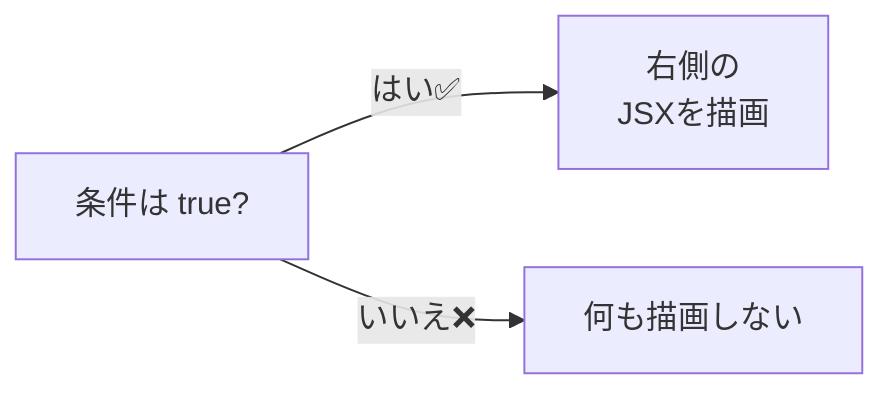

# 第42章：もしこうなら, これを見せる (2)

---

この章では、**「この条件が true のときだけ、これを表示したい！」**
そんなときに超よく使うテクニック 👉 **`&&` 演算子での条件付きレンダリング** をやっていきます 💻🌸

前の章では `? :`（三項演算子）で条件によって
「Aを出すか、Bを出すか」を決めましたが、
今回は **「出す or 出さない」** のシンプル版です ✨

---

## 1️⃣ JavaScriptでの `&&` のおさらい

まずはふつうの JavaScript の話から 👀

`A && B` のルールはこうでしたね：

* 左側 `A` が **true っぽい値** → 右側 `B` を返す
* 左側 `A` が **false っぽい値** → 左側 `A` をそのまま返す

```js
true && "こんにちは"   // "こんにちは"
false && "こんにちは"  // false

1 && "OK"             // "OK"
0 && "OK"             // 0
```

React では、
この「**false なら右側まで行かない**」性質を利用して、
**「条件がOKのときだけ JSX を描画」** させます ✨

---

## 2️⃣ JSX × `&&`：条件付きレンダリングの基本形 🎨

React（JSX）での基本パターンはこれです：

```tsx
{条件 && <表示したいJSX />}
```

イメージはこんな感じ 👇



たとえば、**ログインしているときだけメッセージ表示**したい場合：

```tsx
{isLoggedIn && <p>ログイン中です✨</p>}
```

* `isLoggedIn` が `true` → `<p>ログイン中です✨</p>` が表示される
* `isLoggedIn` が `false` → React は「何も出さない」扱いになる

👀 ポイント
React は `false` や `null` や `undefined` を
「なにも描画しないもの」として扱ってくれます。
これが `&&` とめちゃ相性いいんです ✨

---

## 3️⃣ ちょっと実践：ログイン状態でメッセージを出し分ける 💻

ミニアプリを作りながら、`&&` を体で覚えましょ〜 🙌

### 🧩 やりたいこと

* 「ログイン」ボタンを押すとログイン状態を切り替える
* ログイン中だけ、**ヒミツのメッセージ**を表示する

`src/App.tsx` をこんな感じで書きかえてみましょう ✍️

```tsx
import { useState } from "react";

type UserStatus = {
  name: string;
  isLoggedIn: boolean;
};

export function App() {
  const [user, setUser] = useState<UserStatus>({
    name: "ななこ",
    isLoggedIn: false,
  });

  const handleToggleLogin = () => {
    setUser({
      ...user,
      isLoggedIn: !user.isLoggedIn,
    });
  };

  return (
    <div style={{ padding: "16px" }}>
      <h1>条件付き表示の練習🎯</h1>

      <p>こんにちは、{user.name} さん 👋</p>

      {/* ここがポイント：ログイン中だけメッセージを表示 */}
      {user.isLoggedIn && (
        <p style={{ color: "purple", fontWeight: "bold" }}>
          🎉 ログイン中だけ見えるヒミツメッセージだよ！
        </p>
      )}

      <button onClick={handleToggleLogin}>
        {user.isLoggedIn ? "ログアウトする" : "ログインする"}
      </button>
    </div>
  );
}
```

### 👀 解説ポイント

* `user.isLoggedIn && (...)`

  * `isLoggedIn` が `true` のときだけ、右側の `<p>...</p>` が描画されます
* `button` のラベルは、前の章でやった `? :` を使って出し分け

ここでの主役はあくまで `&&` です 💪
「**true のときだけ出す**」パターンは、UIでほんとう〜〜によく使います！

---

## 4️⃣ ローディング中だけ「読み込み中...」を出したいとき ⏳

次によくあるのが、**データ読み込み中の表示**です。

* 読み込み中 → 「読み込み中...」を表示
* 読み込み終わり → 消す

これも `&&` で超スッキリ書けます ✨

```tsx
import { useState } from "react";

export function App() {
  const [isLoading, setIsLoading] = useState(false);

  const handleLoadData = () => {
    setIsLoading(true);

    // ダミーで2秒後に読み込み完了にする
    setTimeout(() => {
      setIsLoading(false);
      alert("データ取得完了！📦");
    }, 2000);
  };

  return (
    <div style={{ padding: "16px" }}>
      <h1>ローディング表示の練習⏳</h1>

      <button onClick={handleLoadData} disabled={isLoading}>
        {isLoading ? "読み込み中..." : "データを読み込む"}
      </button>

      {/* ローディング中だけメッセージ表示 */}
      {isLoading && <p>サーバーと通信中だよ…💌</p>}
    </div>
  );
}
```

`isLoading && <p>...</p>`
たったこれだけで「読み込み中だけ表示」ができています 🎉

---

## 5️⃣ `&&` と `? :` の使い分け 🤔

**ざっくりルール**はこんな感じに覚えてOKです ✍️

* 「**出す or 出さない**」
  → `条件 && <コンポーネント />`
* 「**A を出すか B を出すか**」
  → `条件 ? <A /> : <B />`

### 例：

1. ログイン中だけ「マイページ」を出す → `&&` が向いてる
2. ログイン中は「ログアウトボタン」、未ログインなら「ログインボタン」 → `? :` が向いてる

両方同じReactだけど、
**「パターンが違うから書き方も変える」**って感じです 🌟

---

## 6️⃣ `&&` の落とし穴😵‍💫：`0` や `""` に注意！

`&&` は**「左側が false っぽい値なら、その左側を返す」**というルールでした。

そのため、こんな書き方はちょっと危険です ⚠️

```tsx
const [count, setCount] = useState(0);

// これだと count が 0 のとき、なにも表示されない
{count && <p>現在のカウント: {count}</p>}
```

* `count` が `0` のとき → `0 && <p>...</p>` → `0` が返る
* React は `0` を **描画してしまうこともある** or **空に見えてしまう**など、意図とズレることがあります

✨ 安全に書きたいときは、**比較を使う**のがオススメです：

```tsx
{count > 0 && <p>現在のカウント: {count}</p>}
```

* `count > 0` が `true` のときだけ表示
* `0` のときは `false` になるので、何も表示されない

📌 まとめ：
「数字」や「文字列」をそのまま左側に置くときは、
**値の意味までちゃんと考える**ようにしておきましょう 💡

---

## 7️⃣ TypeScript 的なポイント🧠

この章のコードで使っている TS の要素をちょこっと整理 👇

### ✅ `type` でデータのカタチを定義

```tsx
type UserStatus = {
  name: string;
  isLoggedIn: boolean;
};
```

* `name` は文字列
* `isLoggedIn` は `true/false`（boolean）

`useState` にこの型を渡すことで、
`user.isLoggedIn` が必ず `boolean` だとわかるので、

```tsx
{user.isLoggedIn && <p>...</p>}
```

この書き方も VS Code 的に安心安全です 🛟
もし `isLoggedIn` をうっかり `string` にしちゃったら、
VS Code がちゃんと怒ってくれます(笑) 😇

---

## 8️⃣ 手を動かしてみようチャレンジ 🔥

最後に、アウトプット用のミニお題です ✍️

### 📝 お題1：お知らせバナー

1. `NoticeBanner` というコンポーネントを作る

2. Props はこんな感じの `type` で定義する

   ```tsx
   type NoticeBannerProps = {
     show: boolean;
     message: string;
   };
   ```

3. `show` が `true` のときだけ、`<div>` に `message` を表示する

4. `App` からは、`<NoticeBanner show={true} message="テスト中です🧪" />`
   みたいに呼び出してみる

👉 ヒント：
`{show && <div>...</div>}` を使えばOKだよ〜！✨

### 📝 お題2：残り席があるときだけ表示する

1. `remainingSeats` という `number` の state を用意する
2. `remainingSeats > 0` のときだけ
   「残り `{remainingSeats}` 席です🎫」を表示
3. `残り席を減らす` ボタンを作って、クリックのたびに `-1` する

👉 ヒント：

```tsx
{remainingSeats > 0 && (
  <p>残り {remainingSeats} 席です🎫</p>
)}
```

---

## 9️⃣ この章のまとめ 🎀

* `条件 && <コンポーネント />` で **「true のときだけ表示」** ができる ✨
* ログイン中だけ表示、読み込み中だけ表示…など、UIで超よく使う
* 数字や空文字をそのまま左側に置くときは、`0` や `""` に注意！
* TypeScript で型をちゃんと付けておくと、条件式も安心して書ける 🧠

次の章では、**配列データを `.map()` でズラッと並べる表示** に進みます 🚀
`&&` と組み合わせると、かなり本格的なUIが作れるようになるよ！✨
