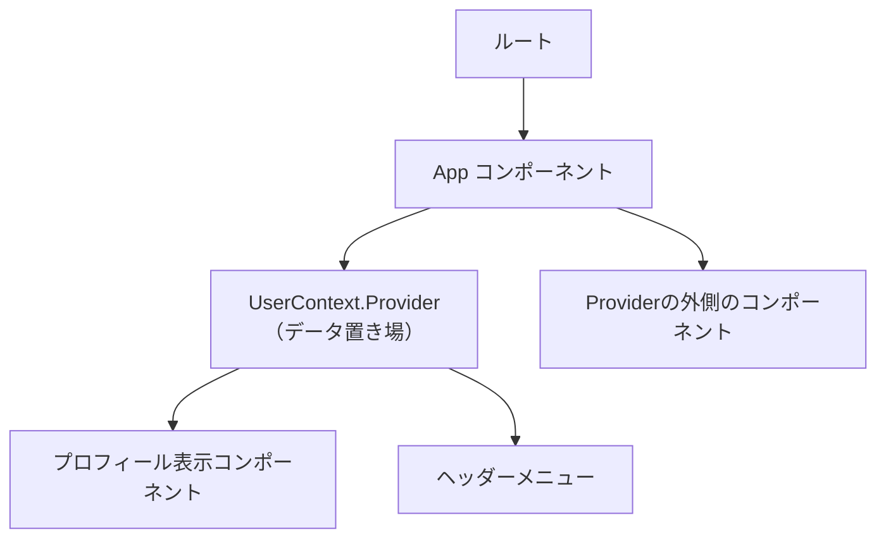

# 第73章：`createContext`の型定義！

> キーワード：**`createContext<T | null>(null)` をちゃんと理解する章** ✨

---

### 1️⃣ この章でやること 🎯

この章では、

* `createContext` に **型** をちゃんと付ける
* そのときによく出てくる **`null` を許容するパターン** を理解する
* 「なんで `| null` を付けるの？🤔」をスッキリさせる

ところまでを目標にします 💪

> ※ コンテキストの中身の値を実際に使うカスタムフック（`useSomethingContext` みたいなやつ）は、第76章でじっくりやります🥰
> ここでは「**Contextオブジェクトの型定義**」にフォーカスします。

---

### 2️⃣ ちょっとおさらい：Contextってどんな感じだっけ？🪄

第71〜72章で出てきたイメージを、簡単に図で思い出しておきましょう。



* `UserContext.Provider` の **内側の子コンポーネント** は、`UserContext` から値を読める ✅
* `Provider` の **外側** で `UserContext` を読もうとすると、**デフォルト値** が返る ✅

この「**デフォルト値**」が、`createContext(ここに渡すやつ)` です。
そして TypeScript 的には、ここが **`null` になることがよくある** → だから型で `| null` を許容してあげよう、という話になります。([React][1])

---

### 3️⃣ `createContext` の基本の型定義 👩‍💻

まずは、**よく使う型定義パターン** を先に見ちゃいましょう。

#### 🌟 よく出てくる書き方

```ts
// ① Contextの中身の型を先に定義する
export type UserContextValue = {
userName: string;
setUserName: (value: string) => void;
};

// ② Contextオブジェクトを作るときに、型＋nullを許容して定義する
import { createContext } from "react";

export const UserContext = createContext<UserContextValue | null>(null);
```

ポイントはココ 👇

* `<UserContextValue | null>`
  → **「中身は `UserContextValue` だけど、`null` の可能性もあるよ」** という型
* `createContext<UserContextValue | null>(null)`
  → 「**最初のデフォルト値は `null`**」って実際に渡している

React公式の TypeScript ガイドでも、
「**Contextを作るときはいったん `| null` を含めておいて、あとでカスタムフックで `null` を排除するのがおすすめだよ**」というパターンが紹介されています。([React][2])

> つまり：
>
> * `createContext` を作るこのタイミングでは、**`null を許容しておくのが正解**」
> * コンポーネント側から使うときに「`null` じゃないよね？」を確認する、という2段構えの作戦です 💡

---

### 4️⃣ なんで `| null` を付けるの？🧐

「そもそも、`createContext<UserContextValue>(null)` じゃダメなの？」
と思うかもしれません。

#### ❌ こう書くと怒られるやつ

```ts
// ❌ TypeScript に怒られるパターン
const UserContext = createContext<UserContextValue>(null);
//                ~~~~~~~~~~~~~~~~~~~~~~~~~~~~~~~~
// Type 'null' is not assignable to type 'UserContextValue' みたいなエラー
```

* 型の宣言では「**必ず `UserContextValue` が入るよ！**」と言っておきながら
* 実際の値は `null` を渡しているので、TypeScript からすると

  > 「え、それ嘘じゃん…😇」
  > となってエラーになります。

だから正しくは、

* デフォルト値が `null` なら **型でも `| null` を許可する**
* 型と実際の値を **矛盾させない**

というのが大事になります ✨

---

### 5️⃣ 実例：ユーザー名を管理する Context の型定義 🧑‍💼💬

ここからは、**具体的なコード** でイメージを固めましょう。

#### Step 1: Contextに入れる「中身の型」を決める 🧩

`src/contexts/UserContext.tsx` みたいなファイルを作るイメージで OK です。

```ts
// src/contexts/UserContext.tsx

// Contextの「中身」の型
export type UserContextValue = {
userName: string;                       // 今ログイン中のユーザー名
setUserName: (value: string) => void;   // ユーザー名を更新する関数
};
```

ここは普通の TypeScript の `type` ですね 👍

---

#### Step 2: `createContext` に型＆`null` を付ける 🎀

続きで `createContext` を書きます。

```ts
import { createContext } from "react";
import type { UserContextValue } from "./UserContextValue"; // 同じファイルなら不要

// 「中身は UserContextValue だけど、nullの可能性もあるよ」という Context 型
export const UserContext = createContext<UserContextValue | null>(null);
```

ここでやっていることは…

* `<UserContextValue | null>`
  → Contextから取り出したときに、
  TypeScript上では **`UserContextValue` かもしれないし、`null` かもしれない** と考える
* `(null)`
  → 「Provider が無いときは、とりあえず `null` を返す」というデフォルト値を決めている

> 「Provider でちゃんと `value` を渡すから、実際に画面で使うときは `null` にはならないようにするよ！」
> という約束のもとで、**「でも型の上では一応 `null` もありえる」ということにしておく** 感じです。

---

#### Step 3: Provider コンポーネントの土台も見ておこう 🏗️

この章のメインは「型定義」ですが、イメージしやすいように Provider もざっくり書いておきます。

```ts
// src/contexts/UserContext.tsx

import { createContext, useState } from "react";
import type { ReactNode } from "react";

export type UserContextValue = {
userName: string;
setUserName: (value: string) => void;
};

// ★ 型は「UserContextValue | null」、初期値は null
export const UserContext = createContext<UserContextValue | null>(null);

type UserProviderProps = {
children: ReactNode;
};

export function UserProvider({ children }: UserProviderProps) {
const [userName, setUserName] = useState("ゲスト");

// この value は絶対に null じゃない！
const value: UserContextValue = {
userName,
setUserName,
};

return (
<UserContext.Provider value={value}>
{children}
</UserContext.Provider>
);
}
```

大事なポイントはここ 👇

* **Context自体** の型：`UserContextValue | null`（`null` を許容）
* **Provider が実際に渡す値**：`UserContextValue`（`null` じゃない）

つまり：

> * **外の世界から見ると**
>
>   * 「もしかしたら Provider がなくて `null` かも…」という可能性を含めた型
> * **Provider の中では**
>
>   * 「ここは絶対にちゃんと値を作るよ！」という責任を持つ

という分担になっています 😊

第76章で、この `UserContext` を読む専用の

```ts
useUserContext()
```

みたいな **カスタムフック** を作って、
`null` だったらエラーを投げる → それ以外のコンポーネントでは **`null` を気にしなくていい世界**
を作っていきます 🌍✨（お楽しみに！）([React][2])

---

### 6️⃣ 「null を許容するテクニック」まとめポイント 🍡

ここまでの大事なポイントをもう一度整理します。

* `createContext` は「**デフォルト値**」を必ず渡さないといけない
* 意味のあるデフォルトがないときは、公式ドキュメントでも
  「**`null` を渡してね**」と案内されている([React][1])
* だから TypeScript 的には

  * `createContext<MyType>(null)` は **嘘つきなのでダメ** ❌
  * `createContext<MyType | null>(null)` が **正直な書き方** ⭕

> 👉 この「**デフォルトは null だけど、型には `| null` を付けておく**」というセットが
> 「`null` を許容するテクニック」の正体です ✨

そして、

* 実際にコンポーネントから読むときは

  * `useContext` または React 19 の `use(Context)` で値を取得
  * そのときに、**カスタムフックで `null` をチェックしてあげる** のが定番パターン

React 19 では `use` という新しい API で Context も読めるようになっていて、
`use(MyContext)` という書き方ができますが、
「`null` を許容して型を定義 → 後でチェックする」という考え方自体は同じです。([GitClear][3])

---

### 7️⃣ ミニ練習問題 ✍️✨

ノートか VSCode で、実際に手を動かしてみてください 🙌

#### 🔸 練習1：ThemeContext に型を付けてみよう

第72章で作った（はずの）`ThemeContext` を思い出してください。

* `theme`：`"light"` or `"dark"` のどちらか
* `toggleTheme`：テーマを切り替える関数

これを TypeScript で次のように定義してみましょう：

1. `ThemeContextValue` 型を定義する
2. `createContext<ThemeContextValue | null>(null)` で `ThemeContext` を作る

ヒント：

* `type Theme = "light" | "dark";` みたいに別の型を作ってもOK
* 中身の型はたとえばこんな感じ

  ```ts
  type ThemeContextValue = {
    theme: "light" | "dark";
    toggleTheme: () => void;
  };
  ```

---

#### 🔸 練習2：VSCodeの「型ホバー」を見てみよう 🕵️‍♀️

`ThemeContext` にマウスを当てて、VSCode のポップアップで

* `ThemeContextValue | null` と表示されているか確認してみてください ✅

> 「あ、ちゃんと `| null` 付きの型として認識されてる！」
> と確認できると、かなり理解が深まります 💡

---

### 8️⃣ この章のまとめ 🌟

* `createContext` に渡す **デフォルト値** と
  **ジェネリクスの型** は、必ず矛盾しないようにする
* デフォルトに `null` を渡すなら、
  `createContext<MyType | null>(null)` のように **型でも `null` を許容** する
* Provider の中では「絶対に `null` じゃない値」を作って渡す
* あとでカスタムフックを作って、
  「`null` じゃないかチェック → それ以外のコンポーネント側では `null` を気にしなくていい」
  という世界を目指す 💫

次の章では、この型付き Context を実際にアプリの中で配る (`Provider`) 側を
もっと丁寧に見ていきます 🧺✨

「`null` を許容するテクニック」、なんとなくモヤモヤしていたところが
少しでもスッキリしていたらうれしいです〜🥰

[1]: https://react.dev/reference/react/createContext?utm_source=chatgpt.com "createContext"
[2]: https://react.dev/learn/typescript?utm_source=chatgpt.com "Using TypeScript"
[3]: https://www.gitclear.com/open_repos/facebook/react/release/v19.0.0?utm_source=chatgpt.com "React v19.0.0 Release"
