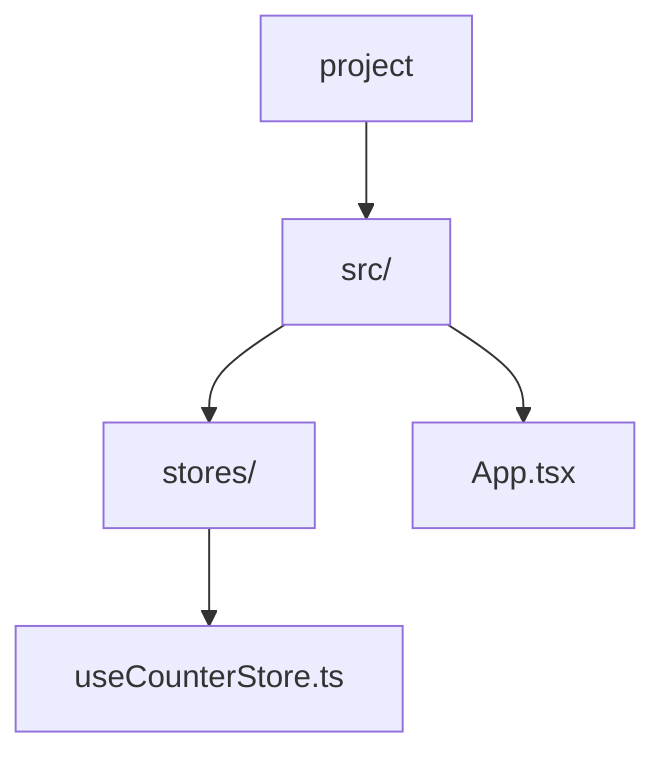
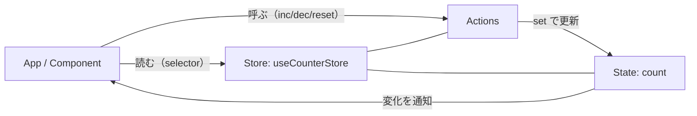

# 第172章：最初の「ストア」を作る

この章では「アプリのどこからでも使える状態（グローバルState）」を、Zustandで1つ作ります😊
結論：**「create で作った“カスタムフック”＝ストア」** って覚えればOKだよ〜！🙌

---

## 1) Zustand を入れる 📦💨

プロジェクトのフォルダで、ターミナル（PowerShell）を開いて👇

```bash
npm install zustand
```

（公式でも npm で入れる形だよ） ([npmjs.com][1])

---

## 2) ストア用フォルダ＆ファイルを作る 🗂️✍️

次の構成にしてみよう👇（無ければ作ってOK！）

* src/stores/useCounterStore.ts

### 📌 フォルダ構成（イメージ）



---

## 3) 最初のストアを書いてみよう 🧠✨

「状態（count）」と「更新する関数（inc/dec/reset）」を、1つのオブジェクトにまとめます🙆‍♀️

📄 **src/stores/useCounterStore.ts**

```ts
import { create } from "zustand"

type CounterStore = {
  count: number
  inc: () => void
  dec: () => void
  reset: () => void
}

// create<型>()((set) => ( ... )) という形が、TS的に安定でおすすめ✨
export const useCounterStore = create<CounterStore>()((set) => ({
  count: 0,

  inc: () => set((s) => ({ count: s.count + 1 })),
  dec: () => set((s) => ({ count: s.count - 1 })),
  reset: () => set({ count: 0 }),
}))
```

この「`create<型>()`(...)」の書き方は、TypeScriptガイドでも案内されてる定番だよ😊 ([Zustand Documentation][2])

---

## 4) App.tsx で “ちょい使い” して動作確認 ✅🎮

📄 **src/App.tsx**（中身をいったんこれにしてOK）

```tsx
import { useCounterStore } from "./stores/useCounterStore"

export default function App() {
  const count = useCounterStore((s) => s.count)
  const inc = useCounterStore((s) => s.inc)
  const dec = useCounterStore((s) => s.dec)
  const reset = useCounterStore((s) => s.reset)

  return (
    <main style={{ padding: 24 }}>
      <h1>Zustand Counter 🐻</h1>

      <p style={{ fontSize: 24 }}>count: {count}</p>

      <div style={{ display: "flex", gap: 8 }}>
        <button onClick={dec}>-1</button>
        <button onClick={inc}>+1</button>
        <button onClick={reset}>reset</button>
      </div>
    </main>
  )
}
```

起動して確認👇

```bash
npm run dev
```

ボタン押して数字が変われば成功〜！🎉✨

---

## 5) ざっくり図解：ストアって何してるの？🧩🔁

「コンポーネントがストアから読む → アクション呼ぶ → set で更新 → 必要な所だけ再描画」って流れだよ😊



---

## 6) よくあるつまずき 🥲🩹

* **import パスが違う**
  「./stores/useCounterStore」になってるか確認👀
* **ファイル名の綴りミス**
  useCounterStore.ts（大文字小文字も注意！）
* **型がズレる**
  まずはこの章の形（CounterStore に state と actions をまとめる）でOK🙆‍♀️

---

## 7) ミニ練習 🎯✨（5〜10分）

できたらストアに機能追加してみよ〜！💪💕

1. **step 付き増減**
   incBy: (n: number) => void を追加して、「+5」ボタンを作る🖐️
2. **下限ガード**
   count が 0 未満にならないようにする（dec の中で条件分岐）🧠
3. **double**
   double: () => void を作って count を2倍にする🐣➡️🐓

---

## まとめ 🎀

* Zustandのストアは **createで作る「カスタムフック」** だよ😊
* ストアには **State（値）** と **Actions（更新関数）** を一緒に入れると超わかりやすい✨
* コンポーネント側は **useCounterStore(セレクター)** で必要なものだけ取るのが基本👍

次の第173章で「コンポーネント側でストアを気持ちよく使うコツ」に入っていけるよ〜！😆💖

[1]: https://www.npmjs.com/package/zustand?utm_source=chatgpt.com "zustand"
[2]: https://zustand.docs.pmnd.rs/guides/advanced-typescript?utm_source=chatgpt.com "Advanced TypeScript Guide - Zustand"
